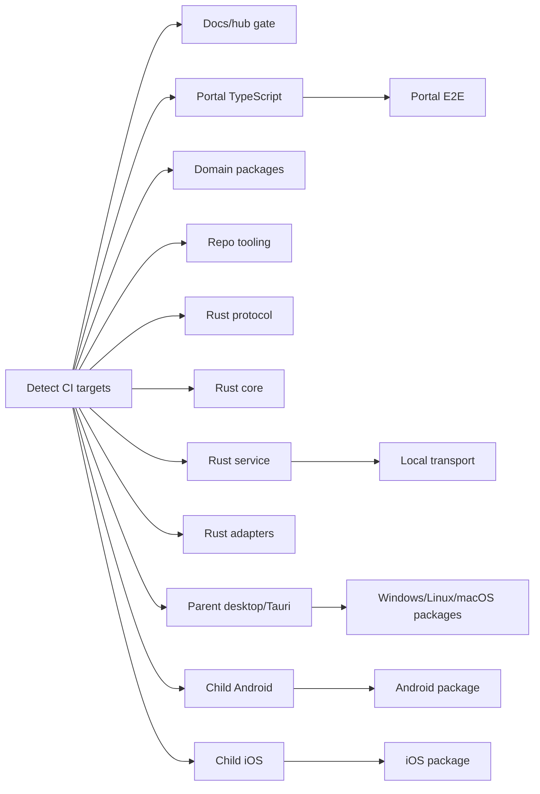

# Ocentra Parent CI

The CI gate is intentionally target-split. `ci.yml` detects changed paths,
fans out to focused reusable workflows, then reports a few aggregate gates for
branch protection compatibility. The goal is fast feedback and cheap retries:
if Android package smoke fails, rerun the Android package target; do not make
portal lint, Rust protocol tests, Windows MSI, and macOS package smoke run
again just to check the Android fix.



## Orchestration

- `ci.yml`: small orchestrator. It classifies path changes into docs/hub,
  portal TypeScript, domain packages, Rust protocol/core/service/adapters,
  parent desktop/Tauri, child Android, child iOS, and package targets.
- `ci-docs-hub.yml`: docs, `.hub`, and root Markdown fast gate.
- `ci-format.yml`: repository format check.
- `ci-release-version.yml`: release version alignment.
- `secret-scan.yml`: custom repo scanner plus Gitleaks.
- `dependency-policy.yml`: dependency policy and SBOM.
- `build.yml`: production build when source package work needs it.

## Target Workflows

- `ci-portal-typescript.yml`: portal build-contracts, lint, type-check, and
  portal unit tests.
- `ci-domain-packages.yml`: schema/source boundary lint, shared contract build,
  and domain contract tests.
- `ci-tooling.yml`: repository script/tooling tests.
- `ci-rust-agent-protocol.yml`: protocol crate format/check/tests.
- `ci-rust-agent-core.yml`: core crate format/clippy/tests.
- `ci-rust-agent-service.yml`: service crate format/clippy/tests.
- `ci-rust-adapters.yml`: updater, eventing, network evidence, and screen
  adapter crate checks/tests.
- `ci-local-transport.yml`: real local WebSocket and LAN transport smoke.
- `ci-portal-e2e.yml`: portal-to-Rust E2E on Windows, Linux, and macOS.
- `ci-parent-desktop-tauri.yml`: parent desktop/Tauri type-check and build.
- `ci-child-android.yml`: child Android source contract checks for runtime,
  protocol, and capability boundaries. APK build and emulator smoke stay in
  the Android package target.
- `ci-child-ios.yml`: child iOS source contract checks for runtime, protocol,
  and capability boundaries. Simulator build, install, launch, and proof output
  stay in the iOS package target.
- `ci-package-windows.yml`: Windows MSI preview and smoke.
- `ci-package-linux.yml`: Linux DEB preview and smoke.
- `ci-package-macos.yml`: macOS PKG preview and smoke.
- `ci-package-android.yml`: Android APK preview and emulator smoke.
- `ci-package-ios.yml`: iOS simulator package preview and smoke.

## Required Aggregates

The orchestrator keeps small aggregate jobs named like the historical required
gates:

- `Format, Lint, Types, Rust Check`
- `Full Validation Gate`
- `Package Preview Gate`

Those aggregate jobs fail if any relevant target fails or is cancelled, and
ignore skipped targets. This keeps branch protection stable while letting
engineers rerun focused target jobs.

## Rules

- Workflow file changes force all targets on purpose. CI changes should prove
  the full graph once.
- Docs/hub-only changes are limited to `docs/**`, `.hub/**`, and root-level
  `*.md`; they run only the docs/hub gate.
- Portal-only work should not run Android/iOS package previews.
- Android-only work should not run portal lint or Windows/macOS packages unless
  shared contracts or service code also changed.
- Rust is not one bucket. Protocol, core, service, and adapter crates are
  separate targets.
- Repo scripts and workflow topology are their own tooling target.
- Package previews are platform targets. Windows, Linux, macOS, Android, and
  iOS can be retried independently.

## Release Boundary

Pushes to `main` run validation and package previews, but they do not create
GitHub Releases and do not publish trusted update manifests. Production release
publishing belongs to `release.yml` on the `production` branch only.

## Local Parity

Before pushing a CI change, run at minimum:

```powershell
cmd /c npx prettier --check .github/workflows/*.yml .github/workflows/README.md
node --test scripts/test/workflow-ci-trigger.test.mjs
```

Before declaring product implementation PR-ready, run the smallest relevant
target locally while working, then the broader gate requested by the hub or PR
review.
