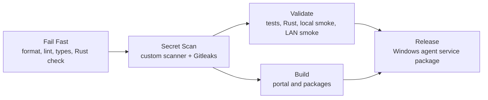

# Ocentra Parent CI

The pipeline uses the same modular shape as other Ocentra repositories, scaled to the current scaffold.



## Files

- `ci.yml`: orchestrates the gate.
- `fail-fast.yml`: catches broken formatting, lint, TypeScript, and Rust check failures early.
- `secret-scan.yml`: runs the repo scanner plus Gitleaks.
- `validate.yml`: runs `npm run validate`.
- `build.yml`: runs `npm run build`.
- `.github/actions/setup-ci`: shared Node/Rust/npm setup.

On pushes to `main`, the orchestrator creates a GitHub Release only after validation and build pass. The release job requires the repository version to be unique and aligned across npm and Cargo sources, then publishes the Windows service package, checksum, update manifest, and bootstrap installer.

## Local Parity

Before pushing, run:

```powershell
cmd /c npm run ci:local
```

The pre-commit hook runs the commit-time subset:

```powershell
cmd /c npm run hooks:install
```

Check release version alignment directly:

```powershell
cmd /c npm run release:version
```
