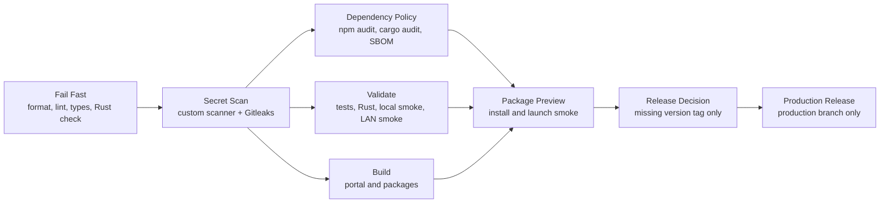

# Ocentra Parent CI

The pipeline uses the same modular shape as other Ocentra repositories, scaled to the current scaffold.



## Files

- `ci.yml`: orchestrates the gate.
- `fail-fast.yml`: catches broken formatting, lint, TypeScript, and Rust check failures early.
- `secret-scan.yml`: runs the repo scanner plus Gitleaks.
- `dependency-policy.yml`: runs npm audit, cargo audit, npm license policy, and SBOM metadata generation.
- `validate.yml`: runs `npm run validate`.
- `build.yml`: runs `npm run build`.
- `package-preview.yml`: builds installable preview artifacts for Windows, Linux, macOS, Android, and iOS simulator, then smoke-checks installation or launch.
- `release.yml`: publishes production GitHub Releases from the `production` branch only when the version tag is missing.
- `.github/actions/setup-ci`: shared Node/Rust/npm setup.

Pushes to `main` run validation and package previews, but they do not create GitHub Releases and do not publish trusted update manifests. This keeps normal development from creating dozens of real installer releases.

Pushes to `production` run the production release workflow. That workflow runs the same gates, builds package previews, then checks whether the aligned version tag already exists. If the tag is missing, it publishes the signed Windows x64 MSI, checksum, signed update manifest, and bootstrap installer. If the tag exists, the publish job is skipped.

Documentation-only pushes to `main` do not run the CI workflow. Changes limited to Markdown files or `docs/**` are ignored by `ci.yml`, so README and planning updates cannot trigger package previews. Use `workflow_dispatch` when a manual CI run is still wanted for a docs-only change.

For emergency or intentional bypasses on a code-touching commit, GitHub's native skip marker is also available. Include `[skip ci]` in the commit message only when you are deliberately bypassing the gate and do not want a release from that push.

The production release job requires `OCENTRA_PARENT_UPDATE_SIGNING_KEY_BASE64` as a repository secret. The updater binary is built with the matching public key and rejects unsigned or incorrectly signed manifests. Package preview builds use an explicit ephemeral update key so the MSI can be tested without publishing a trusted update channel. Future Windows Authenticode, macOS, Android store, and Apple store signing secrets are documented by `scripts/release/check-production-secrets.mjs` but are not required until those release paths exist.

## Local Parity

Before pushing, run:

```powershell
cmd /c npm run ci:local
```

The pre-commit hook runs the commit-time subset:

```powershell
cmd /c npm run hooks:install
```

Check release version alignment directly:

```powershell
cmd /c npm run release:version
```
