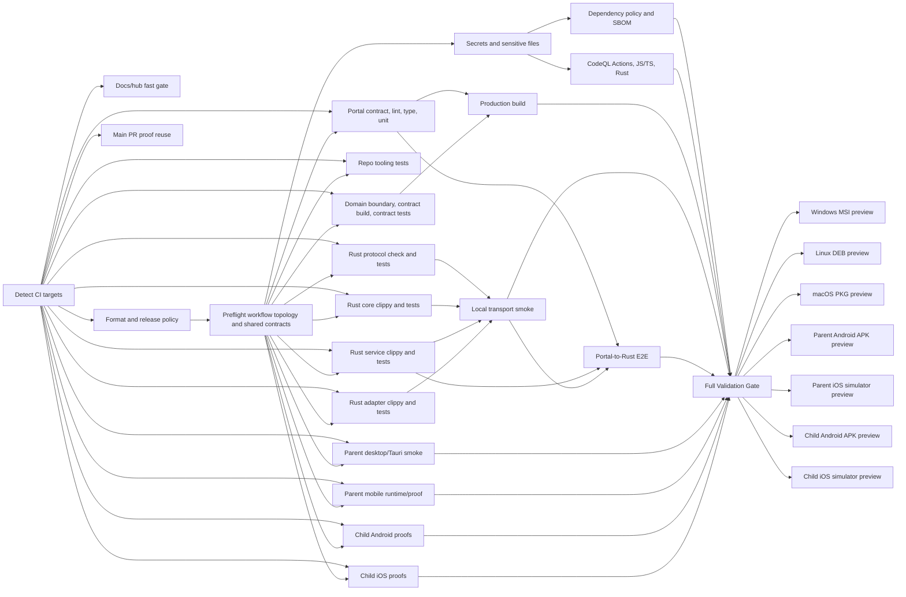

# Ocentra Parent CI

The CI gate is intentionally target-split, but final product PR validation is
comprehensive. `ci.yml` detects changed paths, preserves a fast docs/Ledger
gate, fans out to focused reusable workflows, then reports a few aggregate
gates for branch protection compatibility. Non-doc pull requests targeting
`main` or `production` force every product, Rust, portal, mobile, and package
target so a change in one surface cannot hide a regression in another. The
split still gives fast feedback and cheap retries: if Android package smoke
fails, rerun the Android package target; do not make portal lint, Rust protocol
tests, Windows MSI, and macOS package smoke run again just to check the Android
fix.



## Orchestration

- `ci.yml`: small orchestrator. It classifies path changes into docs/Ledger,
  portal TypeScript, domain packages, Rust protocol/core/service/adapters,
  parent desktop/Tauri, child Android, child iOS, and package targets. Docs-only
  PRs stay fast; product PRs force the full target graph for merge proof.
- `ci-docs-hub.yml`: docs, Ledger integration docs, and root Markdown fast gate.
- `ci-format.yml`: repository format check.
- `ci-release-version.yml`: release version alignment.
- `ci-preflight.yml`: workflow topology test, CI verifier syntax check, and
  shared contract build before broad fanout.
- `secret-scan.yml`: custom repo scanner plus Gitleaks.
- `dependency-policy.yml`: dependency policy and SBOM.
- `ci-codeql.yml`: CodeQL static analysis for GitHub Actions,
  JavaScript/TypeScript, and Rust with security-and-quality queries.
- `build.yml`: production build when source package work needs it.

## Target Workflows

- `ci-portal-typescript.yml`: portal build-contracts, lint, type-check, and
  portal unit tests.
- `ci-domain-packages.yml`: schema/source boundary lint, shared contract build,
  and domain contract tests.
- `ci-tooling.yml`: repository script/tooling tests.
- `ci-rust-agent-protocol.yml`: protocol crate format/check/tests.
- `ci-rust-agent-core.yml`: core crate format/clippy/tests.
- `ci-rust-agent-service.yml`: service crate format/clippy/tests.
- `ci-rust-adapters.yml`: updater, eventing, network evidence, and screen
  adapter crate checks/tests.
- `ci-local-transport.yml`: real local WebSocket and LAN transport smoke.
- `ci-portal-e2e.yml`: portal-to-Rust E2E on Windows, Linux, and macOS.
- `ci-parent-desktop-tauri.yml`: parent desktop/Tauri type-check and build.
- `ci-parent-mobile.yml`: parent mobile runtime contracts and source artifact
  proof for the separate Android/iOS parent mobile app scaffolds.
- `ci-child-android.yml`: child Android source contract checks for runtime,
  protocol, and capability boundaries. APK build and emulator smoke stay in
  the Android package target.
- `ci-child-ios.yml`: child iOS source contract checks for runtime, protocol,
  and capability boundaries. Simulator build, install, launch, and proof output
  stay in the iOS package target.
- `ci-package-windows.yml`: Windows MSI preview and smoke.
- `ci-package-linux.yml`: Linux DEB preview and smoke.
- `ci-package-macos.yml`: macOS PKG preview and smoke.
- `ci-package-parent-android.yml`: parent mobile Android APK preview and
  emulator smoke for `ca.ocentra.parent.mobile`.
- `ci-package-parent-ios.yml`: parent mobile iOS simulator package preview and
  smoke for `ca.ocentra.parent.mobile`.
- `ci-package-android.yml`: Android APK preview and emulator smoke.
- `ci-package-ios.yml`: iOS simulator package preview and smoke.

Android/iOS package targets are split by product role. Parent mobile package
targets build `ca.ocentra.parent.mobile`; child-agent package targets build
`ca.ocentra.parent.agent`.

## Required Aggregates

The orchestrator keeps small aggregate jobs named like the historical required
gates:

- `Format, Lint, Types, Rust Check`
- `Full Validation Gate`
- `Package Preview Gate`

Those aggregate jobs fail if any relevant target fails or is cancelled, and
ignore skipped targets. For non-doc product PRs, the orchestrator marks every
product target relevant before those aggregates run. This keeps branch
protection stable while letting engineers rerun focused target jobs.

## Rules

- Workflow file changes force all targets on purpose. CI changes should prove
  the full graph once.
- Preflight sits between early policy checks and broad fanout. If workflow
  topology, CI helper syntax, or shared contract generation is broken, expensive
  package, E2E, dependency, and static-analysis work should not start.
- Docs/Ledger-only changes are limited to `docs/**`, root-level `*.md`, and
  Ledger integration metadata; they run only the docs/Ledger gate.
- Product pull requests are final merge proof and run every product, Rust,
  portal, mobile, E2E, and package target unless they are docs/Ledger-only.
- Path targeting remains useful for docs/Ledger fast-paths, workflow dispatch,
  and focused reruns, but it must not suppress product PR merge proof.
- Rust is not one bucket. Protocol, core, service, and adapter crates are
  separate targets.
- Repo scripts and workflow topology are their own tooling target.
- Package previews are platform targets. Windows, Linux, macOS, Android, and
  iOS can be retried independently.
- Child mobile package previews do not prove parent mobile packaging. Parent
  mobile Android/iOS targets have separate package, smoke, and proof rows.
- Static analysis is a first-class validation lane. It runs after the secret
  scan for source changes and blocks the full validation aggregate when CodeQL
  reports a failing Actions, JavaScript/TypeScript, or Rust analysis job.
- Package previews run after `Full Validation Gate`, not alongside it. If E2E,
  dependency policy, static analysis, or source validation fails, preview
  installer jobs should not spend runner time.

## Main Push Reuse

Normal PRs run the full relevant CI graph before merge. On `push` to `main`,
`ci.yml` checks whether the pushed merge commit came from a merged pull request
whose head commit already had the required aggregate checks green:

- `Format, Lint, Types, Rust Check`
- `Full Validation Gate`
- `Package Preview Gate`

When that proof is valid, the main push takes the lightweight
`Main PR Proof Reuse and Post-Merge Integrity` path instead of running the
whole graph again. If the proof is missing, stale, or unverifiable, the main
push falls back to full CI.

## Release Boundary

Pushes to `main` run validation and package previews, but they do not create
GitHub Releases and do not publish trusted update manifests. Production release
publishing belongs to `release.yml` on the `production` branch only.

## Local Parity

Before pushing a CI change, run at minimum:

```powershell
cmd /c npx prettier --check .github/workflows/*.yml .github/workflows/README.md
node --test scripts/test/workflow-ci-trigger.test.mjs
```

Before declaring product implementation PR-ready, run the smallest relevant
target locally while working, then the broader gate requested by the hub or PR
review.
