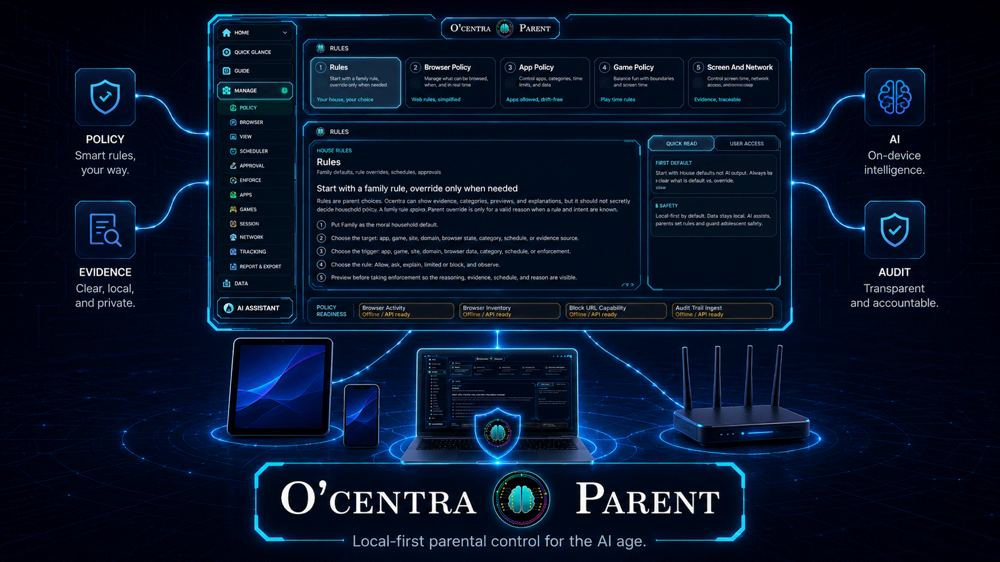
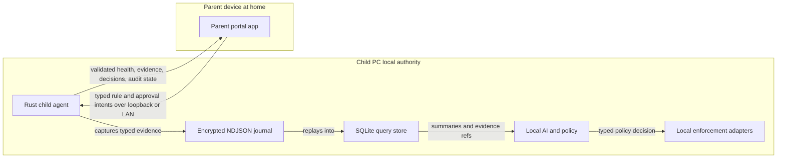
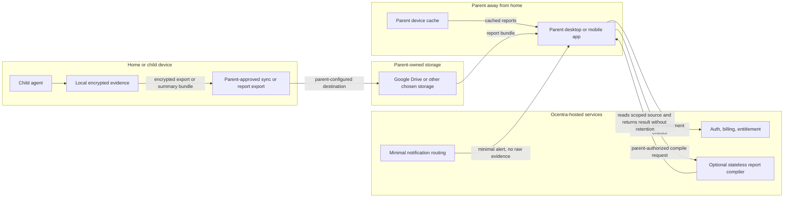
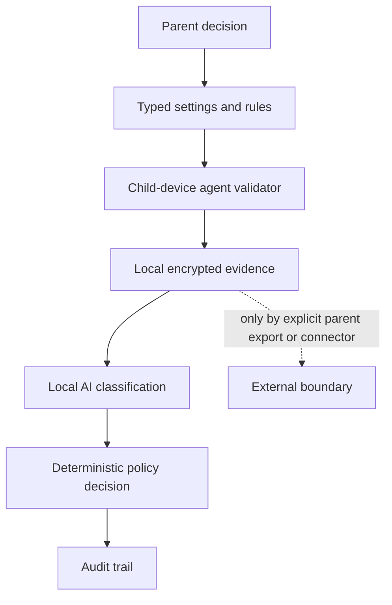
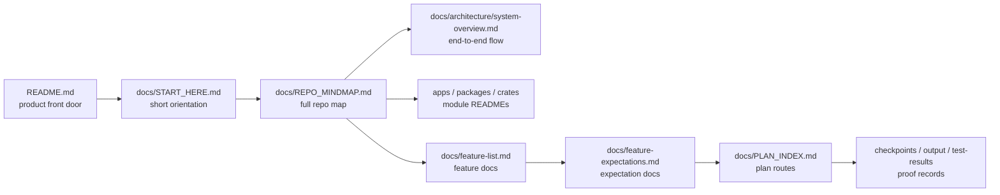

# Ocentra Parent

<p align="center">
  
</p>

Ocentra Parent is a local-first family-safety system from Ocentra. It is designed
to run mostly inside the household: a child-device agent records real activity
evidence locally, parent-owned apps and devices show visibility/control, and
Ocentra-hosted services stay out of child-activity data custody by default.

`family.ocentra.ca` is the public website, download, account, subscription, docs,
update, and optional stateless report-compile surface. It is not the source of
truth for child activity data.

## Contents

- [Important Capability And Data Notice](#important-capability-and-data-notice)
- [What This App Is](#what-this-app-is)
- [What Problem We Are Solving](#what-problem-we-are-solving)
- [Why Existing Approaches Are Not Enough](#why-existing-approaches-are-not-enough)
- [What Ocentra Offers](#what-ocentra-offers)
- [Your House, Your Rules](#your-house-your-rules)
- [Parent Control, Child Trust, And Transparency](#parent-control-child-trust-and-transparency)
- [Why Ocentra](#why-ocentra)
- [Product Capability Contract](#product-capability-contract)
- [Data Custody Rule](#data-custody-rule)
- [How The System Works](#how-the-system-works)
- [Remote Parent Access](#remote-parent-access)
- [Security And Privacy Model](#security-and-privacy-model)
- [Current Repository State](#current-repository-state)
- [Repo Navigation](#repo-navigation)
- [Important Docs](#important-docs)
- [Engineering Principles](#engineering-principles)
- [Current Shape](#current-shape)
- [Transparency And Commercial Use Notice](#transparency-and-commercial-use-notice)

## Important Capability And Data Notice

> [!IMPORTANT]
> Ocentra Parent is a powerful household safety tool. When enabled by a parent or
> guardian, the child-device agent can process sensitive device signals such as
> location/device status, browser activity, app/game sessions, network metadata,
> screen-analysis summaries, policy/enforcement state, and audit/proof records.
> It is designed to be visible, typed, parent-controlled, and proof-gated, not a
> hidden surveillance system. Install and configure it only when you understand
> the enabled capabilities, household rules, child disclosures, and applicable
> consent or legal requirements.

> [!CAUTION]
> Do not use Ocentra Parent for unauthorized monitoring, access, control, or
> invasion of privacy. The project is intended for legitimate parent/guardian
> administration of household devices and must be used within the law and the
> rules of the devices, accounts, schools, and platforms involved.

> [!IMPORTANT]
> By default, Ocentra does not collect, sell, host, or retain family activity
> records. Evidence, configuration, reports, proof records, and parent-owned
> exports are stored locally or in a parent-selected destination. The product
> design requires encrypted storage and authenticated parent/child-device access;
> Ocentra-hosted services are not the default custody holder and do not receive a
> default copy of the family data. If Ocentra never receives the data or keys, it
> cannot restore them. Parents are responsible for any configured storage
> destination, backup, retention, access control, and deletion policy.

Read the detailed rules in [Data Custody And Local-First Expectations](docs/expectations/data-custody.md),
[Security And Privacy Model](#security-and-privacy-model), and
[Product Constitution](docs/product-constitution.md).

## What This App Is

Ocentra Parent is a parent-controlled local agent, parent portal, and policy
system for household devices. It is built to observe real device activity where
that activity actually happens: inside the device, not only from a cloud account,
a platform profile, or an after-the-fact dashboard.

The product exists for a real parent problem: children live inside browsers,
games, chats, short-form video, school apps, and social feeds, while parents
often only see the outside story. A child can look like they are studying while
bouncing between TikTok, Snapchat, Discord, games, adult content, or other
distracting and unsafe parts of the internet.

Ocentra Parent is not trying to be a cloud surveillance platform. The core
product is:

- a headless local agent on the child device,
- a local evidence journal and SQLite query store,
- local AI and deterministic policy evaluation,
- parent-controlled rules and approvals,
- local/LAN parent visibility,
- optional parent-owned sync/report storage,
- minimal remote alerts and account/subscription services.

Product posture is parent-controlled, not Ocentra-moralized. Ocentra provides
transparent capabilities, honest status, typed rules, local privacy boundaries,
and auditable outcomes. Parents decide which observation modes, schedules,
categories, time limits, report paths, and enforcement actions fit their child
and household.

## What Problem We Are Solving

The internet is no longer a single browser window a parent can check. It is a
mix of browsers, profiles, apps, games, chats, video feeds, school tools,
notifications, VPNs, side-loaded clients, shared devices, and recommendation
systems built to hold attention.

Parents need more than a cloud dashboard that assumes the child uses the right
account or profile. They need local, explainable, device-level visibility and
control that can answer practical questions:

- What app, site, game, screen, network, location, or policy state was actually
  involved?
- Which local record supports an alert, report, rule, block, approval, or action
  result?
- Is the source live, stale, unavailable, degraded, manual-required, or only a
  scaffold?
- Did the device enforce the parent rule, or only record a proof/checkpoint that
  more work is required?

## Why Existing Approaches Are Not Enough

Many parental-control tools start outside the device: from a cloud account,
phone ecosystem, browser profile, DNS setting, router rule, or platform policy.
Those controls can help, but they often depend on assumptions that fail in real
households:

- the child stays inside the expected profile;
- the platform correctly knows the child's age;
- the browser, app, game, or video service cooperates;
- the device does not have another account, local app, unmanaged browser, VPN,
  hotspot, side-loaded client, or borrowed device path;
- the parent sees enough context to distinguish homework, harmless use,
  distraction, risky behavior, or actual danger.

A platform age gate or government-level under-age ban can move pressure onto
large platforms, but it cannot replace household-level supervision on the device
itself. Real protection needs a local control point that can see the device state
and enforce the parent's rules where the activity happens.

## What Ocentra Offers

Ocentra's intended difference is local-first, device-level, evidence-backed
control:

- **Inside-the-device guardrail:** The child agent runs locally, observes typed
  device facts, and gives the parent a closer view than cloud-only dashboards.
- **Evidence-backed decisions:** Alerts, reports, limits, approvals, and actions
  should point to local records and clear source labels.
- **Parent-owned rules:** Parents define schedules, limits, categories,
  approvals, visibility modes, report paths, and enforcement choices.
- **Local AI and policy:** AI assistance and deterministic rules are designed to
  run close to the evidence instead of making Ocentra the default data holder.
- **Honest status:** Unsupported, degraded, manual-required, scaffold-only, and
  proof-only paths must be labeled instead of marketed as finished features.
- **Parent-owned data custody:** Ocentra-hosted systems are for account, billing,
  downloads, entitlement, updates, minimal notification routing, relay, and
  optional stateless compile boundaries; they are not the default family-data
  warehouse.

## Your House, Your Rules

> [!NOTE]
> Ocentra's core motto is: **your house, your rules; your child, your
> responsibility.** Governments, platforms, schools, and app stores can set broad
> policies, but they cannot understand every household, child, schedule, device,
> risk level, and parenting decision. Ocentra is built to give parents the local
> tools to define and enforce their own rules, with visible status and evidence
> instead of blind trust in a remote platform.

A ban alone rarely solves the practical problem. It often moves responsibility
from one place to another: from government to platform, from platform to profile,
from profile to device, and finally back to the parent when the child finds a
path around it. Ocentra is built around the final control point: the device and
the household rule.

## Parent Control, Child Trust, And Transparency

> [!NOTE]
> Ocentra is intentionally capable, but capabilities should not all be enabled by
> default. Parents choose the rules and features they need. Ocentra provides the
> tools, typed controls, evidence labels, and safety boundaries; the household
> decides what is appropriate.

This is not about assuming a child is bad or untrustworthy. It is about not
trusting the environment around them. Modern feeds, ads, games, notifications,
shorts, reels, and recommendation systems are engineered to compete for
attention. Young minds wander; adults do too. Screen-time discipline is not only
about punishment or control. It is about helping the household build healthier
boundaries around systems designed to be addictive.

Ocentra endorses transparency between parent and child wherever safety allows.
The goal is not secret control for its own sake. The goal is a parent-visible,
child-aware, auditable control surface that protects the child from a noisy and
aggressive digital environment while keeping family data out of Ocentra custody
by default.

## Why Ocentra

Most parental-control products start from an account, a cloud dashboard, or a
platform ecosystem. Ocentra starts from the child device. The product goal is a
local agent that can see real device activity, explain it with evidence, apply
parent rules, and keep child activity data out of Ocentra custody by default.

Ocentra should matter to parents because it is designed around these promises:

- Local-first protection: activity evidence, AI classification, policy
  decisions, timers, and enforcement run on the child device by default.
- No default child-data warehouse: Ocentra-hosted services are for account,
  billing, downloads, entitlement, notification routing, relay, and optional
  stateless compile boundaries, not default storage of child activity.
- AI for high-tech and low-tech parents: a parent should be able to ask the
  assistant to set a bedtime schedule, block or limit a category, explain why a
  video or app was flagged, draft a rule, preview the result, and tune it in the
  portal.
- Context-aware control: Ocentra is built to combine browser URL evidence,
  app/game sessions, network summaries, local screen summaries, schedules,
  parent rules, and local AI output instead of only offering simple allow/block
  toggles.
- Social and video direction: social apps, video URLs, visible content, and
  interaction context must become first-class evidence and policy targets where
  platform permissions allow them. The goal is not to trust a single age rating
  when local evidence can support a better parent decision.
- Honest platform status: if a capability is unsupported, degraded,
  manual-required, scaffold-only, or waiting on an OS entitlement, the product
  must say so.

Compared with Google Family Link, Apple Screen Time, Microsoft Family Safety,
Bark, Qustodio, Norton Family, Net Nanny, Canopy, Kidslox, FamilyTime, and
FamiSafe, Ocentra's intended position is local-first, AI-assisted, and
evidence-backed. The current parity/gap map is tracked in
[Competitor Capability Map](docs/competitor-capability-map.md).

## Product Capability Contract

The README is the product-facing entry point. The authoritative requirements
live in:

- [Product Constitution](docs/product-constitution.md): why Ocentra exists, what
  claims are allowed, and what status words mean.
- [Product Capability Checklist](docs/product-capability-checklist.md): feature
  status, expectation docs, current proof, and next gap.
- [Feature List](docs/feature-list.md): per-feature docs with competitor
  pressure, roadmap links, expectations, gaps, and checklists.
- [Feature Expectations](docs/feature-expectations.md): expectation files that
  define what each feature must prove.
- [Product Roadmap](docs/product-roadmap.md): milestone order from V0.1 through
  production hardening.

Repo navigation and module ownership live in:

- [Repo Mindmap](docs/REPO_MINDMAP.md): top-down path through the repository.
- [Module Map](docs/MODULE_MAP.md): product area to module/plan ownership.
- [Module README Coverage](docs/MODULE_README_COVERAGE.md): exact module README target set.
- [Dependency Boundary Matrix](docs/DEPENDENCY_BOUNDARY_MATRIX.md): intended package/crate dependency boundaries.
- [Event Flow Map](docs/EVENT_FLOW_MAP.md): event/request/read-model chain standard.

User-facing product copy may describe the intended finished product. Repository
status must still point back to the checklist and roadmap so "what we have" and
"what we are building" stay separate.

## Data Custody Rule

Ocentra does not store child activity evidence by default.

| Data or service                  | Default owner/location                  | Ocentra-hosted by default |
| -------------------------------- | --------------------------------------- | ------------------------- |
| Raw evidence journal             | Child device                            | No                        |
| SQLite activity query store      | Child device                            | No                        |
| Browser URL/tab evidence         | Child device local store                | No                        |
| App/game/process sessions        | Child device local store                | No                        |
| Screen-analysis temporary images | Child device encrypted temp queue       | No                        |
| Local AI and policy decisions    | Child device                            | No                        |
| Parent rules and approvals       | Child/parent devices                    | No                        |
| Generated family reports         | Parent device or parent-owned storage   | No                        |
| Parent-owned cloud sync          | Google Drive, OneDrive, iCloud, etc.    | No                        |
| Downloads, billing, entitlements | Ocentra-hosted account/control plane    | Yes, no child evidence    |
| Notification delivery metadata   | Provider/Ocentra minimal route boundary | Minimal only              |
| Stateless report compilation     | Ocentra-hosted transient worker         | No retained family data   |

Parent-owned storage means the parent configures the destination: Google Drive,
OneDrive, iCloud Drive, Dropbox, a NAS, or another explicit storage target.
Ocentra may provide connectors and schemas, but it must not silently become the
family-data warehouse.

See [Data Custody And Local-First Expectations](docs/expectations/data-custody.md)
for the full rule.

## How The System Works

The normal product path is local:



The current repo uses a Vite web portal as a development scaffold so the Rust
agent path can be tested. The production parent portal should be packaged for
parent-owned devices. Tauri is the preferred desktop-shell candidate unless a
later architecture decision replaces it.

The evidence pipeline is intentionally boring and replayable:

```text
capture -> encrypted NDJSON journal -> SQLite query store -> local AI/policy/enforcement -> local API -> parent portal/reports
```

NDJSON is the append-only source of truth. SQLite is the default cross-platform
query/index layer for time windows, joins, summaries, and reports. Local AI and
policy evaluation happen after evidence is written or from a typed observation
that will be written.

For the full code-level flow from UI to TypeScript contracts, Rust protocol,
service orchestration, runtime crates, eventing, read models, and reports, see
[System Overview](docs/architecture/system-overview.md).

## Remote Parent Access

Away-from-home use should not require Ocentra to store child data.



Remote modes must label the source clearly:

- live child agent over local/LAN,
- authenticated relay to a reachable child agent,
- parent device cache,
- parent-owned storage,
- Ocentra-hosted account/subscription metadata,
- unavailable/stale/degraded.

Push, WhatsApp, email, SMS, or in-app notifications carry minimal detail by
default. Sensitive context stays behind the authenticated parent app, local/LAN
access, or parent-owned storage.

## Security And Privacy Model

The security model is transparent custody plus typed control:



Security and privacy commitments:

- Child-device safety decisions run locally.
- Ocentra-hosted services do not store raw child evidence or generated reports
  by default.
- Parent rules are household decisions, not hidden Ocentra value judgments.
- Every sensitive mode needs visible settings, status, and audit history.
- Network evidence is metadata-first; no decrypted HTTPS payloads or normal raw
  packet dumps.
- Browser URL evidence requires a managed-browser boundary; process/window or
  network metadata alone cannot prove exact tab URL.
- Screen evidence, when enabled by the parent, is local-only: encrypted temporary
  queue, local OCR/vision, typed summary, then image deletion.
- Parent-owned storage connectors use explicit scopes and visible destination
  status.
- Notifications minimize child detail and link back to authenticated parent
  surfaces for sensitive context.
- Future Ocentra-hosted child-data custody would require a separate product,
  security, privacy, retention, deletion, and validation design before code.

## Current Repository State

> [!WARNING]
> This repository is beyond the initial scaffold, but it is not a finished
> consumer parental-control product. It is an active commercial-development
> repository with substantial workspace layout, domain boundaries, validation
> gates, Rust crate boundaries, local/LAN development APIs, a Vite development
> portal, MSI/update scaffolding, package-preview scaffolds for target platforms,
> dependency/security gates, and SBOM generation already present. Product
> completion, platform parity, distribution, support, and some enforcement/mobile
> claims remain proof-gated and under development.

Implemented foundation:

- TypeScript workspaces and Rust crates.
- Effect Schema domain contracts.
- Rust protocol parity for shared contracts.
- Encrypted append-only activity journal.
- SQLite activity query/read-model direction.
- Local Rust service and WebSocket intent/event paths.
- Local and LAN dev scripts with fixed ports.
- Windows MSI and updater scaffold.
- Package-preview scaffolds for Linux, macOS, Android, and iOS.
- Security scans, dependency policy, validation gates, and CI.

Current proof-backed work includes browser URL/tab evidence direction,
app/game sessions, network summaries, local screen-analysis queue summaries,
local AI dry-run policy evaluation, local provider/runtime status, activity
report persistence/family fanout/MIA context, enforcement spine proof, LAN
pairing/control proof, parent desktop shell proof, and Android/iOS packaging
scaffolds.

Not product-complete yet:

- Consumer first-run setup, child profiles, co-parent/observer UX, and recovery.
- Full parent policy UI for rules, schedules, exceptions, approvals, and audit.
- Product-grade parent assistant flow for "ask AI to set this up" actions.
- Broad app/browser/domain/network enforcement adapters across platforms.
- Social/message/video monitoring as a first-class product area.
- Location/geofence/SOS/battery product runtime.
- Android child-agent privileged behavior on real devices.
- iOS child-agent entitlement/device proof.
- Remote away-from-home control without default Ocentra child-data custody.
- Notification delivery, reports, billing, public website, support, store
  distribution, and production signing.

Use [Product Capability Checklist](docs/product-capability-checklist.md) for the
current feature-by-feature status.

## Repo Navigation

This README is the product-facing front door. It keeps the parent/problem/product
story in one place and routes deeper readers into the repo map, architecture,
module boundaries, feature docs, expectation docs, plan routes, and proof records.



Primary navigation paths:

- [Start Here](docs/START_HERE.md): short human orientation route.
- [Repo Mindmap](docs/REPO_MINDMAP.md): full visual map from README to architecture, modules, features, expectations, plans, and proof.
- [System Overview](docs/architecture/system-overview.md): UI -> TypeScript contracts -> Rust protocol/service -> runtime -> journal/read model -> policy/action/report flow.
- [Module Map](docs/MODULE_MAP.md): product area to app/package/crate/feature/plan ownership matrix.
- [Module README Coverage](docs/MODULE_README_COVERAGE.md): repo-derived target list for app, package, and crate READMEs.
- [Dependency Boundary Matrix](docs/DEPENDENCY_BOUNDARY_MATRIX.md): intended dependency direction and feature-to-feature communication rules.
- [Event Flow Map](docs/EVENT_FLOW_MAP.md): command -> owner -> event/request -> consumer -> stored result -> read model/UI chain.

## Important Docs

Primary navigation:

- [Start Here](docs/START_HERE.md)
- [Repo Mindmap](docs/REPO_MINDMAP.md)
- [System Overview](docs/architecture/system-overview.md)
- [Module Map](docs/MODULE_MAP.md)
- [Module README Coverage](docs/MODULE_README_COVERAGE.md)
- [Dependency Boundary Matrix](docs/DEPENDENCY_BOUNDARY_MATRIX.md)
- [Event Flow Map](docs/EVENT_FLOW_MAP.md)
- [Module README Standard](docs/MODULE_README_STANDARD.md)

Product and feature truth:

- [Product Roadmap](docs/product-roadmap.md)
- [Product Constitution](docs/product-constitution.md)
- [Feature List](docs/feature-list.md)
- [Product Capability Checklist](docs/product-capability-checklist.md)
- [Competitor Capability Map](docs/competitor-capability-map.md)
- [Feature Expectations](docs/feature-expectations.md)
- [Data Custody And Local-First Expectations](docs/expectations/data-custody.md)
- [Cloud Feature Expectations](docs/expectations/cloud.md)
- [Sync And Export Expectations](docs/expectations/sync-export.md)
- [Portal Feature Expectations](docs/expectations/portal.md)
- [Capture Feature Expectations](docs/expectations/capture.md)
- [Browser URL And Tab Evidence Expectations](docs/expectations/browser-evidence.md)
- [Browser URL And Tab Evidence Capture Architecture](docs/architecture/browser-url-tab-evidence-capture.md)
- [App And Game Evidence Expectations](docs/expectations/app-game-evidence.md)
- [Network Flow Evidence Expectations](docs/expectations/network-flow-evidence.md)
- [Network Flow Evidence Capture Architecture](docs/architecture/network-flow-evidence-capture.md)
- [Screen Evidence Analysis Expectations](docs/expectations/screen-evidence.md)
- [Policy Feature Expectations](docs/expectations/policy.md)
- [Enforcement Feature Expectations](docs/expectations/enforcement.md)
- [System Boundaries](docs/architecture/system-boundaries.md)
- [Release And Update Architecture](docs/architecture/release-update.md)

## Engineering Principles

- Domain packages own shared contracts.
- Runtime apps and Rust crates consume contracts instead of inventing local
  strings.
- Effect Schema is the TypeScript validation standard.
- Branded strings must come from schema decoders.
- Runtime source does not own inline string literals; domains own text, ids,
  routes, commands, events, fields, and protocol names.
- Runtime app TypeScript does not annotate values as raw `string`; app code
  receives branded domain values or parses external `unknown` input at the
  boundary.
- Source files and functions have shape budgets. Validation warns at 80% and
  fails when a module becomes too large.
- Test doubles are forbidden. Tests must exercise real contracts, parsers,
  localhost services, and transport boundaries.
- Tests are required for every source workspace and Rust crate from the start.
- Rust service execution is async and Tokio multithreaded by default.
- NDJSON is the append-only evidence journal.
- SQLite is the default local query store.

## Current Shape

This repository is source-visible for transparency, so this section describes the
source tree without treating the repository as an open-source distribution or a
self-hosting guide. For module-to-plan ownership, see
[Module Plan Map](docs/MODULE_PLAN_MAP.md). For exact README coverage targets,
see [Module README Coverage](docs/MODULE_README_COVERAGE.md).

```text
OcentraParent/
  README.md                 Product-facing front door and transparency notice.
  AGENTS.md                 Agent/doc routing entry point.
  package.json              npm workspace root: apps/* and packages/*.
  Cargo.toml                Rust workspace root: 31 crates, UNLICENSED.
  docs/                     Product truth, expectations, features, plans, architecture, audits, route indexes.
  .ocentra-ai/rules/        Repo-specific engineering and agent rules.
  .github/                  CI, validation, release, and branch-protection workflows.
  apps/                     Parent-facing app workspaces.
    local-api/              TypeScript local API manifest/route metadata.
    parent-desktop/         Tauri parent desktop shell candidate.
    portal/                 Vite parent portal surface.
  packages/                 TypeScript domain/contract workspaces.
    activity-domain/        Activity, evidence projection, journal/query/read-model contracts.
    agent-protocol-domain/  TypeScript command/event protocol boundary.
    ai-domain/              Local AI, evaluator, provider, context, assistant contracts.
    app-game-domain/        App/game identity, session, approval, and action-readiness contracts.
    billing-domain/         Billing, entitlement, subscription, device-limit, support contracts.
    browser-domain/         Browser URL/tab, managed/unmanaged, browser-control contracts.
    capability-domain/      Capability, status, manual/degraded/unavailable state contracts.
    child-runtime-domain/   Child runtime handoff, queue, dispatch, receipt contracts.
    data-custody-domain/    Storage, retention, export, delete, sync-boundary contracts.
    endpoint-domain/        Endpoint, path, header, query, and version constants.
    enforcement-domain/     Action, adapter, integrity, rollback, and audit contracts.
    event-domain/           Shared event/request/result envelope contracts.
    evidence-domain/        Evidence ids, refs, source labels, and record primitives.
    family-domain/          Household, profile, device role, and family identity contracts.
    lan-domain/             LAN discovery, pairing, route, trust, lease, and role contracts.
    logging-domain/         Structured logging, redaction, app/test/proof log contracts.
    network-domain/         Network flow, domain, analyzer, and remote-delivery contracts.
    notification-domain/    Notification intent, outbox, scheduler, provider, receipt contracts.
    parent-domain/          Parent-facing product projections and cross-feature composition.
    policy-domain/          Rules, schedules, budgets, overrides, and preview contracts.
    portal-domain/          Portal route ids, panel ids, DOM ids, and dev-command descriptors.
    production-domain/      Release, support, publication, package, production-readiness contracts.
    remote-access-domain/   Remote route, session, relay/cache/storage, capability-fabric contracts.
    schema-domain/          Canonical Effect Schema and brand foundation.
    screen-domain/          Screen analysis, visibility, queue, retention, live-view contracts.
    setup-domain/           Setup, provisioning, bootstrap, pairing, install/setup contracts.
    text-domain/            Schema-backed display text tokens.
    tracking-domain/        Location, geofence, device status, place, check-in contracts.
  crates/                   Rust runtime, protocol, evidence, eventing, storage, and platform crates.
    agent-core/             Shared local runtime helpers and reusable feature logic.
    agent-protocol/         Rust protocol parity and wire constants.
    agent-service/          Local/LAN service transport and orchestration.
    agent-updater/          Update/package maintenance boundary.
    app-core/               Shared app/runtime primitives.
    app-game-core/          App/game runtime logic and proof-gated adapters.
    billing-core/           Billing/entitlement runtime helpers.
    browser-core/           Browser runtime logic and proof-gated adapters.
    child-ai-core/          Child-local evaluator/provider runtime boundary.
    child-enforcement-core/ Child action/adapters/integrity boundary.
    child-notification-core/ Child notification handoff boundary.
    child-policy-core/      Child policy evaluation and schedule/budget runtime boundary.
    child-runtime/          Child runtime handoff, queue, dispatch, receipt, status boundary.
    entitlement-core/       Entitlement and license state boundary.
    family-identity-core/   Household/profile/device identity runtime boundary.
    lan-core/               LAN discovery, route, pairing, and lease runtime boundary.
    logging-core/           Rust logging/proof trace boundary.
    network-core/           Network runtime/read-model/adapter boundary.
    ocentra-eventing/       Event bus, request, journal, replay, proof primitives.
    ocentra-evidence/       Evidence refs, record helpers, local record primitives.
    ocentra-network-evidence/ Network metadata parser/replay helpers.
    parent-runtime-core/    Parent runtime route/read-model helpers.
    policy-control-core/    Policy control-plane runtime helpers.
    provisioning-core/      Setup/provisioning/bootstrap runtime boundary.
    remote-access-core/     Remote route/session/capability runtime boundary.
    screen-ai-core/         Screen AI job/result/runtime boundary.
    screen-capture-adapter/ Platform screen capture adapter boundary.
    screen-core/            Screen record/read-model/runtime boundary.
    screen-live-view-core/  Screen live-view session/capability boundary.
    storage-custody-core/   Storage, export, delete, retention, sync runtime boundary.
    tracking-core/          Tracking/location/geofence/read-model runtime boundary.
  scripts/                  Internal validation, CI, release, proof, dev, ledger, and guardrail tooling.
  platforms/                Android/iOS scaffold and future platform proof surfaces.
  infra/                    Hosted/control-plane infrastructure where applicable.
  output/                   Generated proof/output artifacts when present; not product truth by itself.
  test-results/             Test/proof artifacts when present; route through checklist and feature docs.
```

This tree is documentation for transparency. It does not grant permission to reuse the product source.

## Transparency And Commercial Use Notice

> [!IMPORTANT]
> This repository is source-visible for product transparency. It is published so
> families, reviewers, researchers, platforms, and safety/privacy readers can
> understand what Ocentra Parent is intended to do, how it is designed to work,
> where data custody boundaries sit, and where people can raise concerns or give
> feedback.

> [!CAUTION]
> This repository is **not open source**. No GPL, MIT, Apache, or other open-source
> license is granted. All code, architecture, product design, documentation,
> names, workflows, proof systems, and implementation details remain proprietary
> to Ocentra unless a separate written license says otherwise.

> [!CAUTION]
> Reading this repository for transparency, review, or feedback is allowed. Reuse,
> redistribution, repackaging, commercial use, or incorporation into another
> product requires explicit written permission from Ocentra.

> [!NOTE]
> Build, self-host, and local-run instructions are intentionally not provided in
> this public README. Product installation, support, and commercial access are
> provided only through official Ocentra channels. Feedback about safety,
> privacy, documentation, product behavior, or capability boundaries is welcome;
> code contributions are not assumed accepted unless Ocentra explicitly requests
> them under separate terms.
