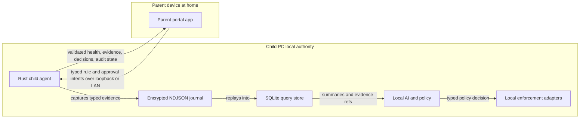
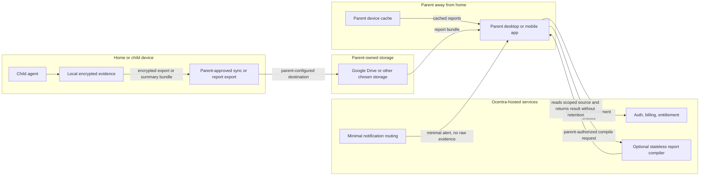
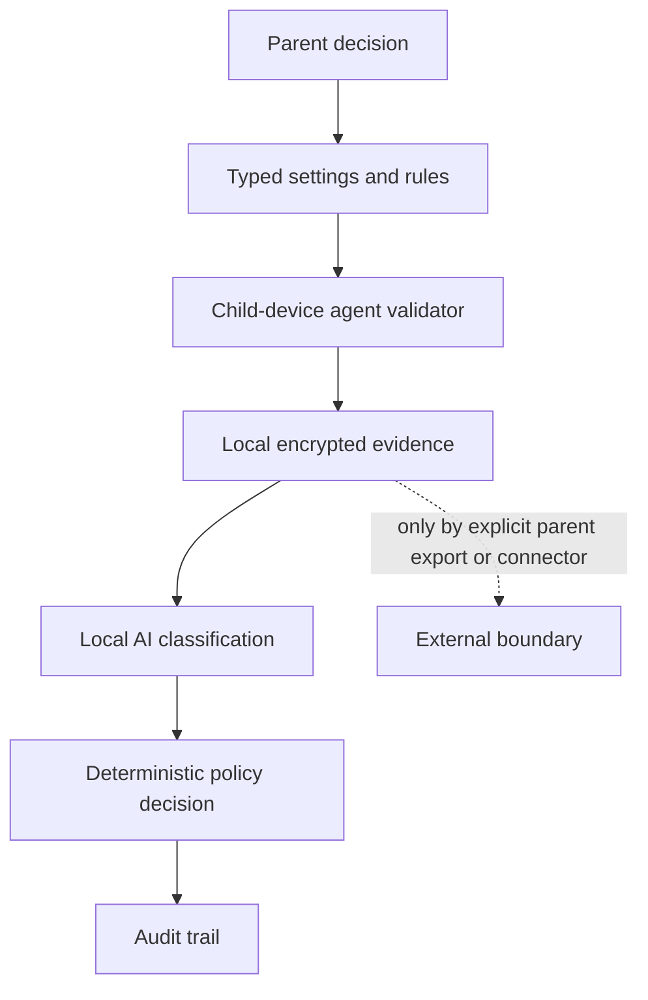

# Ocentra Parent

Ocentra Parent is a local-first family-safety system from Ocentra. It is designed
to run mostly inside the household: a child-device agent records real activity
evidence locally, parent-owned apps and devices show visibility/control, and
Ocentra-hosted services stay out of child-activity data custody by default.

`family.ocentra.ca` is the public website, download, account, subscription, docs,
update, and optional stateless report-compile surface. It is not the source of
truth for child activity data.

## Contents

- [What This App Is](#what-this-app-is)
- [Why Ocentra](#why-ocentra)
- [Product Capability Contract](#product-capability-contract)
- [Data Custody Rule](#data-custody-rule)
- [How The System Works](#how-the-system-works)
- [Remote Parent Access](#remote-parent-access)
- [Security And Privacy Model](#security-and-privacy-model)
- [Current Repository State](#current-repository-state)
- [Important Docs](#important-docs)
- [Commands](#commands)
- [Release Scaffold](#release-scaffold)
- [Local Dev Loop](#local-dev-loop)
- [LAN Dev Loop](#lan-dev-loop)

## What This App Is

The product exists for a real parent problem: children live inside browsers,
games, chats, short-form video, school apps, and social feeds, while parents
often only see the outside story. A child can look like they are studying while
bouncing between TikTok, Snapchat, Discord, games, adult content, or other
distracting and unsafe parts of the internet.

Ocentra Parent is not trying to be a cloud surveillance platform. The core
product is:

- a headless local agent on the child device,
- a local evidence journal and SQLite query store,
- local AI and deterministic policy evaluation,
- parent-controlled rules and approvals,
- local/LAN parent visibility,
- optional parent-owned sync/report storage,
- minimal remote alerts and account/subscription services.

Product posture is parent-controlled, not Ocentra-moralized. Ocentra provides
transparent capabilities, honest status, typed rules, local privacy boundaries,
and auditable outcomes. Parents decide which observation modes, schedules,
categories, time limits, report paths, and enforcement actions fit their child
and household.

## Why Ocentra

Most parental-control products start from an account, a cloud dashboard, or a
platform ecosystem. Ocentra starts from the child device. The product goal is a
local agent that can see real device activity, explain it with evidence, apply
parent rules, and keep child activity data out of Ocentra custody by default.

Ocentra should matter to parents because it is designed around these promises:

- Local-first protection: activity evidence, AI classification, policy
  decisions, timers, and enforcement run on the child device by default.
- No default child-data warehouse: Ocentra-hosted services are for account,
  billing, downloads, entitlement, notification routing, relay, and optional
  stateless compile boundaries, not default storage of child activity.
- AI for high-tech and low-tech parents: a parent should be able to ask the
  assistant to set a bedtime schedule, block or limit a category, explain why a
  video or app was flagged, draft a rule, preview the result, and tune it in the
  portal.
- Context-aware control: Ocentra is built to combine browser URL evidence,
  app/game sessions, network summaries, local screen summaries, schedules,
  parent rules, and local AI output instead of only offering simple allow/block
  toggles.
- Social and video direction: social apps, video URLs, visible content, and
  interaction context must become first-class evidence and policy targets where
  platform permissions allow them. The goal is not to trust a single age rating
  when local evidence can support a better parent decision.
- Honest platform status: if a capability is unsupported, degraded,
  manual-required, scaffold-only, or waiting on an OS entitlement, the product
  must say so.

Compared with Google Family Link, Apple Screen Time, Microsoft Family Safety,
Bark, Qustodio, Norton Family, Net Nanny, Canopy, Kidslox, FamilyTime, and
FamiSafe, Ocentra's intended position is local-first, AI-assisted, and
evidence-backed. The current parity/gap map is tracked in
[Competitor Capability Map](docs/competitor-capability-map.md).

## Product Capability Contract

The README is the product-facing entry point. The authoritative requirements
live in:

- [Product Constitution](docs/product-constitution.md): why Ocentra exists, what
  claims are allowed, and what status words mean.
- [Product Capability Checklist](docs/product-capability-checklist.md): feature
  status, expectation docs, current proof, and next gap.
- [Feature List](docs/feature-list.md): per-feature docs with competitor
  pressure, roadmap links, expectations, gaps, and checklists.
- [Feature Expectations](docs/feature-expectations.md): expectation files that
  define what each feature must prove.
- [Product Roadmap](docs/product-roadmap.md): milestone order from V0.1 through
  production hardening.

User-facing product copy may describe the intended finished product. Repository
status must still point back to the checklist and roadmap so "what we have" and
"what we are building" stay separate.

## Data Custody Rule

Ocentra does not store child activity evidence by default.

| Data or service                  | Default owner/location                  | Ocentra-hosted by default |
| -------------------------------- | --------------------------------------- | ------------------------- |
| Raw evidence journal             | Child device                            | No                        |
| SQLite activity query store      | Child device                            | No                        |
| Browser URL/tab evidence         | Child device local store                | No                        |
| App/game/process sessions        | Child device local store                | No                        |
| Screen-analysis temporary images | Child device encrypted temp queue       | No                        |
| Local AI and policy decisions    | Child device                            | No                        |
| Parent rules and approvals       | Child/parent devices                    | No                        |
| Generated family reports         | Parent device or parent-owned storage   | No                        |
| Parent-owned cloud sync          | Google Drive, OneDrive, iCloud, etc.    | No                        |
| Downloads, billing, entitlements | Ocentra-hosted account/control plane    | Yes, no child evidence    |
| Notification delivery metadata   | Provider/Ocentra minimal route boundary | Minimal only              |
| Stateless report compilation     | Ocentra-hosted transient worker         | No retained family data   |

Parent-owned storage means the parent configures the destination: Google Drive,
OneDrive, iCloud Drive, Dropbox, a NAS, or another explicit storage target.
Ocentra may provide connectors and schemas, but it must not silently become the
family-data warehouse.

See [Data Custody And Local-First Expectations](docs/expectations/data-custody.md)
for the full rule.

## How The System Works

The normal product path is local:



The current repo uses a Vite web portal as a development scaffold so the Rust
agent path can be tested. The production parent portal should be packaged for
parent-owned devices. Tauri is the preferred desktop-shell candidate unless a
later architecture decision replaces it.

The evidence pipeline is intentionally boring and replayable:

```text
capture -> encrypted NDJSON journal -> SQLite query store -> local AI/policy/enforcement -> local API -> parent portal/reports
```

NDJSON is the append-only source of truth. SQLite is the default cross-platform
query/index layer for time windows, joins, summaries, and reports. Local AI and
policy evaluation happen after evidence is written or from a typed observation
that will be written.

## Remote Parent Access

Away-from-home use should not require Ocentra to store child data.



Remote modes must label the source clearly:

- live child agent over local/LAN,
- authenticated relay to a reachable child agent,
- parent device cache,
- parent-owned storage,
- Ocentra-hosted account/subscription metadata,
- unavailable/stale/degraded.

Push, WhatsApp, email, SMS, or in-app notifications carry minimal detail by
default. Sensitive context stays behind the authenticated parent app, local/LAN
access, or parent-owned storage.

## Security And Privacy Model

The security model is transparent custody plus typed control:



Security and privacy commitments:

- Child-device safety decisions run locally.
- Ocentra-hosted services do not store raw child evidence or generated reports
  by default.
- Parent rules are household decisions, not hidden Ocentra value judgments.
- Every sensitive mode needs visible settings, status, and audit history.
- Network evidence is metadata-first; no decrypted HTTPS payloads or normal raw
  packet dumps.
- Browser URL evidence requires a managed-browser boundary; process/window or
  network metadata alone cannot prove exact tab URL.
- Screen evidence, when enabled by the parent, is local-only: encrypted temporary
  queue, local OCR/vision, typed summary, then image deletion.
- Parent-owned storage connectors use explicit scopes and visible destination
  status.
- Notifications minimize child detail and link back to authenticated parent
  surfaces for sensitive context.
- Future Ocentra-hosted child-data custody would require a separate product,
  security, privacy, retention, deletion, and validation design before code.

## Current Repository State

This repository is beyond the initial scaffold, but it is not yet a finished
consumer parental-control product. The committed foundation includes workspace
layout, domain boundaries, validation gates, Rust crate boundaries, local and
LAN dev APIs, a Vite development portal, MSI/update scaffolding, package-preview
scaffolds for target platforms, dependency/security gates, and SBOM generation.

Implemented foundation:

- TypeScript workspaces and Rust crates.
- Effect Schema domain contracts.
- Rust protocol parity for shared contracts.
- Encrypted append-only activity journal.
- SQLite activity query/read-model direction.
- Local Rust service and WebSocket intent/event paths.
- Local and LAN dev scripts with fixed ports.
- Windows MSI and updater scaffold.
- Package-preview scaffolds for Linux, macOS, Android, and iOS.
- Security scans, dependency policy, validation gates, and CI.

Current proof-backed work includes browser URL/tab evidence direction,
app/game sessions, network summaries, local screen-analysis queue summaries,
local AI dry-run policy evaluation, local provider/runtime status, activity
report persistence/family fanout/MIA context, enforcement spine proof, LAN
pairing/control proof, parent desktop shell proof, and Android/iOS packaging
scaffolds.

Not product-complete yet:

- Consumer first-run setup, child profiles, co-parent/observer UX, and recovery.
- Full parent policy UI for rules, schedules, exceptions, approvals, and audit.
- Product-grade parent assistant flow for "ask AI to set this up" actions.
- Broad app/browser/domain/network enforcement adapters across platforms.
- Social/message/video monitoring as a first-class product area.
- Location/geofence/SOS/battery product runtime.
- Android child-agent privileged behavior on real devices.
- iOS child-agent entitlement/device proof.
- Remote away-from-home control without default Ocentra child-data custody.
- Notification delivery, reports, billing, public website, support, store
  distribution, and production signing.

Use [Product Capability Checklist](docs/product-capability-checklist.md) for the
current feature-by-feature status.

## Important Docs

- [Product Roadmap](docs/product-roadmap.md)
- [Product Constitution](docs/product-constitution.md)
- [Feature List](docs/feature-list.md)
- [Product Capability Checklist](docs/product-capability-checklist.md)
- [Competitor Capability Map](docs/competitor-capability-map.md)
- [Feature Expectations](docs/feature-expectations.md)
- [Data Custody And Local-First Expectations](docs/expectations/data-custody.md)
- [Cloud Feature Expectations](docs/expectations/cloud.md)
- [Sync And Export Expectations](docs/expectations/sync-export.md)
- [Portal Feature Expectations](docs/expectations/portal.md)
- [Capture Feature Expectations](docs/expectations/capture.md)
- [Browser URL And Tab Evidence Expectations](docs/expectations/browser-evidence.md)
- [Browser URL And Tab Evidence Capture Architecture](docs/architecture/browser-url-tab-evidence-capture.md)
- [App And Game Evidence Expectations](docs/expectations/app-game-evidence.md)
- [Network Flow Evidence Expectations](docs/expectations/network-flow-evidence.md)
- [Network Flow Evidence Capture Architecture](docs/architecture/network-flow-evidence-capture.md)
- [Screen Evidence Analysis Expectations](docs/expectations/screen-evidence.md)
- [Policy Feature Expectations](docs/expectations/policy.md)
- [Enforcement Feature Expectations](docs/expectations/enforcement.md)
- [System Boundaries](docs/architecture/system-boundaries.md)
- [Release And Update Architecture](docs/architecture/release-update.md)

## Engineering Principles

- Domain packages own shared contracts.
- Runtime apps and Rust crates consume contracts instead of inventing local
  strings.
- Effect Schema is the TypeScript validation standard.
- Branded strings must come from schema decoders.
- Runtime source does not own inline string literals; domains own text, ids,
  routes, commands, events, fields, and protocol names.
- Runtime app TypeScript does not annotate values as raw `string`; app code
  receives branded domain values or parses external `unknown` input at the
  boundary.
- Source files and functions have shape budgets. Validation warns at 80% and
  fails when a module becomes too large.
- Test doubles are forbidden. Tests must exercise real contracts, parsers,
  localhost services, and transport boundaries.
- Tests are required for every source workspace and Rust crate from the start.
- Rust service execution is async and Tokio multithreaded by default.
- NDJSON is the append-only evidence journal.
- SQLite is the default local query store.

## Current Shape

```text
apps/
  portal/          Vite dev portal for local and LAN agent visibility.
  parent-desktop/  Tauri parent desktop shell candidate.
  local-api/       Reserved TypeScript API boundary.
packages/
  schema-domain/          Shared Effect Schema helpers.
  endpoint-domain/        Endpoint/path/header brand boundaries.
  agent-protocol-domain/  WebSocket command/event contracts.
  text-domain/            Schema-backed display text tokens.
  portal-domain/          Portal route, DOM, nav, and service-state contracts.
  parent-domain/          Family, policy, enforcement, AI, LAN, mobile, and control contracts.
  activity-domain/        Capture, evidence, journal, query, browser, app/game, network, and screen contracts.
  logging-domain/         Effect Schema operational logging contracts.
crates/
  agent-core/      Local runtime core and adapter helpers.
  agent-protocol/  Rust protocol structs/constants matching shared contracts.
  agent-service/   Rust local/LAN HTTP and WebSocket service.
  agent-updater/   Update and maintenance binaries.
scripts/
  validation, dependency policy, platform packaging, smoke, and git hook guardrails.
platforms/
  android/      Android scaffold and future Android child-agent/parent-mobile proof.
  ios/          iOS simulator scaffold and future entitlement/device proof.
docs/
  constitution, roadmap, capability checklist, expectations, architecture, and checkpoints.
```

## Commands

```powershell
npm install
npm run hooks:install
npm run validate
```

Use `cmd /c npm ...` on Windows if PowerShell execution policy blocks npm shims.

## Release Scaffold

Releases are part of the scaffold because the Windows agent needs a repeatable
install/update path from the beginning.

```powershell
cmd /c npm run release:version
cmd /c npm run release:package:windows
```

Source pushes to `main` run the CI gate and build package-preview artifacts for
Windows, Linux, macOS, Android, and iOS simulator, but they do not publish GitHub
Releases. README-only, Markdown-only, and `docs/**` pushes are ignored by CI.

Production releases happen from the `production` branch only. After `main` is
green and the version is intentionally bumped, pushing/merging to `production`
builds the signed Windows release, creates tag `v<version>`, and publishes
GitHub Release assets. If the version tag already exists, the production
workflow still runs its gates and package previews, then skips publishing.
Package previews for Linux, macOS, Android, and iOS stay as CI artifacts until
their signing/store/update paths are deliberately promoted.

Package previews are not just archive builds. CI now performs install or launch
smoke checks for each scaffolded platform: MSI install/uninstall on Windows, DEB
install/remove on Linux, PKG payload validation on macOS, APK install/launch in
Android emulator, and app install/launch in iOS simulator.

Once a release exists, install on another Windows PC from an elevated PowerShell
session:

Latest Windows MSI download:

https://github.com/ocentra/OcentraParent/releases/latest/download/ocentra-parent-agent-windows-x64-latest.msi

That URL is intended for a future `family.ocentra.ca` download button. A browser
click downloads the MSI; Windows still requires the parent to open it and approve
the installer.

Support/admin one-line install:

```powershell
powershell -NoProfile -ExecutionPolicy Bypass -Command "irm https://github.com/ocentra/OcentraParent/releases/latest/download/install-ocentra-parent-agent-windows.ps1 | iex"
```

See [Release And Update Architecture](docs/architecture/release-update.md) for
the updater boundary. The MSI installs the headless service under
`%ProgramFiles%\Ocentra\Ocentra Parent Agent`, registers it as
`OcentraParentAgent`, starts it on install, and gives Windows a normal
uninstall/upgrade entry. It also installs `OcentraParentUpdater`, a separate
signed-manifest updater service that checks GitHub Release metadata and runs
quiet MSI upgrades.

The production Windows update manifest requires
`OCENTRA_PARENT_UPDATE_SIGNING_KEY_BASE64`. Future platform signing secrets for
Authenticode, macOS, Android store, and Apple store distribution are documented
in the repo but are not required until those release paths are implemented.

## Local Dev Loop

Run the loopback-only stack:

```powershell
cmd /c npm run dev
```

Or run the pieces separately:

```powershell
cmd /c npm run dev:agent
cmd /c npm run dev:portal
```

The portal connects to `ws://127.0.0.1:4477/api/dev/ws`, sends typed intent
envelopes from `@ocentra-parent/agent-protocol-domain`, and validates returned
events through Effect Schema. The Rust service still exposes
`http://127.0.0.1:4477/api/dev/log-snapshot` as a plain HTTP smoke endpoint.

Local development uses fixed Ocentra Parent ports:

- Rust agent service: `127.0.0.1:4477`
- Vite portal: `127.0.0.1:4478`

Use `npm run dev`, `npm run dev:agent`, or `npm run dev:portal` so
`scripts/dev/*` can reclaim only stale Ocentra Parent processes. Do not run the
portal on generic Vite ports like `5173` or the Ocentra Games asset-editor port
`5174`.

Parallel worker lanes can override those defaults without rewriting commands:

```powershell
$env:OCENTRA_PARENT_AGENT_PORT = "4677"
$env:OCENTRA_PARENT_PORTAL_PORT = "4678"
cmd /c npm run dev
```

With those overrides, the portal opens at `http://127.0.0.1:4678/#/commands`
and connects to `ws://127.0.0.1:4677/api/dev/ws`.

## LAN Dev Loop

Run the same scaffold over your local network:

```powershell
cmd /c npm run dev:lan
```

LAN mode keeps the same ports but binds both dev surfaces to the network:

- Rust agent service bind: `0.0.0.0:4477` by default, or
  `OCENTRA_PARENT_AGENT_PORT`
- Vite portal bind: `0.0.0.0:4478` by default, or
  `OCENTRA_PARENT_PORTAL_PORT`
- Portal URL from another device: `http://<this-pc-lan-ip>:4478/#/commands` by
  default
- Agent WebSocket URL from the portal: `ws://<this-pc-lan-ip>:4477/api/dev/ws`
  by default

The managed scripts auto-detect the first non-internal IPv4 address. If Windows
has multiple active network adapters, set the host explicitly:

```powershell
$env:OCENTRA_PARENT_LAN_HOST = "192.168.1.25"
cmd /c npm run dev:lan
```

LAN mode is explicit because it exposes the agent to other devices on the
network. The Rust service refuses non-loopback binds unless
`OCENTRA_PARENT_AGENT_LOCAL_NETWORK_ENABLED=true`, and browser origins are
restricted through `OCENTRA_PARENT_AGENT_ALLOWED_ORIGINS`.
