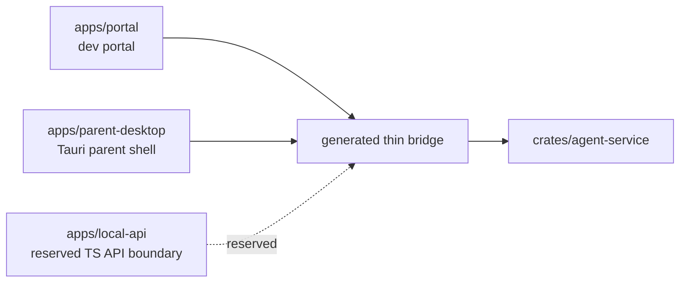

# Apps

The `apps/` workspace contains parent-facing application shells and API
experiments. Apps do not own product contracts or child-device authority.
TypeScript in apps is presentation-only or generated/thin edge code.

The parent UI bridge is Rust-owned in `crates/schema/src/parent_ui_bridge.rs`,
and `apps/portal/generated/parent-ui-bridge.ts` is the checked-in generated
thin binding layer consumed by the portal host bridge.

## Ownership

| App              | Owns                                                                                                              | Does not own                                                            |
| ---------------- | ----------------------------------------------------------------------------------------------------------------- | ----------------------------------------------------------------------- |
| `portal`         | Fast HMR dev portal surface for local/LAN proof, service-backed status, and UI validation.                       | Capture, AI model execution, policy evaluation, timers, enforcement, or contracts. |
| `parent-desktop` | Production desktop shell candidate that packages the parent portal and connects to typed local/LAN service paths. | Child-device runtime behavior, product contracts, or local model execution. |
| `local-api`      | Reserved generated/thin TypeScript API boundary if a future API belongs outside the Rust service.                 | Current localhost service behavior.                                     |

## Connected Docs

- [Product constitution](../docs/product-constitution.md)
- [Portal expectations](../docs/expectations/portal.md)
- [Platform expectations](../docs/expectations/platforms.md)
- [LAN pairing expectations](../docs/expectations/lan-pairing.md)
- [Product capability checklist](../docs/product-capability-checklist.md)

## Current Gaps

- First-run family setup, child profiles, policy authoring, reports,
  notifications, and AI action flow are not yet a finished parent product.
- Portal screens must stay service-backed. UI-only normal paths are not a
  product claim.
- Desktop and mobile parent shells need production packaging, signing, update,
  and route-status proof before user-facing distribution claims.
