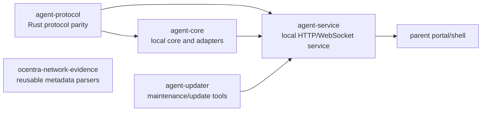

# Rust Crates

The Rust workspace owns runtime behavior. TypeScript packages own
portal/protocol-facing contract mirrors, display state, and UI rendering; they
must not become the source of truth for runtime decisions.

## Crate Ownership

| Crate                      | Owns                                                                                                                                              | Does not own                                                                               |
| -------------------------- | ------------------------------------------------------------------------------------------------------------------------------------------------- | ------------------------------------------------------------------------------------------ |
| `agent-core`               | Local runtime helpers, evidence/journal/query core, tracking state helpers, and platform-adapter logic that should not live in the service shell. | WebSocket transport or TypeScript contract definitions.                                    |
| `agent-protocol`           | Rust serde structs, constants, and enums that mirror Rust-crossing TypeScript contracts.                                                          | Product logic or platform behavior.                                                        |
| `agent-service`            | Local/LAN HTTP and WebSocket service, command handling, runtime orchestration, and parent portal read paths.                                      | Product contracts, UI rendering, or hidden cloud custody.                                  |
| `agent-updater`            | Signed-manifest/update maintenance tools and updater binaries.                                                                                    | Safety policy, capture, or enforcement.                                                    |
| `ocentra-eventing`         | Reusable local eventing, queueing, request/response, journal, replay, and proof helpers.                                                          | Parent-specific event taxonomy or platform behavior.                                       |
| `ocentra-network-evidence` | Reusable network metadata parsers and replay helpers for proof fixtures.                                                                          | Live capture, platform adapters, policy, enforcement, UI, or decrypted payload inspection. |

## Tracking Boundary

Tracking runtime and decision behavior belongs in Rust first. The current
minimal boundary is:

- `agent-core` owns tracking state helpers, local durable runtime state, and
  query/projection helpers that should not live in WebSocket transport. Tracking
  core code is grouped under `agent-core/src/tracking/` instead of new root-level
  `tracking_*` files.
- `agent-protocol` owns Rust serde structs, constants, command names, event
  names, field names, and state labels for tracking.
- `agent-service` owns transport, orchestration, WebSocket handlers, and
  response event construction only.
- TypeScript package code mirrors portal/protocol/read-model contracts and
  renders UI state. It must not grow tracking runtime decision ownership.

New Rust tracking tests should be placed in crate-level `tests/` directories
when the behavior can be tested through public crate APIs. Keep source-adjacent
test modules only for existing private implementation seams, binary-service
transport wiring, or when a focused private helper cannot be specified through
the public boundary.

## Connected Docs

- [Product constitution](../docs/product-constitution.md)
- [Platform expectations](../docs/expectations/platforms.md)
- [Enforcement expectations](../docs/expectations/enforcement.md)
- [AI expectations](../docs/expectations/ai.md)
- [Release installer expectations](../docs/expectations/release-installer.md)

## Current Gaps

- Broad OS capture/enforcement support remains platform-specific and proof-bound.
- Android/iOS child-agent parity is not implied by Rust contracts.
- Service hardening, support diagnostics, tamper/uninstall alerts, and
  production update behavior need explicit product/security proof.
