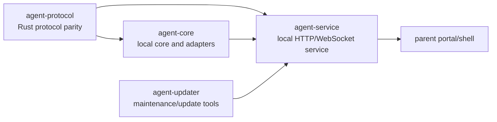

# Rust Crates

The Rust workspace owns child-device runtime behavior. TypeScript packages own
shared product/protocol contracts first; Rust mirrors Rust-crossing protocol
shapes and executes the local service/runtime paths.

## Crate Ownership

| Crate            | Owns                                                                                                                      | Does not own                                              |
| ---------------- | ------------------------------------------------------------------------------------------------------------------------- | --------------------------------------------------------- |
| `agent-core`     | Local runtime helpers, evidence/journal/query core, and platform-adapter logic that should not live in the service shell. | WebSocket transport or TypeScript contract definitions.   |
| `agent-protocol` | Rust serde structs, constants, and enums that mirror Rust-crossing TypeScript contracts.                                  | Product logic or platform behavior.                       |
| `agent-service`  | Local/LAN HTTP and WebSocket service, command handling, runtime orchestration, and parent portal read paths.              | Product contracts, UI rendering, or hidden cloud custody. |
| `agent-updater`  | Signed-manifest/update maintenance tools and updater binaries.                                                            | Safety policy, capture, or enforcement.                   |

## Connected Docs

- [Product constitution](../docs/product-constitution.md)
- [Platform expectations](../docs/expectations/platforms.md)
- [Enforcement expectations](../docs/expectations/enforcement.md)
- [AI expectations](../docs/expectations/ai.md)
- [Release installer expectations](../docs/expectations/release-installer.md)

## Current Gaps

- Broad OS capture/enforcement support remains platform-specific and proof-bound.
- Android/iOS child-agent parity is not implied by Rust contracts.
- Service hardening, support diagnostics, tamper/uninstall alerts, and
  production update behavior need explicit product/security proof.
