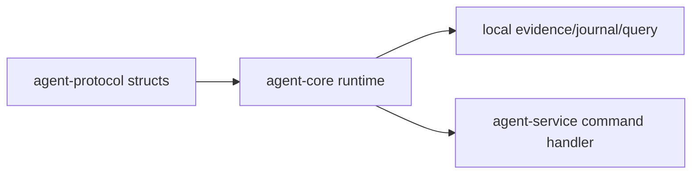

# ocentra-parent-agent-core

Local runtime core for child-device behavior that should not live in the HTTP
service shell.

## Owns

- Platform-neutral core helpers.
- Evidence/journal/query-store runtime support.
- App/game journal and SQLite read-model projection for typed evidence,
  identity, authority, action-result, platform-authority, and classifier
  protocol rows without upgrading them into live policy or adapter authority.
- Tracking read-model queries over ActivityStore SQLite rows for
  location/geofence/expected-place/check-in/retention journal evidence.
- Local adapter logic that can be tested without WebSocket transport.
- Policy-dispatch validation that can reject wrong actor/device/evidence,
  source, route, and capability combinations before the service exposes
  dispatch-ready state.
- Windows-specific capture/enforcement helpers when they are behind explicit
  platform boundaries.
- App/game live process snapshot helpers that turn real local process metadata
  into runtime evidence records without claiming foreground, content, policy, or
  adapter authority.
- App/game live process journal bridge helpers that turn those runtime records
  into encrypted-journal events and SQLite read-model rows without adding a
  service subscription or policy consumer.
- Bounded app/game live process event helpers that let the service capture path
  append runtime-only rows without exposing raw executable paths or foreground
  claims.
- App/game live foreground-window source helpers that turn active-window
  metadata into foreground evidence records and journal events with opaque
  window/title refs, without content capture, service capture, policy, or
  adapter authority.
- App/game live Windows shortcut inventory source helpers that turn bounded
  Start Menu shortcut scans into inventory-only rows and journal events with
  hashed source/desktop-entry refs, without registry, Store package, runtime,
  foreground, policy, or adapter claims.
- App/game live Windows packaged-app manifest source helpers that turn bounded
  `AppxManifest.xml` evidence into inventory-only store-package rows and journal
  events with hashed source refs, without registry, service capture, runtime,
  foreground, policy, or adapter claims.
- App/game live Windows installed-app registry source helpers that turn bounded
  Windows Uninstall registry evidence into inventory-only rows and journal
  events with hashed source/path refs, without service capture, runtime,
  foreground, policy, or adapter claims.
- Network runtime broker/family-hub remote delivery status proof that preserves
  custody, auth, encryption, retention, replay, deletion, offset, dedupe,
  broker config, family-hub identity, relay policy, idempotency, and
  dead-letter refs while keeping live transport, policy authority, side effects,
  enforcement commands, adapter execution, and host filtering false.
- Network remote event-chain journal/export proof that writes local runtime
  event-chain envelopes through the reusable eventing NDJSON journal and replay
  projection while keeping live delivery, policy authority, adapter execution,
  exact URL, decrypted payload, and page content claims false.
- Network remote receipt ledger proof that builds local acknowledgement records
  from event-chain projection replay rows while preserving sequence, event id,
  event type, correlation id, journal refs, and local receipt-ack refs without
  claiming live remote acknowledgement delivery.
- Network remote durable envelope proof that builds local durable store records
  from receipt-ledger rows while preserving sequence, event id, event type,
  correlation id, receipt refs, local receipt-ack refs, replay refs,
  delete/export readiness refs, and support-status refs without claiming live
  remote acknowledgement implementation or product-ready remote delivery.
- Network remote outbox handoff proof that builds prepared local outbox
  candidates from durable envelope records while preserving sequence, event id,
  event type, correlation id, durable refs, receipt refs, and local receipt-ack
  refs and rejecting duplicate durable envelopes without dispatching transport
  or claiming remote acknowledgements.
- Screen event runtime helpers for successful, capture/queue-only,
  deletion-only, and degraded AI paths through `ocentra-eventing`, preserving
  no-raw-image custody and keeping degraded paths out of policy/action refs.
- Network remote fixture transport proof that records one proof-local dispatch
  attempt and one fixture acknowledgement for each prepared outbox candidate
  while preserving event/outbox/handoff refs and keeping live broker/family-hub
  delivery, provider or child-device delivery, product-ready support, policy
  authority, adapter execution, and host filtering unclaimed.
- Network remote delete/export propagation readiness proof that records
  proof-local remote delete and export readiness refs for each fixture
  acknowledgement while preserving event/outbox/handoff/ack refs and keeping
  actual remote propagation, product-ready support, policy authority, adapter
  execution, and host filtering unclaimed.
- Network row10p provider/child readiness proof that maps row10l fixture
  acknowledgements into provider-route and child-device-route readiness records
  with manual-required unavailable state, zero delivery artifacts, and no live
  provider/child delivery claim.
- Network row10q cross-process custody readiness proof that maps row10p
  provider/child readiness records into cross-process replay, remote retention,
  remote delete custody, and remote export custody readiness records with zero
  custody/replay artifacts and no actual cross-process replay or remote
  delete/export propagation claim.
- Network policy-preview proof that reads stored ActivityStore network flow
  rows, maps destination-domain metadata into a domain policy target, resolves
  parent-rule contexts only when they cite stored network activity event refs,
  and keeps the resulting decision dry-run with enforcement handoff disabled.
- Household Mesh Bridge consumer proof that exports only selected local event
  refs into typed authenticated LAN message refs, validates incoming LAN
  messages before local republish, rejects direct remote publish into another
  runtime bus, rejects unselected or mismatched event/message refs, rejects
  provider/parent policy-authority escalation, rejects raw payload transfer, and
  preserves child-agent-only AI policy authority.

## Must Not Own

- WebSocket command/event schema names.
- Product contracts that belong in TypeScript domain packages first.
- Parent portal UI behavior.
- Cloud account or billing logic.

## Flow

## Connected Docs

- [Capture expectations](../../docs/expectations/capture.md)
- [Evidence storage expectations](../../docs/expectations/evidence-storage.md)
- [Enforcement expectations](../../docs/expectations/enforcement.md)

## Gaps To Fill

- Keep adapters split by platform and capability.
- Add real OS proof before a helper becomes a product claim.
- Keep long-running capture/enforcement work nonblocking for service health.
- Keep policy-dispatch validation platform-neutral and deterministic; adapter
  execution stays behind explicit proof boundaries.
- App/game protocol-row storage, live process journal replay, live
  foreground-window source proof, live shortcut inventory source proof, live
  packaged-app manifest source proof, and live registry inventory source proof
  are staged core proof only; bounded runtime, shortcut-inventory, and
  packaged-app and registry inventory rows now feed service capture, while
  portal authority/classifier/source rows, policy consumption, and adapter
  execution remain separate gaps.
- Tracking read-model queries are query-store proof only; narrow portal summary
  consumption exists, while platform replay, deletion/tombstone behavior, richer
  UI, and physical-device artifacts remain separate proof gaps.
- Network remote delivery is status proof only; live broker/family-hub
  transport, cross-process replay, remote retention/delete/export propagation,
  and production transport configuration remain separate implementation gaps.
- Network remote event-chain journaling is export-boundary proof only; live
  broker/family-hub delivery, child-device/provider transport, remote
  retention/delete/export propagation, and receipt acknowledgements remain
  separate gaps.
- Network receipt ledgers are local acknowledgement records only; remote
  provider acknowledgements, child-device acknowledgements, remote
  retention/delete/export propagation, and delivery retries remain separate
  gaps.
- Network durable envelopes are local store/readiness records only; live
  broker/family-hub transport, remote provider acknowledgements, child-device
  acknowledgements, cross-process transport, remote delete/export propagation,
  delivery retries, and product-ready remote delivery remain separate gaps.
- Network remote outbox handoff is local prepared-state proof only; live
  broker/family-hub dispatch, remote acknowledgements, provider/child-device
  delivery, retry execution, remote delete/export propagation, and product-ready
  remote delivery remain separate gaps.
- Screen event runtime helpers are local in-process proof paths; live
  cross-process/LAN transport and broad adapter execution remain separate gaps.
- Network remote fixture transport is a proof-only receipt loop over local
  prepared outbox candidates; live broker/family-hub transport, provider or
  child-device delivery, production acknowledgement semantics, retry execution,
  remote delete/export propagation, and product-ready remote delivery remain
  separate gaps.
- Network remote delete/export propagation readiness is local proof state only;
  live broker/family-hub propagation, provider or child-device delete/export
  delivery, remote acknowledgement semantics, retries, and product-ready remote
  delivery remain separate gaps.
- Network row10p provider/child readiness is a typed unavailable-state gate
  only; live provider transport, child-device delivery, remote acknowledgement
  semantics, retries, and product-ready remote delivery remain separate gaps.
- Network row10q cross-process custody readiness is a typed unavailable-state
  gate only; cross-process durable replay, remote retention, actual remote
  delete/export propagation, live transport, retries, and product-ready remote
  delivery remain separate gaps.
- Network policy preview is stored-row dry-run proof only; AI model execution,
  full policy-engine execution, adapter authorization, adapter action,
  enforcement-command publication, exact URL/content inference, raw PCAP, and
  host filtering remain separate proof-gated gaps.
- Household Mesh Bridge is a consumer-boundary proof only; live physical
  household provider discovery/execution, cross-device claim/lease/idempotency,
  production model quality, raw screenshot/capture transfer, portal UI,
  enforcement commands, and adapter execution remain separate proof-gated gaps.
