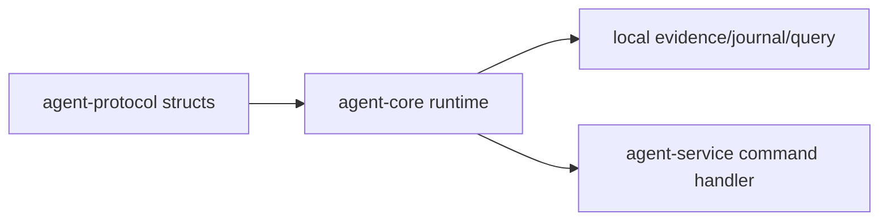

# ocentra-parent-agent-core

Local runtime core for child-device behavior that should not live in the HTTP
service shell.

## Owns

- Platform-neutral core helpers.
- Evidence/journal/query-store runtime support.
- Local adapter logic that can be tested without WebSocket transport.
- Windows-specific capture/enforcement helpers when they are behind explicit
  platform boundaries.

## Must Not Own

- WebSocket command/event schema names.
- Product contracts that belong in TypeScript domain packages first.
- Parent portal UI behavior.
- Cloud account or billing logic.

## Flow

## Connected Docs

- [Capture expectations](../../docs/expectations/capture.md)
- [Evidence storage expectations](../../docs/expectations/evidence-storage.md)
- [Enforcement expectations](../../docs/expectations/enforcement.md)

## Gaps To Fill

- Keep adapters split by platform and capability.
- Add real OS proof before a helper becomes a product claim.
- Keep long-running capture/enforcement work nonblocking for service health.
