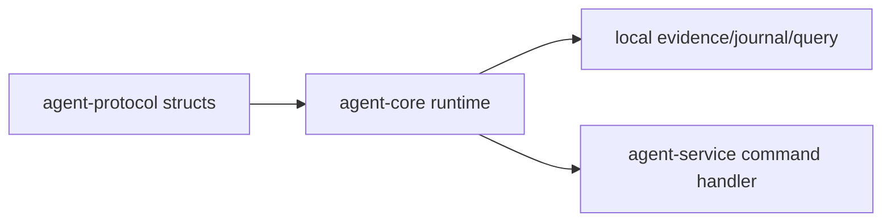

# ocentra-parent-agent-core

Local runtime core for child-device behavior that should not live in the HTTP
service shell.

## Owns

- Platform-neutral core helpers.
- Evidence/journal/query-store runtime support.
- App/game journal and SQLite read-model projection for typed evidence,
  identity, authority, action-result, platform-authority, and classifier
  protocol rows without upgrading them into live policy or adapter authority.
- Tracking read-model queries over ActivityStore SQLite rows for
  location/geofence/expected-place/check-in/retention journal evidence.
- Local adapter logic that can be tested without WebSocket transport.
- Policy-dispatch validation that can reject wrong actor/device/evidence,
  source, route, and capability combinations before the service exposes
  dispatch-ready state.
- Windows-specific capture/enforcement helpers when they are behind explicit
  platform boundaries.
- App/game live process snapshot helpers that turn real local process metadata
  into runtime evidence records without claiming foreground, content, policy, or
  adapter authority.
- App/game live process journal bridge helpers that turn those runtime records
  into encrypted-journal events and SQLite read-model rows without adding a
  service subscription or policy consumer.
- Bounded app/game live process event helpers that let the service capture path
  append runtime-only rows without exposing raw executable paths or foreground
  claims.
- App/game live foreground-window source helpers that turn active-window
  metadata into foreground evidence records and journal events with opaque
  window/title refs, without content capture, service capture, policy, or
  adapter authority.
- App/game live Windows shortcut inventory source helpers that turn bounded
  Start Menu shortcut scans into inventory-only rows and journal events with
  hashed source/desktop-entry refs, without registry, Store package, runtime,
  foreground, policy, or adapter claims.
- App/game live Windows packaged-app manifest source helpers that turn bounded
  `AppxManifest.xml` evidence into inventory-only store-package rows and journal
  events with hashed source refs, without registry, service capture, runtime,
  foreground, policy, or adapter claims.
- App/game live Windows installed-app registry source helpers that turn bounded
  Windows Uninstall registry evidence into inventory-only rows and journal
  events with hashed source/path refs, without service capture, runtime,
  foreground, policy, or adapter claims.
- Browser live Windows inventory source helpers that turn bounded Uninstall
  registry display-icon/install-location values and Start Menu shortcut targets
  into candidate browser executable paths for the existing browser inventory
  adapter, without URL, active-tab, UI, policy, or enforcement claims.

## Must Not Own

- WebSocket command/event schema names.
- Product contracts that belong in TypeScript domain packages first.
- Parent portal UI behavior.
- Cloud account or billing logic.

## Flow

## Connected Docs

- [Capture expectations](../../docs/expectations/capture.md)
- [Evidence storage expectations](../../docs/expectations/evidence-storage.md)
- [Enforcement expectations](../../docs/expectations/enforcement.md)

## Gaps To Fill

- Keep adapters split by platform and capability.
- Add real OS proof before a helper becomes a product claim.
- Keep long-running capture/enforcement work nonblocking for service health.
- Keep policy-dispatch validation platform-neutral and deterministic; adapter
  execution stays behind explicit proof boundaries.
- App/game protocol-row storage, live process journal replay, live
  foreground-window source proof, live shortcut inventory source proof, live
  packaged-app manifest source proof, and live registry inventory source proof
  are staged core proof only; bounded runtime, shortcut-inventory, and
  packaged-app and registry inventory rows now feed service capture, while
  portal authority/classifier/source rows, policy consumption, and adapter
  execution remain separate gaps.
- Browser live registry and Start Menu inventory source proof feeds service
  browser inventory candidate paths, while full shortcut shell parsing,
  AppX/MSIX enumeration, signature/hash extraction, portal rendering, and
  blocking remain separate gaps.
- Tracking read-model queries are query-store proof only; narrow portal summary
  consumption exists, while platform replay, deletion/tombstone behavior, richer
  UI, and physical-device artifacts remain separate proof gaps.
