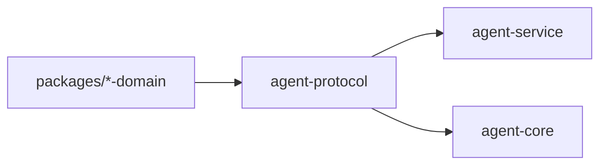

# ocentra-parent-agent-protocol

Rust protocol parity crate for data that crosses the TypeScript/Rust boundary.

## Owns

- Serde structs and enums for Rust-crossing command/event payloads.
- Protocol constants used by Rust service/core code.
- Exact field names and enum values mirrored from TypeScript contracts.
- Screen evidence provider constants for `localOcr`/WinRT OCR service proof and
  Activity Screen read-model fields for model id, prompt/template version, and
  raw-image retention state.
- V0.8 enforcement product-control read-model, command, event, and payload
  constants shared by the Rust service and TypeScript protocol adapter.
- V0.8 enforcement policy-dispatch read-model, command, event, and payload
  constants shared by the Rust service and TypeScript protocol adapter.
- V0.8 supported-adapter runtime proof and enforcement integrity runtime audit
  structs/constants, including no-claim fields mirrored into the service event
  payload.
- V0.8 integrity alert/status bridge structs/constants nested in the integrity
  runtime audit payload for permission-loss, stale heartbeat, stopped/removed,
  and tamper/manual parent-visible status proof.
- V0.9 signed LAN discovery/relay spine structs, enums, constants, and parity
  tests for adapter evidence, signed proof rejection, route safety, relay/cache
  availability, parent-owned storage, and custody labels.
- V0.8 notification provider status boundary structs/constants nested in the
  integrity runtime audit payload for queued, delivered, failed, unavailable,
  manual-required, quiet-hours, and escalation readiness proof.
- V0.9 LAN source-matrix structs, constants, and parity tests for workpack and
  discovery-source proof status rows consumed by service-backed diagnostics.
- Tracking journal read-model structs, command/event names, payload field, and
  parity tests for the narrow service-backed
  `agent.activity.tracking.read-model.get` proof path.
- Network remote delivery status bridge command/event names, constants, status
  structs, and parity tests for the row10b through row10e proof chain consumed
  by the Rust service and TypeScript protocol adapter.
- App/game boundary read-model structs, command/event names, payload field, and
  parity tests for the service-backed authority/classifier row-count proof
  path.
- App/game notification readiness read-model structs, command/event names,
  payload field, no-claim booleans, and parity tests for the service-backed
  local notification intent readiness proof path.
- App/game activity-surface source status structs for backend app-use/games row
  freshness/count/capability proof without portal, policy, or adapter claims.
- App/game evidence claim, AI digest reference/classification digest, identity,
  identity-merge, control authority/action-result, platform authority matrix,
  and classifier boundary structs/constants mirrored from the TypeScript domain
  packages for Rust-crossing serialization proof.
- App/game runtime evidence/path-ref prefixes used by core source readers so
  executable paths can be represented as opaque refs instead of raw UI strings.
- App/game foreground evidence/window-ref/title-ref prefixes used by core
  foreground source readers so window identity and title evidence can be
  represented without raw window or content strings.
- App/game Windows registry constants used by core installed-app source readers
  so registry paths, value names, confidence, and hashed path refs stay
  protocol-owned rather than invented in runtime code.

## Must Not Own

- Runtime behavior.
- Policy decisions.
- UI labels or portal layout.
- Local string literals that should be constants.

## Flow

## Connected Docs

- [Contract expectations](../../docs/expectations/contracts.md)
- [Protocol/domain rules](../../.ocentra-ai/rules/ocentra-parent-protocol-websocket.mdc)

## Gaps To Fill

- Add parity tests for every new Rust-crossing shape.
- Keep constants granular so service/core code does not invent strings.
- Product-control no-claim boundaries must stay explicit in protocol structs
  until platform adapter evidence proves a broader claim.
- Policy-dispatch structs must preserve implemented, report-only, degraded,
  unavailable, manual-required, and scaffold states without upgrading broad
  adapter claims.
- Integrity runtime audit structs must preserve unsupported, unavailable,
  manual-required, dry-run, observe-only, stale/rejected, timer recovery,
  rollback, child-status, parent-override, permission-loss, heartbeat, and
  tamper/manual states without claiming broad app/domain/browser blocking,
  notification delivery, tamper resistance, mobile enforcement,
  stealth/persistence, or privilege escalation.
- Integrity alert/status bridge structs must preserve notification intent/status
  refs and audit drill-in while keeping provider delivery, anti-tamper
  resistance, broad blocking, mobile enforcement, stealth/persistence, and
  privilege escalation unclaimed.
- Signed LAN discovery structs must preserve manual-required/not-implemented
  states for physical household proof, signed child-agent artifacts, relay, and
  cache routes until service/runtime proof is real.
- Notification provider status boundary structs must preserve delivered as
  receipt-required contract coverage only. Real delivery receipts, provider
  webhooks, retry execution, quiet-hours scheduling, escalation delivery, and
  parent preference controls remain outside this crate.
- Notification provider status boundary structs must preserve provider status,
  readiness, preference, audit, and receipt-required refs while keeping delivery
  implementation, observed delivery, sensitive provider payloads, and provider
  child-evidence storage unclaimed.
- LAN source-matrix structs must preserve weak-source fences so passive or
  manual discovery evidence cannot become child-agent confirmation by accident.
- Tracking read-model structs preserve journal row and citation-id evidence
  only; they do not claim mobile background behavior, provider delivery, or
  product-complete tracking UI beyond narrow portal summary consumption.
- Network remote delivery status bridge structs preserve proof/status refs only;
  broker/family-hub transport, remote acknowledgement, provider or child-device
  delivery, cross-process replay, remote delete/export propagation, policy
  authority, adapter execution, exact content, and host filtering remain
  unclaimed until separate proof exists.
- App/game evidence/identity/authority/classifier parity structs preserve
  serialization proof only; core live process snapshots now exist for runtime
  rows, core live foreground-window source proof exists for foreground rows, and
  core Windows shortcut, Store package, and registry sources now exist for
  inventory-only rows. Agent-service owns a recurring bounded runtime capture
  cadence, registry-backed inventory capture, source status rows on app-use and
  games activity-surface read-models, and dedicated app/game boundary and
  notification readiness read-model events, but policy runtime, portal
  identity/classifier/platform-authority rows, provider delivery, child
  delivery, and adapter execution remain separate proof-gated work.
- App/game notification readiness read-model structs preserve local readiness
  rows only. Provider delivery, receipt ingestion, local outbox runtime,
  scheduler runtime, parent notification UI, child delivery, policy evaluator
  execution, adapter dispatch, broad blocking, and platform support remain
  unclaimed.
- App/game timer parent preference setup request structs preserve
  service-local action-result persistence, mutation receipt, child-runtime
  handoff, queue, and dispatch readiness refs/status only. Actual child
  receipt, provider delivery, durable outbox runtime, adapter dispatch, and
  platform enforcement remain unclaimed.
