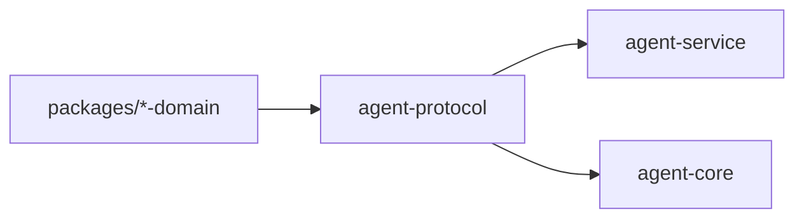

# ocentra-parent-agent-protocol

Rust protocol parity crate for data that crosses the TypeScript/Rust boundary.

## Owns

- Serde structs and enums for Rust-crossing command/event payloads.
- Protocol constants used by Rust service/core code.
- Exact field names and enum values mirrored from TypeScript contracts.
- V0.8 enforcement product-control read-model, command, event, and payload
  constants shared by the Rust service and TypeScript protocol adapter.

## Must Not Own

- Runtime behavior.
- Policy decisions.
- UI labels or portal layout.
- Local string literals that should be constants.

## Flow

## Connected Docs

- [Contract expectations](../../docs/expectations/contracts.md)
- [Protocol/domain rules](../../.ocentra-ai/rules/ocentra-parent-protocol-websocket.mdc)

## Gaps To Fill

- Add parity tests for every new Rust-crossing shape.
- Keep constants granular so service/core code does not invent strings.
- Product-control no-claim boundaries must stay explicit in protocol structs
  until platform adapter evidence proves a broader claim.
