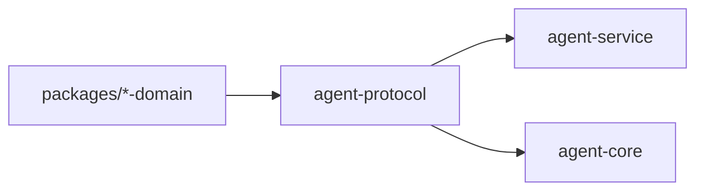

# ocentra-parent-agent-protocol

Rust protocol parity crate for data that crosses the TypeScript/Rust boundary.

## Owns

- Serde structs and enums for Rust-crossing command/event payloads.
- Protocol constants used by Rust service/core code.
- Exact field names and enum values mirrored from TypeScript contracts.
- V0.8 enforcement product-control read-model, command, event, and payload
  constants shared by the Rust service and TypeScript protocol adapter.
- V0.8 enforcement policy-dispatch read-model, command, event, and payload
  constants shared by the Rust service and TypeScript protocol adapter.
- V0.8 supported-adapter runtime proof and enforcement integrity runtime audit
  structs/constants, including no-claim fields mirrored into the service event
  payload.
- V0.8 integrity alert/status bridge structs/constants nested in the integrity
  runtime audit payload for permission-loss, stale heartbeat, stopped/removed,
  and tamper/manual parent-visible status proof.
- V0.9 signed LAN discovery/relay spine structs, enums, constants, and parity
  tests for adapter evidence, signed proof rejection, route safety, relay/cache
  availability, parent-owned storage, and custody labels.
- V0.8 notification provider status boundary structs/constants nested in the
  integrity runtime audit payload for queued, delivered, failed, unavailable,
  manual-required, quiet-hours, and escalation readiness proof.
- V0.9 LAN source-matrix structs, constants, and parity tests for workpack and
  discovery-source proof status rows consumed by service-backed diagnostics.

## Must Not Own

- Runtime behavior.
- Policy decisions.
- UI labels or portal layout.
- Local string literals that should be constants.

## Flow

## Connected Docs

- [Contract expectations](../../docs/expectations/contracts.md)
- [Protocol/domain rules](../../.ocentra-ai/rules/ocentra-parent-protocol-websocket.mdc)

## Gaps To Fill

- Add parity tests for every new Rust-crossing shape.
- Keep constants granular so service/core code does not invent strings.
- Product-control no-claim boundaries must stay explicit in protocol structs
  until platform adapter evidence proves a broader claim.
- Policy-dispatch structs must preserve implemented, report-only, degraded,
  unavailable, manual-required, and scaffold states without upgrading broad
  adapter claims.
- Integrity runtime audit structs must preserve unsupported, unavailable,
  manual-required, dry-run, observe-only, stale/rejected, timer recovery,
  rollback, child-status, parent-override, permission-loss, heartbeat, and
  tamper/manual states without claiming broad app/domain/browser blocking,
  notification delivery, tamper resistance, mobile enforcement,
  stealth/persistence, or privilege escalation.
- Integrity alert/status bridge structs must preserve notification intent/status
  refs and audit drill-in while keeping provider delivery, anti-tamper
  resistance, broad blocking, mobile enforcement, stealth/persistence, and
  privilege escalation unclaimed.
- Signed LAN discovery structs must preserve manual-required/not-implemented
  states for physical household proof, signed child-agent artifacts, relay, and
  cache routes until service/runtime proof is real.
- Notification provider status boundary structs must preserve delivered as
  receipt-required contract coverage only. Real delivery receipts, provider
  webhooks, retry execution, quiet-hours scheduling, escalation delivery, and
  parent preference controls remain outside this crate.
- Notification provider status boundary structs must preserve provider status,
  readiness, preference, audit, and receipt-required refs while keeping delivery
  implementation, observed delivery, sensitive provider payloads, and provider
  child-evidence storage unclaimed.
- LAN source-matrix structs must preserve weak-source fences so passive or
  manual discovery evidence cannot become child-agent confirmation by accident.
