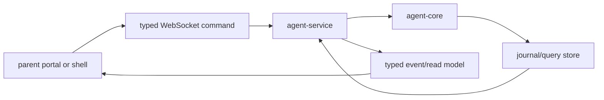

# ocentra-parent-agent-service

Local Rust service that exposes the child-device agent over loopback/LAN
development paths and orchestrates runtime commands.

## Owns

- Local HTTP and WebSocket endpoints.
- Command validation and dispatch.
- Service-backed read models for the parent portal.
- LAN bind/origin restrictions and dev service lifecycle.
- Runtime orchestration around core, protocol, AI, policy, activity, and
  enforcement paths.
- Local Activity report JSON storage/history queries and Parent Assistant
  evidence context assembly from service-owned Activity read models.
- Screen service analysis runtime that consumes encrypted screen queue jobs,
  invokes service-owned local adapter commands, records `localVision` or
  `localOcr` Activity Screen read-model rows with model/provider metadata, and
  drains processed queue records while keeping raw screenshot retention disabled
  by default.
- Local JSON-backed screen parent settings persistence proof that reports a
  disabled default, persists parent strict dry-run settings across reload, and
  rejects raw image retention or unsafe policy/capture combinations before
  persistence.
- Screen settings WebSocket command handling for
  `agent.screen-settings.get` and `agent.screen-settings.replace`, backed by
  the same local JSON `ScreenSettingsRuntime` and rejecting raw-image retention
  before persistence.
- Env-gated screen live-view worker startup runtime that defaults disabled,
  consumes protocol-owned live-view gate constants, and starts the worker only
  after runtime, startup, deletion, platform prompt, relay/cache, physical
  parity, privacy/legal, and unsafe-retention/control gates allow it.
- V0.8 product-control spine runtime reports through
  `agent.enforcement.product-control-spine.get` without upgrading unsupported
  broad adapter claims.
- V0.8 policy-dispatch runtime reports through
  `agent.enforcement.policy-dispatch.get` with validated capability matrix,
  evidence refs, timers, approvals, audit refs, and child reason codes.
- V0.8 supported-adapter runtime proof reports through
  `agent.enforcement.supported-adapter-runtime-proof.get`, including the
  enforcement integrity runtime audit read model for supported action results,
  timer recovery/rollback, child-status, parent-override, permission-loss,
  integrity heartbeat, tamper/manual states, and nested integrity alert/status
  bridge rows for permission loss, stale heartbeat, stopped/removed, and tamper
  manual review, plus nested notification provider status boundary rows for
  queued, delivered, failed, unavailable, manual-required, quiet-hours, and
  escalation readiness.
- V0.9 signed LAN discovery/relay spine read-model rows for adapter evidence,
  signed proof rejection, selected-route safety, parent decision audits,
  relay/cache unavailable state, parent-owned storage unavailable state, and no
  Ocentra child-data custody claims.
- V0.9 LAN source-matrix read-model rows that expose plan workpack/source
  status, implemented-source proof, and weak-source fences to the parent portal.
- Tracking service read-model reports through
  `agent.activity.tracking.read-model.get`, backed by ActivityStore SQLite rows
  and citation IDs in the `trackingReadModel` payload field, with active
  kind/device/capability count summaries derived from the same rows.
- Network flow read-model reports through
  `agent.network.flow.read-model.get`, backed by ActivityStore SQLite rows and
  local `ocentra-eventing` runtime delivery counts for stored network rows
  without broker, family-hub, adapter, or host-filter claims. The same service
  payload includes row51 stored-flow product-path proof counts and refs: stored
  rows with a domain target derive row-scoped trigger, capture, ingest,
  typed-event, policy-decision, action-result, retention, delete, export, and
  portal read-model refs through `ocentra-network-evidence`, while tombstoned
  rows and rows without a domain target do not invent policy/action refs.
- Network remote delivery status reports through
  `agent.network.remote-delivery.status.get`, derived from the row10t external
  cross-process transport status identity over the local row10k
  transport-dispatch state, row10l fixture transport proof, row10m delete/export
  readiness proof, row10p provider/child readiness, row10q cross-process custody
  readiness, row10r deterministic replay metadata through the row10s
  cross-process replay status bridge, and row10t transport envelope/ack
  metadata. The cached deterministic protocol snapshot carries row10b through
  row10t refs, prepared candidate counts, blocked-dispatch refs, row10l fixture
  dispatch/ack counts, delete/export readiness refs, provider/child readiness
  refs, cross-process custody refs, replay/store/cursor refs, replay counts,
  transport envelope/ack counts, duplicate rejection, and zero live dispatch/ack
  counters without broker/family-hub transport, product
  remote acknowledgement, provider or child-device delivery, actual remote
  delete/export propagation, policy, adapter, exact content, or host-filter
  claims.
- Network live-capture status reports through
  `agent.network.live-capture.status.get`, derived from row13 live-capture
  proof-gate state and row03a raw-capture custody readiness refs. The
  deterministic service snapshot exposes proof-ready, manual-required,
  unavailable, and degraded platform rows plus zero driver, packet capture,
  raw-PCAP-without-custody, content, policy, adapter, enforcement, netstat
  substitution, remote upload, and host-filter claims.
- App/game live process capture bridge rows through the existing activity
  capture journal/store path, exposing runtime-only app/game rows to the
  existing app-use/games read models without foreground, policy, or adapter
  claims.
- Recurring bounded app/game live process capture cadence that keeps the same
  journal/store/read-model path fresh without upgrading runtime rows into
  foreground, policy, or adapter authority.
- Optional app/game live foreground capture bridge through the same bounded
  activity-capture journal/store path, exposing foreground rows only when the
  active-window source is available and still avoiding content, policy, adapter,
  or platform support claims.
- Bounded app/game live Windows shortcut inventory capture through the same
  activity-capture journal/store path, exposing inventory-only rows with hashed
  source refs and no runtime, foreground, policy, or adapter claims.
- Bounded app/game live Windows packaged-app manifest capture through the same
  activity-capture journal/store path, exposing Store/UWP inventory-only rows
  with hashed source refs and no runtime, foreground, policy, or adapter claims.
- Bounded app/game live Windows registry inventory capture through the same
  activity-capture journal/store path, exposing Uninstall registry
  inventory-only rows with hashed source/path refs and no runtime, foreground,
  policy, or adapter claims.
- App/game app-use/games read-model evidence refs for staged evidence-claim,
  identity, approval authority/action-result, platform authority matrix, and AI
  classifier result rows from the existing `AppGameServiceReadModel`, without
  adding policy, portal UI, live classifier/provider, or adapter claims.
- App/game app-use/games read-model staged boundary row counts for evidence
  claim, identity, approval authority/action-result, platform authority
  matrix/rows, and AI classifier result rows in the existing read-model payloads.
- App/game app-use/games read-model source status rows for inventory, runtime,
  foreground, and launcher source kinds with backend row counts, latest observed
  timestamps, capability state, and evidence refs.
- Dedicated app/game boundary read-model reports through
  `agent.activity.app-game.boundary.read-model.get`, backed by the same
  `AppGameServiceReadModel` and exposing staged authority/classifier row
  counts plus citation refs without portal UI, policy, provider, or adapter
  claims.

## Must Not Own

- TypeScript product contracts.
- Parent portal UI.
- Hidden cloud storage of child activity.
- Enforcement without a typed policy decision and adapter capability status.

## Flow

## Connected Docs

- [Real evidence proof expectations](../../docs/expectations/real-evidence-proof.md)
- [LAN pairing expectations](../../docs/expectations/lan-pairing.md)
- [AI expectations](../../docs/expectations/ai.md)
- [Enforcement expectations](../../docs/expectations/enforcement.md)

## Gaps To Fill

- Production service hardening and diagnostics.
- Complete service-backed portal read models for all parent surfaces.
- Parent portal Activity UI wiring remains C-owned; this crate exposes the
  typed report/read-model events and saved-report evidence context only.
- Platform adapter execution proof for capture, enforcement, notifications, and
  remote routing.
- Product-complete broad app, network/domain, exact URL, notification, and
  tamper enforcement still require platform-specific adapter proof.
- Policy-dispatch read models are backend proof hooks; C-owned visual UX and
  D-owned packaging/release proof remain outside this crate's scope.
- Integrity runtime audit read models are backend proof hooks only; broad
  app/domain/browser blocking, notification delivery, tamper resistance, mobile
  enforcement, stealth/persistence, and privilege escalation remain unclaimed
  until separate platform/runtime proof exists.
- Integrity alert/status bridge read models are backend notification
  intent/status and audit drill-in proof only; provider delivery, UI, anti-tamper
  resistance, broad blocking, mobile enforcement, stealth/persistence, and
  privilege escalation remain unclaimed.
- Signed LAN hello/heartbeat, two-host household proof, real relay, and real
  cache routes remain manual-required or not implemented until runtime adapters
  and artifacts exist.
- Notification provider status boundary read models are backend
  status/readiness proof only; provider adapters, provider receipts, retry
  execution, quiet-hours scheduling, escalation delivery, parent controls,
  notification UI, and Ocentra-hosted child activity storage remain unclaimed.
- LAN source-matrix output is diagnostic/proof state only; it must not be used
  to imply missing production discovery adapters are implemented.
- Tracking read-model output is consumed by a narrow parent portal summary only;
  the service also exposes active summary fields for future report/policy/full
  UI consumers, while child UI, physical-device proof, and
  provider/notification delivery remain separate gaps.
- Network runtime delivery output is service-local and read-model-count only;
  broker/family-hub delivery, cross-process durable replay/retention, policy
  execution, adapter execution, and host filtering remain separate gaps.
- Network product-path bridge output is service-backed proof metadata only;
  live capture drivers, local-AI model execution, full policy engine execution,
  adapter mutation, exact URL/content claims, broker/family-hub delivery, and
  host filtering remain separate gaps.
- Network remote delivery status output is a read-only proof/status bridge;
  row10l fixture transport, row10m delete/export readiness, row10p
  provider/child readiness, row10q cross-process custody readiness, row10r
  deterministic replay metadata through the row10s cross-process replay status
  bridge, and row10t deterministic external cross-process transport envelope/ack
  metadata are visible through the status bridge, but real broker or family-hub
  transport, product remote acknowledgement, provider/child-device delivery,
  actual remote delete/export propagation, product readiness, policy execution,
  adapter execution, and host filtering remain separate gaps.
- Network live-capture status output is a read-only proof/status bridge. Real
  Npcap/libpcap invocation, packet capture, raw artifact creation, raw PCAP
  without custody, exact URL/content/decrypted-payload visibility, netstat
  substitution, policy execution, adapter execution, enforcement command
  publication, and host filtering remain separate gaps.
- App/game live process, optional foreground, Windows shortcut inventory,
  Windows packaged-app manifest capture, and Windows registry inventory capture
  have bounded service proof; subscribed foreground transitions, policy
  consumption, portal source/status polish, and adapter execution remain
  separate gaps.
- App/game authority/classifier surface evidence is transport-only in the
  app-use/games evidence vector, explicit count fields, and the dedicated
  backend boundary read-model event; portal rows, policy consumption, provider
  execution, and adapter proof remain separate gaps.
- App/game source status rows are backend read-model summaries only; polished
  portal rendering, policy consumption, richer subscriptions, adapter
  execution, and broad blocking remain separate gaps.
- App/game timer parent preference setup request persistence writes
  service-local action-result, mutation receipt, child-runtime handoff, queue,
  and dispatch readiness audit rows only; actual child runtime receipt,
  provider delivery, durable production outbox runtime, adapter dispatch, broad
  blocking, and platform enforcement remain separate gaps.
- Screen service analysis proofs are backend/local proof hooks only; production
  OCR/VLM quality, authenticated-account surfaces, broader live trigger
  producers, retention UI, and enforcement remain separate gaps.
- Screen service event bridge proofs map successful, capture/queue-only,
  deletion-only, and degraded Activity Screen rows into the shared core
  eventing runtime without raw-image escape or duplicate service event buses.
- Screen settings persistence and WebSocket command handling are backend/runtime
  proof only; parent portal form submit wiring, product retention-control UI,
  raw screenshot retention
  enablement, live view, and privacy/legal approval remain separate gaps.
- Screen live-view worker startup is service-owned and env-gated, but platform
  prompt screenshots, hosted relay infrastructure, physical-device parity,
  privacy/legal approval, and product-complete live view remain separate gates.
