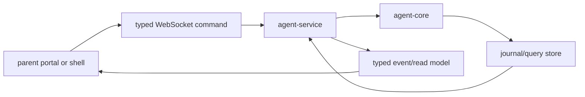

# ocentra-parent-agent-service

Local Rust service that exposes the child-device agent over loopback/LAN
development paths and orchestrates runtime commands.

## Owns

- Local HTTP and WebSocket endpoints.
- Command validation and dispatch.
- Service-backed read models for the parent portal.
- LAN bind/origin restrictions and dev service lifecycle.
- Runtime orchestration around core, protocol, AI, policy, activity, and
  enforcement paths.
- Local Activity report JSON storage/history queries and Parent Assistant
  evidence context assembly from service-owned Activity read models.
- V0.8 product-control spine runtime reports through
  `agent.enforcement.product-control-spine.get` without upgrading unsupported
  broad adapter claims.
- V0.8 policy-dispatch runtime reports through
  `agent.enforcement.policy-dispatch.get` with validated capability matrix,
  evidence refs, timers, approvals, audit refs, and child reason codes.

## Must Not Own

- TypeScript product contracts.
- Parent portal UI.
- Hidden cloud storage of child activity.
- Enforcement without a typed policy decision and adapter capability status.

## Flow

## Connected Docs

- [Real evidence proof expectations](../../docs/expectations/real-evidence-proof.md)
- [LAN pairing expectations](../../docs/expectations/lan-pairing.md)
- [AI expectations](../../docs/expectations/ai.md)
- [Enforcement expectations](../../docs/expectations/enforcement.md)

## Gaps To Fill

- Production service hardening and diagnostics.
- Complete service-backed portal read models for all parent surfaces.
- Parent portal Activity UI wiring remains C-owned; this crate exposes the
  typed report/read-model events and saved-report evidence context only.
- Platform adapter execution proof for capture, enforcement, notifications, and
  remote routing.
- Product-complete broad app, network/domain, exact URL, notification, and
  tamper enforcement still require platform-specific adapter proof.
- Policy-dispatch read models are backend proof hooks; C-owned visual UX and
  D-owned packaging/release proof remain outside this crate's scope.
