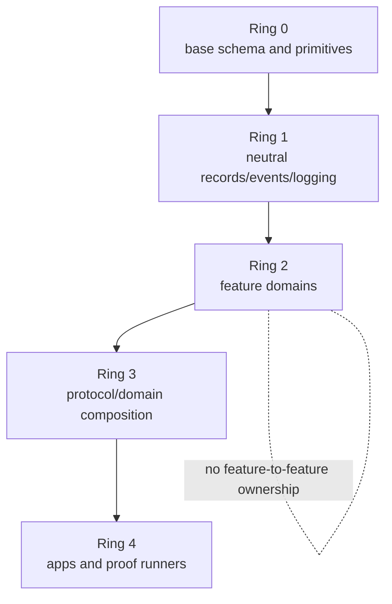
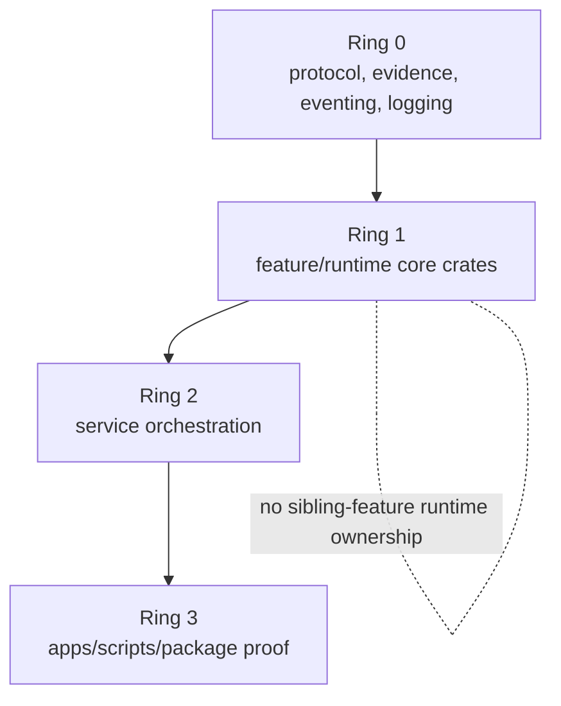
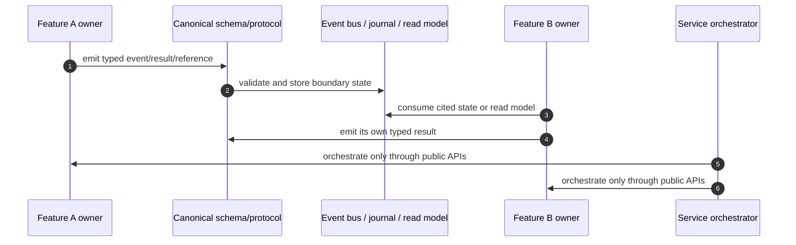

<!-- agent-capsule -->

> Agent Capsule
> Doc: Dependency Boundary Matrix
> Kind: architecture/reference documentation.
> Read when: Writing or reviewing package/crate README files, imports, dependency changes, or feature-to-feature communication.
> Stop rule: Use this to decide intended dependency direction, then read the touched module README and owning feature/plan route.
> Proves: intended dependency policy only.
> Does not prove: current implementation compliance, feature completion, or validation.

<!-- /agent-capsule -->

# Dependency Boundary Matrix

This document defines the intended clean dependency architecture. It is a target contract. If current source code has direct sibling-feature coupling, treat that coupling as migration debt and move toward this matrix.

## Core Rule

Feature domains do not own each other.

Feature-to-feature interaction must go through neutral boundaries:

- canonical schema contracts;
- protocol command/event envelopes;
- `ocentra-eventing` request/event surfaces;
- evidence references;
- journal/read-model projections;
- service orchestration;
- logging/proof-chain traces.

Direct sibling-feature imports are not allowed unless an explicit migration exception says otherwise.

## TypeScript Dependency Rings

| Ring | Examples | May import | Must not import |
| --- | --- | --- | --- |
| 0 | `schema-domain`, `endpoint-domain`, `text-domain`, `portal-domain` | Nothing feature-owned except narrow type-only fixtures when explicitly needed. | Feature domains, app code, Rust/service implementation. |
| 1 | `evidence-domain`, `event-domain`, `logging-domain` | Ring 0. | Feature domains, apps, Rust/service implementation. |
| 2 | AI, LAN, tracking, browser, network, screen, app/game, policy, enforcement, billing, notification, setup, custody, remote access | Rings 0-1 and explicitly approved neutral primitives. | Peer feature domains when the dependency creates ownership or lifecycle coupling. |
| 3 | `agent-protocol-domain`, `parent-domain` | Stable contracts from lower rings. | Runtime side effects, app UI logic, Rust implementation details. |
| 4 | `apps/*`, proof scripts | Public exports and protocol contracts. | New canonical schema truth, runtime constants, feature ownership. |

## Rust Dependency Rings

| Ring | Examples | May import | Must not import |
| --- | --- | --- | --- |
| 0 | `agent-protocol`, `ocentra-evidence`, `ocentra-eventing`, `logging-core` | Other neutral common crates where acyclic. | Feature runtime crates and service orchestration. |
| 1 | `child-ai-core`, `lan-core`, `tracking-core`, `browser-core`, `network-core`, `screen-core`, `app-game-core`, policy/enforcement/storage/runtime crates | Ring 0 and approved neutral helpers. | Peer feature/runtime crates when the dependency bypasses event/protocol/read-model boundaries. |
| 2 | `agent-service`, `agent-updater` | Ring 0 and Ring 1 public APIs. | App UI code, duplicate protocol constants, feature-owned private logic. |
| 3 | package preview, release, proof scripts, app shells | Public service/protocol surfaces. | Private runtime internals as product truth. |

## Feature-To-Feature Communication

Use this pattern when AI needs LAN status, tracking evidence, browser evidence, network summaries, screen summaries, or app/game state.

Feature B may consume Feature A's published state. Feature B must not call Feature A's private runtime or own Feature A's lifecycle.

## Allowed Common Imports

Feature packages/crates may import common layers when the import does not create circular ownership:

- schema/brand/decode helpers;
- endpoint and protocol constants;
- evidence identifiers and references;
- event/request/result envelopes;
- logging and proof-chain helpers;
- capability/status primitives;
- storage/read-model reference types;
- neutral test/proof fixture helpers owned by the common layer.

## Forbidden Coupling Patterns

| Coupling | Why forbidden | Replacement |
| --- | --- | --- |
| AI directly imports LAN runtime/discovery. | AI would own network route lifecycle. | LAN publishes route/provider status; AI consumes typed status through event/read model. |
| LAN directly imports AI runtime/provider scheduler. | LAN would own model/provider lifecycle. | AI publishes provider capability/status; LAN routes only typed capability state. |
| Tracking directly imports AI evaluator. | Tracking would own analysis decisions. | Tracking writes records; AI consumes record refs. |
| Portal defines a command/event/status string. | UI becomes contract owner. | Move the string to domain/protocol package. |
| `agent-service` invents payload fields. | Service becomes protocol owner. | Add TypeScript schema, mirror in Rust protocol, then consume in service. |
| Feature crate imports peer feature crate for a helper. | Creates hidden lifecycle dependency. | Move helper to common crate or communicate via event/read-model. |
