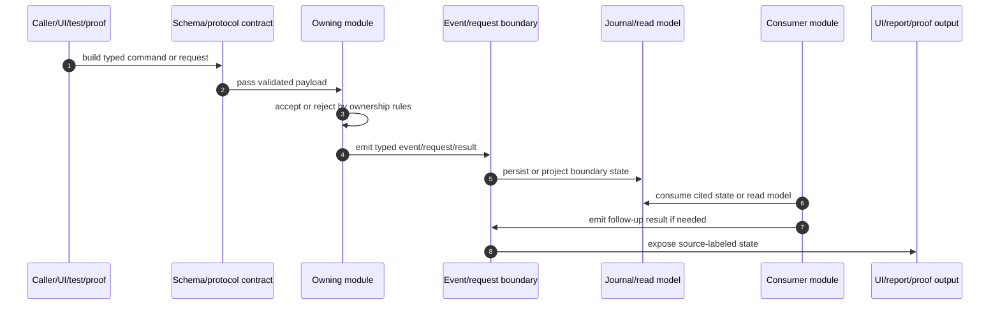
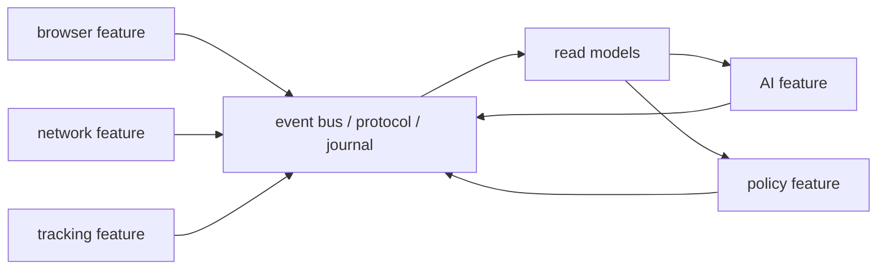

<!-- agent-capsule -->

> Agent Capsule
> Doc: Event Flow Map
> Kind: architecture/reference documentation.
> Read when: Writing module READMEs, feature handoff docs, proof-chain docs, command/event handlers, or runtime boundary docs.
> Stop rule: Use this to define flow shape, then read the touched module README and owning plan route.
> Proves: intended event/request/read-model architecture only.
> Does not prove: runtime implementation, product status, or platform proof.

<!-- /agent-capsule -->

# Event Flow Map

Ocentra Parent modules communicate through typed commands, events, requests, records, and read models.

## Chain Standard

Every meaningful product/runtime chain should be explainable as:

```text
command -> owner accepts/rejects -> event/request emitted -> consumer handles -> result stored -> read model/UI updates
```

A proof or README that cannot name the owner, boundary, event, consumer, stored result, and UI/read-model effect is incomplete.

## Canonical Chain



## Flow Types

| Flow | Use | Owner |
| --- | --- | --- |
| Command | App/test/proof asks for behavior or state. | Protocol package plus service handler. |
| Request | One runtime module asks another boundary for work through a typed channel. | Requesting module owns request; receiving module owns acceptance. |
| Event | A module reports that a state/result happened. | Emitting module owns event meaning. |
| Record | Stored local fact or result. | Evidence/eventing/storage owner. |
| Read model | Queryable projection for UI/report/policy/AI. | Projection owner, not necessarily source owner. |
| Proof artifact | Evidence that a chain executed or stayed unavailable/manual. | Test/proof runner, tied to feature/plan row. |

## Feature Interaction Pattern

Feature modules do not call each other's private behavior. They publish and consume typed state.



## Required Trace Fields

Proof-bearing chains should expose run id, correlation id, owner, boundary name, result, no-claim reason, and redaction state.

## README Flow Requirement

Every module README should answer what enters the module, who validates it, what the module owns, what it emits, who consumes it, and which peers communicate only through protocol/event/read-model boundaries.
