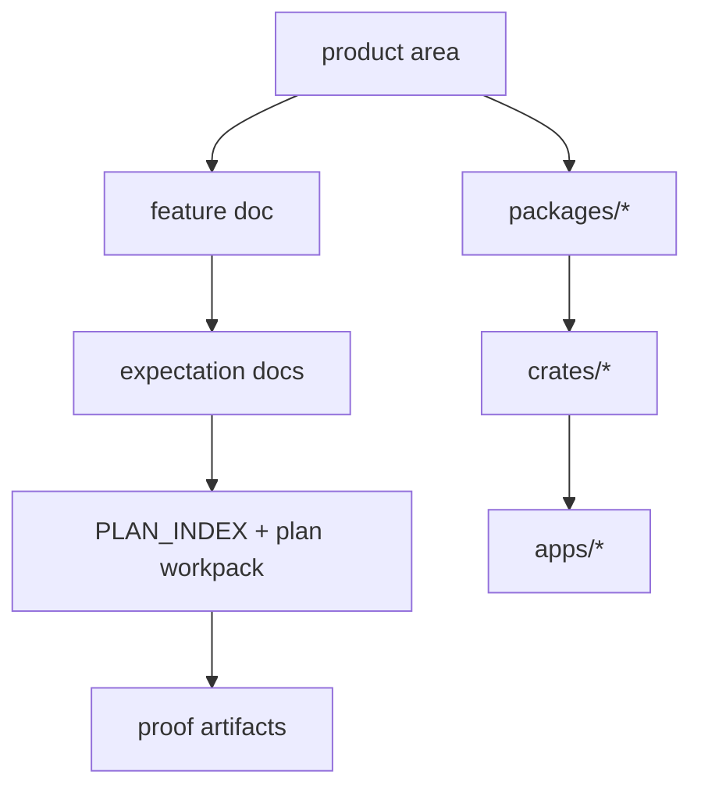

<!-- agent-capsule -->

> Agent Capsule
> Doc: Module Map
> Kind: ownership/navigation matrix.
> Read when: Routing from product area to app/package/crate/feature/plan docs.
> Stop rule: Pick the relevant area, then read the linked workspace README and owning feature/plan route.
> Proves: navigation only.
> Does not prove: implementation status or product completion.

<!-- /agent-capsule -->

# Module Map

This map connects product areas to workspace layers. It does not replace module READMEs.

## Workspace Layers

| Layer | Entry | Role |
| --- | --- | --- |
| Apps | [apps/README.md](../apps/README.md) | Parent-facing shells and UI surfaces. |
| TypeScript packages | [packages/README.md](../packages/README.md) | Schema, protocol, product, feature, and projection contracts. |
| Rust crates | [crates/README.md](../crates/README.md) | Local runtime, service, protocol parity, eventing, storage, and platform adapters. |
| Feature docs | [feature-list.md](feature-list.md) | User-visible product capability routes. |
| Plan docs | [PLAN_INDEX.md](PLAN_INDEX.md) | Execution/workpack routes. |

## Product Area Routes

| Area | TypeScript side | Rust side | Feature/plan route |
| --- | --- | --- | --- |
| App/game | `app-game-domain`, `activity-domain`, `parent-domain` | `app-game-core`, `agent-core`, `agent-service` | app/game feature + app/game plan |
| Browser | `browser-domain`, `activity-domain` | `browser-core`, protocol/service crates | browser feature + browser plan |
| Network | `network-domain`, `activity-domain`, `evidence-domain` | `network-core`, `ocentra-network-evidence`, eventing/service crates | network feature + network plan |
| Screen | `screen-domain`, `activity-domain`, `ai-domain` | `screen-core`, `screen-ai-core`, `screen-live-view-core`, capture adapter | screen feature + screen plans |
| Tracking | `tracking-domain`, `activity-domain` | `tracking-core`, service/read-model crates | tracking feature + tracking plan |
| AI | `ai-domain`, `parent-domain`, evidence/context contracts | `child-ai-core`, protocol/eventing/evidence crates | local AI feature + AI plan |
| LAN/remote | `lan-domain`, `remote-access-domain`, protocol contracts | `lan-core`, `remote-access-core`, service crates | remote/LAN/mobile feature + LAN/remote plans |
| Policy/enforcement | `policy-domain`, `enforcement-domain`, `parent-domain` | policy/enforcement/control crates | policy/enforcement features + plans |
| Billing/support/production | billing, notification, production, setup, custody packages | billing, entitlement, provisioning, updater, storage crates | production/support plans |

## Boundary Rule

A product area may reference another area through published schema/protocol/event/read-model state. It must not import or own another area's private runtime lifecycle.
