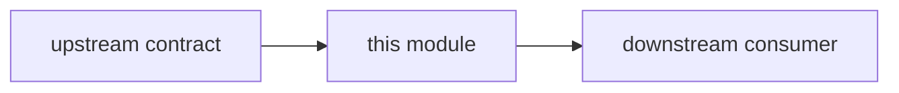

<!-- agent-capsule -->

> Agent Capsule
> Doc: Module README Standard
> Kind: documentation standard.
> Read when: Creating or updating README files under `apps/`, `packages/`, or `crates/`.
> Stop rule: Preserve existing details; add boundary sections without deleting accumulated status/proof notes.
> Proves: README structure only.
> Does not prove: product status, implementation completeness, or validation.

<!-- /agent-capsule -->

# Module README Standard

Every app, package, and crate README is an ownership contract. It should describe the intended clean boundary, not normalize accidental current coupling.

## Safe Update Rule

Existing README content is source material. Do not delete it during normalization. Add new boundary sections around existing material unless a section is plainly obsolete and the owning human asks to remove it.

## Required Sections

Each module README should include:

1. Purpose.
2. Where this fits, with Mermaid.
3. Owns.
4. Must not own.
5. Allowed direct dependencies.
6. Forbidden direct dependencies.
7. Inputs.
8. Outputs.
9. Event/request/read-model flow.
10. Communication with other features.
11. Connected docs.
12. Status source.
13. Boundary debt rule.

## Mermaid Expectation

Every README should include at least one small diagram. Example shape:

## README Tone

Use target-contract language:

- This module owns...
- This module must not own...
- Sibling features communicate through...
- Direct sibling-feature dependencies are migration debt.

Avoid normalizing bad current coupling:

- Do not say a current import makes the dependency acceptable.
- Do not mark a feature complete from a README.
- Do not describe a scaffold as product-ready.
- Do not hide platform/manual-required gaps.

## Existing Detail Rule

If a README already contains detailed proof notes, gap history, or route status, preserve it. Put new boundary guidance above the old detail or add an appendix. Never replace a detailed existing README with a short generic template.

## Dependency Language

Use the dependency language from:

- [Dependency Boundary Matrix](DEPENDENCY_BOUNDARY_MATRIX.md)
- [Event Flow Map](EVENT_FLOW_MAP.md)

Feature modules may directly use common layers such as schema, evidence, eventing, logging, protocol, capability/status primitives, and neutral helpers. Feature modules must not directly own sibling feature lifecycles.
