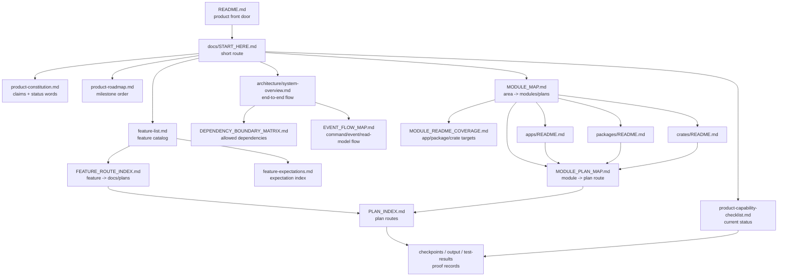

<!-- agent-capsule -->

> Agent Capsule
> Doc: Repo Mindmap
> Kind: visual repository navigation map.
> Read when: You need to locate product truth, architecture, modules, features, plans, or proof records.
> Stop rule: Follow the relevant branch of the map; do not bulk-load unrelated docs.
> Proves: navigation only.
> Does not prove: implementation, validation, or product status.

<!-- /agent-capsule -->

# Repo Mindmap

This map connects the product front door to architecture, modules, features, expectations, plans, and proof records.

## Route Rules

- Product claims route through constitution, roadmap, feature docs, and capability checklist.
- Engineering ownership routes through module map, module plan map, workspace READMEs, dependency matrix, and event-flow map.
- Execution routes through plan index and a single owning plan workpack.
- Proof routes through checklist rows, feature docs, plan state, and named artifacts.

## Do Not Treat As Completion

This map does not prove product readiness. It only shows where to read next.
