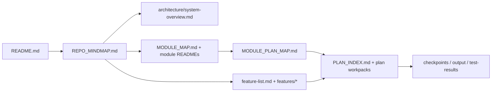

<!-- agent-capsule -->

> Agent Capsule
> Doc: Start Here
> Kind: human and agent orientation route.
> Read when: You need a small entry path through product, architecture, modules, features, plans, and proof.
> Stop rule: Pick the smallest matching route; do not bulk-read all docs.
> Proves: navigation only.
> Does not prove: feature completion, runtime implementation, or product status.

<!-- /agent-capsule -->

# Start Here

Use this page after the root README. It routes readers without replacing the product story in `README.md`.

## Reading Paths

### Product review

1. [README](../README.md)
2. [Product Constitution](product-constitution.md)
3. [Product Roadmap](product-roadmap.md)
4. [Feature List](feature-list.md)
5. [Product Capability Checklist](product-capability-checklist.md)

### Engineering orientation

1. [Repo Mindmap](REPO_MINDMAP.md)
2. [System Overview](architecture/system-overview.md)
3. [Module Map](MODULE_MAP.md)
4. [Module Plan Map](MODULE_PLAN_MAP.md)
5. [Module README Coverage](MODULE_README_COVERAGE.md)
6. [Dependency Boundary Matrix](DEPENDENCY_BOUNDARY_MATRIX.md)
7. [Event Flow Map](EVENT_FLOW_MAP.md)
8. [apps](../apps/README.md), [packages](../packages/README.md), [crates](../crates/README.md)

### Feature work

1. [Feature List](feature-list.md)
2. The matching `docs/features/*.md`
3. Linked expectation docs
4. [Plan Index](PLAN_INDEX.md)
5. The owning plan `AGENTS.md`, `PLAN_STATE.md`, and `WORKPACK_INDEX.md`

### Module work

1. [Module Map](MODULE_MAP.md)
2. [Module Plan Map](MODULE_PLAN_MAP.md)
3. The target module README
4. The mapped plan route

### Status review

1. [Product Capability Checklist](product-capability-checklist.md)
2. Current feature doc
3. Expectation docs
4. Plan state
5. Named proof/checkpoint artifacts
6. Touched module READMEs

## Module Rule

Every app, package, and crate README should preserve existing detail and add ownership, dependency, flow, status-source, boundary-debt, and plan-route sections. See [Module README Standard](MODULE_README_STANDARD.md).
