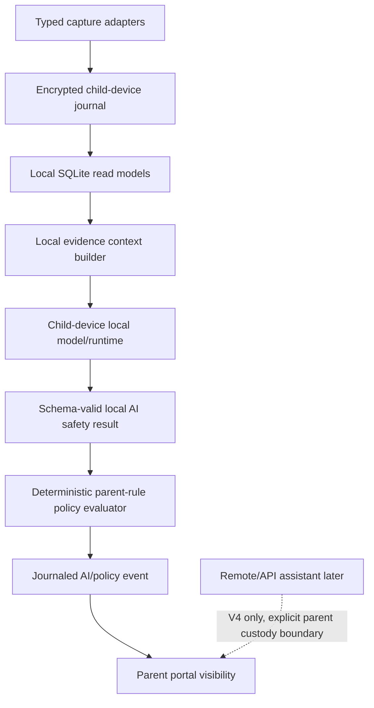

<!-- agent-capsule -->

> Agent Capsule
> Doc: Local AI Evidence Context Builder
> Kind: architecture/reference documentation; read only when selected by plan route, source router, or assigned workpack.
> Read when: Only when this exact doc is named by the active route, index, feature doc, or assigned workpack.
> Stop rule: Do not continue into sibling docs, broad folders, source trees, or historical checkpoints unless this file gives an explicit next path.
> Proves: only the local scope, status, route, or contract stated by this file and its named proof/checklist rows.
> Does not prove: sibling plan completion, implementation correctness, product status, PR readiness, or broad DONE unless routed proof says so.
> Proof rule: If this file changes status or claims, update the owning feature/plan/checklist/proof route that makes the claim current.
> Snippet rule: fenced blocks in this document are contract/artifact/command examples only. They are not instructions to copy implementation code unless the surrounding section explicitly says the snippet is the public contract shape.

<!-- /agent-capsule -->

# Local AI Evidence Context Builder

Status: V0.6 research/spec. This document reconciles the local AI context
builder with browser, app/game, network-flow, and screen-evidence planning before
runtime AI, policy, or enforcement implementation. It does not add feature code.

## Product Claim

Ocentra Parent may claim AI-assisted child-device safety decisions only when the
local context builder assembles schema-valid evidence, parent rules, local model
runtime status, and optional evidence-backed memory or graph references on the
child device. The context builder is not a capture adapter, not a parent portal
feature, not an enforcement path, and not a hidden Ocentra moral policy layer.

The first product path is:

```text
browser/app-game/network/screen evidence
  -> encrypted local journal
  -> local SQLite query store and read models
  -> local evidence context builder
  -> child-device local model/runtime
  -> schema-valid local AI safety result
  -> deterministic policy evaluator
  -> dry-run policy event, approval path, or later enforcement handoff
```

Ocentra-hosted services must not store child activity evidence, screenshots,
browser history, SQLite evidence, generated reports, journals, or parent rules by
default. Remote/API AI is not part of the normal child-device safety path.

## Context Builder Responsibility

The local AI evidence context builder owns a narrow transformation:

- Select the smallest relevant stored evidence window for a local AI request.
- Normalize evidence references from browser, app/game, network-flow, and screen
  sources into a typed context.
- Attach parent rule references, child profile references, device references,
  schedule windows, and parent-approved settings.
- Attach local model/runtime references and prompt/template version references.
- Attach optional memory and knowledge-graph references only when those derived
  facts cite source evidence, policy versions, or parent actions.
- Validate confidence, freshness, custody, unknown, and degraded states before a
  local model sees the context.
- Return an explicit build result: ready, partial, insufficient, unavailable, or
  rejected.

The context builder must not:

- Scan browsers, processes, files, windows, network packets, launcher manifests,
  screenshots, or the OS directly.
- Infer exact URLs from process/window or network evidence.
- Infer app/game duration from portal state or model text.
- Upload prompts, evidence, screenshots, reports, parent rules, or generated
  summaries to Ocentra-hosted services by default.
- Convert category labels into household actions without parent-authored rules.
- Hide product-owned moral judgments inside prompts, model defaults, or
  undocumented policy fallbacks.

## Component Boundary



Runtime ownership:

| Boundary                    | Owner                                                  | Context-builder rule                                              |
| --------------------------- | ------------------------------------------------------ | ----------------------------------------------------------------- |
| Capture adapters            | Child-device Rust agent                                | Builder consumes only stored refs and digests.                    |
| Encrypted journal           | Child-device Rust agent                                | Source of truth for evidence ids and replay.                      |
| SQLite read models          | Child-device Rust agent                                | Query/index only; rebuildable from journal.                       |
| Local AI runtime            | Child-device runtime module/crate                      | Builder cites runtime status; model does not scan sources.        |
| Parent rules and approvals  | Parent-authored contracts validated by the child agent | Rules are explicit refs with version and effective window.        |
| Portal                      | Parent visibility, rules, approvals, and explanations  | Portal displays context/results; it does not build model prompts. |
| Ocentra-hosted services     | Account, billing, releases, minimal routing, later V4  | Not child activity storage by default.                            |
| Parent-owned storage/export | Parent-selected destination                            | Optional source only when explicitly configured.                  |

## Source And Custody Labels

Every context item must carry a source/custody label. The initial label set
should match existing local-first expectations:

- `live-local-child-agent`: loopback response from the child-device agent.
- `live-lan-child-agent`: explicit LAN response from the child-device agent.
- `child-device-journal`: replayed from the encrypted child-device journal.
- `child-device-query-store`: derived from the local SQLite read model.
- `parent-device-cache`: parent-device local cache or report cache.
- `parent-owned-export`: parent-approved export or storage bundle.
- `ocentra-hosted-non-activity`: account, entitlement, pairing, release, or
  notification metadata only.
- `unavailable`: source not configured, unreachable, stale, degraded, or outside
  the current feature boundary.

The context builder must reject any child activity item labeled as
`ocentra-hosted-non-activity`. That label can support entitlement or route
status, but it cannot supply browser, app/game, network, screen, report, rule, or
journal evidence for child-device decisions.

## Common Evidence Reference Shape

Each evidence source may define specialized contracts, but the context builder
needs a common reference shape:

- `evidenceRefId`: stable reference id in the context builder output.
- `evidenceId`: stored journal/query evidence id.
- `evidenceKind`: browser, app-game, network-flow, screen-summary,
  policy-decision, parent-action, or future typed kind.
- `schemaVersion`: source contract version.
- `observedAt`: source observation timestamp.
- `ingestedAt`: query-store ingest timestamp where available.
- `freshUntil`: time after which the item is stale for current-context claims.
- `sourceId`: capture or read-model source id.
- `adapterId`: adapter id or derived-read-model id.
- `deviceRef`: child device reference.
- `childProfileRef`: child profile reference when applicable.
- `custody`: source/custody label.
- `retentionState`: local, temporary, deleted-source, export-copy,
  parent-owned-copy, unavailable, or future explicit retention state.
- `confidence`: finite number from `0` to `1` only when the source can justify a
  probabilistic claim.
- `confidenceKind`: observation, correlation, classifier, model, memory-match,
  graph-edge, or rule-match.
- `capabilityStatus`: available, unsupported, permission-limited, stale,
  degraded, adapter-error, disabled-by-parent, or unavailable.
- `degradedReasons`: typed reason codes when the item is incomplete.
- `unknownReasons`: typed reason codes when a stronger claim is not known.
- `sourceEvidenceRefs`: backing evidence ids used by a derived summary.

The builder must not treat missing confidence as `1`. A deterministic observed
fact may omit confidence and use capability/freshness state instead. Any
probabilistic or derived claim that lacks confidence must be marked degraded or
rejected before decisioning.

## Browser Evidence Context

Browser context references must come from managed browser evidence or from
explicit unmanaged-browser/bypass evidence.

Allowed browser context:

- Supported browser capability status.
- Managed browser session reference.
- Browser family, channel, and version where available.
- Managed profile id or redacted profile reference.
- Window/tab/target ids where the managed browser bridge provides them.
- Active-tab state only when the adapter proves it.
- Exact URL, normalized origin, normalized domain, page title, and timestamp for
  managed evidence.
- Unmanaged browser detection with process/path/signature refs and possible
  bypass reason, but no exact URL.
- Evidence id, source id, adapter id, freshness, capability status, custody, and
  degraded reason.

Required degraded or unknown states:

- unsupported browser;
- unmanaged browser;
- missing managed bridge;
- permission-limited bridge;
- stale tab evidence;
- active tab unknown;
- adapter error;
- default profile attachment rejected;
- exact URL unavailable;
- page content unavailable.

Forbidden browser context:

- Page body text by default.
- Chat message content.
- Keystrokes or form values.
- Cookies, tokens, storage, browser secrets, or raw DevTools protocol dumps.
- Screenshot data.
- Decrypted HTTPS payloads.

Process/window evidence and network evidence may correlate with browser evidence,
but they must never be promoted into exact URL, active-tab, page-title, or page
content claims.

## App And Game Evidence Context

App/game context references must come from stored process/window, inventory,
launcher, deterministic catalog, or session-summary evidence produced by the
Rust agent.

Allowed app/game context:

- Installed app/game inventory references.
- Running process observation references.
- Foreground app/window session references.
- Launcher/library hints from supported launchers.
- Deterministic known-game catalog match before AI classification.
- Session summary id with running time, foreground time, run count, first seen,
  last seen, and evidence ids backing the rollup.
- Unknown, possibly-game, launcher-only, foreground, background, stopped, and
  inventory-unavailable states.
- Parent policy target refs for app id, process id, executable ref, launcher,
  game title, category, and session summary.

Required degraded or unknown states:

- process unknown;
- executable metadata unavailable;
- launcher metadata unavailable;
- game identity ambiguous;
- foreground window unavailable;
- duration incomplete;
- session stale;
- deterministic catalog miss;
- classifier unavailable or low confidence.

Forbidden app/game context:

- AI scanning processes, launcher files, install locations, or windows directly.
- AI inventing duration, foreground time, run count, title, publisher, or
  executable identity.
- Launcher tokens, credentials, account identifiers, chat content, voice content,
  or game telemetry payloads.

App/game duration is evidence, not model output. The context builder may include
agent-generated summaries and unknown states; it must not ask a model to
reconstruct time spent from prose.

## Network Flow Evidence Context

Network context references must come from stored flow observations, DNS/domain
attribution evidence, process-to-flow correlation, and network digest summaries.

Allowed network context:

- Endpoint observation references: local IP/port, destination IP/port, protocol,
  TCP state, adapter/interface hints, and timestamps where available.
- Process attribution references with confidence and degraded state.
- DNS/domain attribution references with source, freshness, confidence, and
  ambiguity state.
- Network flow summary refs: connection count, first/last seen, duration, bytes
  sent/received where available, repeated failures, top destinations, new
  destinations, and high-volume indicators.
- VPN/proxy/tunnel, Tor-like, unknown adapter, or unusual background traffic
  indicators when backed by typed evidence.
- IP-only, domain-known, domain-ambiguous, process-unknown,
  encrypted-content-unavailable, adapter-unavailable, stale, and
  permission-limited states.

Required degraded or unknown states:

- process attribution unknown;
- DNS unavailable;
- domain ambiguous;
- IP-only;
- encrypted content unavailable;
- byte counters unavailable;
- snapshot stale;
- ETW/WFP/provider unavailable;
- adapter error;
- VPN/proxy/tunnel indicator unproven.

Forbidden network context:

- Decrypted HTTPS payloads.
- Exact URLs, URL paths, query strings, active tabs, page titles, or browser
  profiles.
- Packet dumps, ETL files, DNS cache dumps, request/response bodies, chat
  content, search terms, form values, cookies, tokens, or credentials.
- AI sniffing packets, decrypting content, or inventing destinations, bytes,
  duration, process ownership, or domain attribution.

Network flow evidence can support a local AI digest such as likely VPN/proxy,
likely game traffic, new destination, or unusual unknown process. It cannot
replace managed browser URL/tab evidence.

## Screen Evidence Context

Screen context references must come from local screen-analysis summaries produced
after encrypted temporary image queue processing. Raw images are not normal
context-builder input.

Allowed screen context:

- Screen capture capability/status reference.
- Screen-analysis queue job reference with encrypted image reference, TTL, retry
  state, and source evidence refs.
- Local OCR/vision summary reference after schema validation.
- Visible category candidates, confidence, risk signals, redaction notes, and
  allowed extracted text snippets when the screen feature permits them.
- Source refs to foreground app, managed browser URL, app/game session, and
  network digest where available.
- Image digest/hash and deletion state after processing.
- Parent setting refs for enablement, cadence, trigger, strict mode, retention,
  and dry-run/enforcement eligibility.

Required degraded or unknown states:

- screen capture disabled by parent;
- protected surface;
- lock screen or secure desktop;
- password prompt skipped;
- OCR/vision unavailable;
- analysis invalid;
- analysis low confidence;
- queue expired;
- deletion unconfirmed;
- source evidence missing.

Forbidden screen context:

- Permanent raw screenshot retention by default.
- Cloud/remote/API AI upload of screenshots.
- Password fields, secure desktop, lock screen, credential prompts, or
  OS-protected surfaces.
- Keystrokes, audio, camera video, decrypted payloads, browser secrets, tokens,
  cookies, or raw image bytes in the model prompt.

The context builder may cite screen-analysis summaries and deletion state. It
must not pass raw screenshots to remote/API AI under the V0.6/V0.7 child-device
safety path.

## Parent Rule Context

Parent rule references are the only path from a category, risk, or evidence
classification to a household action.

Each parent rule reference should include:

- `parentRuleRefId`.
- `ruleId`.
- `ruleVersion`.
- `familyRef`, `childProfileRef`, and `deviceRef` scope.
- `ruleKind`: site, URL/domain, app, process, launcher, game title, category,
  network indicator, screen category, schedule, time budget, approval, override,
  or future typed kind.
- `targetRefs`: evidence or target references the rule can match.
- `effectiveWindow`: schedule, timezone, start/end, and recurrence refs.
- `action`: allow, warn, block, time-limit, ask-parent, observe-only, or no-op.
- `priority` and conflict-resolution metadata.
- `createdByParentRef` or parent action reference.
- `updatedAt` and optional expiry.
- `custody`: local child device, parent device, LAN, parent-owned storage, or
  unavailable.

Policy rules are explicit parent-controlled settings. Product defaults may ship
category labels, examples, and conservative capability states, but the context
builder must not embed hidden Ocentra moral policy. If no parent rule matches,
the local AI result can explain evidence and uncertainty, but deterministic
policy must choose an explicit no-op, warn, unknown, or ask-parent behavior based
on documented product rules and parent settings.

Rule degradation is explicit:

- rule store unavailable;
- policy version missing;
- schedule window unresolved;
- parent action reference missing;
- conflicting rules;
- unsupported target kind;
- stale parent-owned sync source;
- custody unavailable.

Ambiguous AI output cannot override a stricter parent rule. Remote/API assistant
output cannot override local parent rules or local policy decisions.

## Local Model And Runtime Context

The context builder must attach local runtime references so parents and tests can
explain which local capability produced a result.

Runtime references should include:

- `localModelRuntimeRefId`.
- Provider id and provider kind.
- Model id, model family, model version, and local model path or opaque model
  reference.
- Model artifact hash or manifest reference where available.
- Capability flags: text classification, URL/domain classification, app/game
  classification, network digest classification, OCR, vision summary, or future
  supported tasks.
- Load state: unavailable, not-installed, downloading, loading, loaded,
  unloading, failed, degraded, or disabled-by-parent.
- Resource class: CPU, GPU, NPU, memory class, quantization, and platform
  support where available.
- Privacy mode: local-only for child-device safety decisions.
- Last checked time.
- Degraded reason and unavailable reason.
- Prompt/template id and version.
- Runtime policy: timeout, max input size, output schema version, and retry
  behavior.

Remote/API model references must not appear in V0.6/V0.7 child-device safety
decisions. If a later V4 remote assistant exists, it needs separate
parent-authorized request/result contracts with source/custody, retention,
evidence citations, and failure states.

## Memory And Knowledge-Graph Context

Memory and graph references are derived local indexes, not source truth. They can
make the local agent smarter only when every derived fact points back to source
evidence, a policy version, or a parent action.

Allowed reference kinds:

- evidence memory;
- recent activity memory;
- policy memory;
- semantic memory;
- graph entity;
- graph edge;
- parent action history.

Each memory or graph reference should include:

- Reference id and reference kind.
- Derived index version.
- Generated time.
- Expiry or invalidation rule.
- Confidence or match score when probabilistic.
- Source evidence refs from the encrypted journal/query store.
- Source policy version refs where the memory is rule-derived.
- Parent action refs where the memory is approval/override-derived.
- Degraded reason when source evidence is missing, stale, or deleted.

Memory and graph references without source evidence, policy versions, or parent
actions must be excluded from block, time-limit, or enforcement-eligible
decisions. They may contribute only to explicit safe states such as unknown,
warn, no-op, or ask-parent when the policy contract allows that fallback and the
parent-visible explanation says the derived reference was ungrounded.

The context builder must never let embeddings, graph edges, semantic matches, or
remembered summaries replace the encrypted journal and SQLite ingest source of
truth.

## Confidence Validation

Confidence values are validation data, not subjective labels. Any source field named
`confidence`, `matchScore`, `probability`, or equivalent must follow the same
rules:

- It is a finite JSON number.
- It is greater than or equal to `0`.
- It is less than or equal to `1`.
- It declares what the score means through `confidenceKind`.
- It names the source that produced the score.
- It does not silently default to `1`.
- It does not convert an unknown state into a known fact by itself.

Suggested score interpretation for parent-visible explanations:

| Range         | Meaning                                                                |
| ------------- | ---------------------------------------------------------------------- |
| `0`           | Source asserts no confidence in the claim.                             |
| `0.0001-0.49` | Low confidence; cannot drive stricter decisions without parent rules.  |
| `0.50-0.79`   | Medium confidence; keep uncertainty and supporting evidence visible.   |
| `0.80-0.99`   | High confidence, still tied to evidence and source capability.         |
| `1`           | Exact/deterministic only when the source contract defines it that way. |

The context builder should reject non-numeric, NaN, infinite, negative, or
greater-than-one values at schema boundaries. It should downgrade missing
probabilistic scores to degraded/unknown rather than inventing a value.

Confidence cannot compensate for missing custody, missing evidence refs, stale
evidence, forbidden data, or unsupported capture boundaries.

## Unknown And Degraded State Model

Unknown and degraded states are first-class outputs, not exceptions. The context
builder should separate:

- `unknown`: the system is working, but the fact is not known.
- `degraded`: the system has reduced capability, quality, freshness, or
  permission.
- `unavailable`: the feature/source/model/rule is not configured or reachable.
- `rejected`: the input violates schema, custody, forbidden-data, or confidence
  rules and must not be sent to the model.

Common reason codes should cover:

- `missing-evidence`;
- `stale-evidence`;
- `source-conflict`;
- `unsupported-source`;
- `permission-limited`;
- `adapter-error`;
- `capability-disabled-by-parent`;
- `custody-unavailable`;
- `forbidden-remote-source`;
- `invalid-confidence`;
- `invalid-ai-output`;
- `model-unavailable`;
- `model-overloaded`;
- `model-output-unparseable`;
- `memory-ungrounded`;
- `graph-ungrounded`;
- `parent-rule-missing`;
- `parent-rule-conflict`;
- `schedule-unresolved`;
- `protected-surface`;
- `screen-image-deleted`;
- `screen-deletion-unconfirmed`;
- `network-encrypted-content-unavailable`;
- `browser-active-tab-unknown`;
- `app-duration-incomplete`.

The build result should preserve these states so policy and the parent portal can
explain whether the decision was evidence-backed, partial, unknown, or blocked
by validation.

## Context Build Request And Result

Final contract names belong in the owning domain packages, but V0.6 should
represent these families:

`LocalAiEvidenceContextBuildRequest`:

- schema version;
- request id;
- request time;
- child profile ref;
- device ref;
- current observation ref, if any;
- requested evaluation kind: page, URL, video, app, game, domain, network
  digest, screen summary, recent activity window, or mixed context;
- requested time window;
- parent rule scope;
- model task requirements;
- custody constraints;
- prompt/template version requirement.

`LocalAiEvidenceContext`:

- schema version;
- context id;
- request id;
- child profile ref and device ref;
- current observation summary;
- browser evidence refs;
- app/game evidence refs;
- network flow evidence refs;
- screen summary refs;
- parent rule refs;
- recent activity summary refs;
- optional memory refs;
- optional graph refs;
- local model/runtime refs;
- prompt/template refs;
- custody labels and retention states;
- unknown/degraded state list;
- validation summary.

`LocalAiEvidenceContextBuildResult`:

- schema version;
- request id;
- result state: ready, partial, insufficient, unavailable, or rejected;
- context ref when ready or partial;
- rejected fields and reason codes when rejected;
- missing evidence kinds;
- degraded source list;
- custody boundary summary;
- validation gate summary;
- audit/event refs written for the build attempt where applicable.

`LocalAiSafetyResult` should then cite:

- context id;
- local model/runtime ref;
- prompt/template version;
- action candidate;
- confidence and confidence kind;
- unknown/degraded states;
- evidence refs used;
- parent rule refs considered;
- memory/graph refs used;
- reason codes;
- expiry/timer refs when time-based;
- parse/validation status.

## Prompt And Input Minimization

The prompt or model input should include the least sensitive structured context
needed for the requested local decision:

- stable ids and source refs;
- normalized domains and URL summaries where managed browser evidence allows;
- app/game session summaries and category candidates;
- network flow digest fields, not packet or payload data;
- screen-analysis summary JSON, not raw images;
- parent rules and relevant schedule windows;
- local memory/graph summaries only when source-cited;
- explicit unknown/degraded states.

The prompt must not include raw journals, raw SQLite files, raw screenshots,
packet captures, browser secrets, cloud credentials, or unbounded OS/browser
content. If a future prompt needs a high-sensitivity data class, that data class
requires a separate feature boundary before implementation.

## Local-First Custody And Remote/API Boundary

Normal V0.6/V0.7 behavior is child-device local:

- Evidence is captured on the child device.
- Evidence is written to the encrypted journal.
- SQLite is a local rebuildable query/index store.
- The context builder runs on the child device.
- The local model/runtime runs on the child device.
- Policy evaluation and audit events run on the child device.
- Parent portal and reports display typed results from local/LAN service,
  parent cache, or parent-owned storage as explicitly labeled sources.

Remote/API AI may exist later only for parent-facing assistance, report
summaries, or explanation workflows after an explicit parent action and
data-custody contract. It must not be required for blocking, timing,
ask-parent, or local safety decisions. Remote failures must degrade to
local-only evaluation, unknown, no-op, warn, or ask-parent according to explicit
parent rules and product contracts.

## No Hidden Moral Policy

Ocentra may provide:

- capability labels;
- category labels;
- model/provider defaults;
- conservative degraded-state handling;
- schema validation;
- parent-visible explanations;
- suggested rule templates.

Ocentra must not hide household policy in:

- prompts that silently turn categories into blocks;
- model defaults that override parent rules;
- uncited memory/graph facts;
- hosted services that rewrite local decisions;
- category labels that imply enforcement without a parent rule;
- undocumented fallback behavior.

Parents decide household rules. The product can recommend, explain, and validate,
but a local AI classification is evidence and decision support, not household
authority.

## Validation Gates

Documentation/spec gate for this slice:

- `cmd /c npm run format:check -- docs/architecture/local-ai-evidence-context-builder.md docs/expectations/ai.md`
- `cmd /c npm run hub:guard`
- `git diff --check`

Future contract/runtime gates when implementation begins:

- TypeScript Effect Schema tests for context build requests, context refs, build
  results, local AI safety results, runtime refs, memory refs, graph refs,
  unknown/degraded states, and confidence validation.
- Rust parity tests for every Rust-crossing AI/evidence context shape.
- Journal/SQLite integration tests that build context from real stored evidence.
- Tests proving browser exact URL claims require managed browser evidence.
- Tests proving app/game duration comes from stored session summaries.
- Tests proving network digests cannot claim exact URLs or decrypted content.
- Tests proving screen summaries include deletion state and do not expose raw
  image bytes to remote/API AI.
- Tests proving confidence outside `0..1` is rejected.
- Tests proving missing evidence, stale evidence, unavailable model, invalid
  model output, and ungrounded memory/graph references produce explicit unknown
  or degraded states.
- Policy integration tests proving ambiguous AI output cannot override explicit
  parent rules.
- Custody tests proving Ocentra-hosted non-activity metadata is never accepted
  as child activity evidence.
- Remote/API assistant tests, when that feature exists, proving evidence
  citation, parent authorization, no default Ocentra child-data retention, and no
  override of local safety decisions.

## Implementation Phases

Phase 0, this spec:

- Add the context-builder architecture and acceptance plan.
- Do not implement runtime AI, policy, or capture code.

Phase 1, contracts:

- Add Effect Schema contracts for build request, context, build result, common
  evidence refs, parent rule refs, runtime refs, memory refs, graph refs,
  unknown/degraded states, and confidence validation.
- Add Rust parity only for Rust-crossing shapes after TypeScript contracts exist.

Phase 2, stored-evidence builder:

- Build context from real journal/SQLite read models for one narrow case.
- Reject fake, handwritten, or uncited context in tests.
- Keep unknown/degraded states visible.

Phase 3, local model dry-run:

- Invoke a local provider only after context validation.
- Parse model output into typed local AI safety results.
- Reject invalid model output before policy consumes it.

Phase 4, deterministic policy preview:

- Resolve parent rules deterministically over local AI result and evidence refs.
- Journal dry-run policy events with evidence, model, and rule refs.
- Keep enforcement disabled by default.

Phase 5, memory and graph enrichment:

- Add local derived indexes only after the narrow evaluator works.
- Require source evidence, policy version, or parent action refs for any derived
  fact that can influence decisions or explanations.

## Done Signal

V0.6 context-builder reconciliation is done when the repo has a contract-ready
architecture for assembling browser, app/game, network, and screen evidence refs
with confidence validation, unknown/degraded states, parent rule refs,
local-model/runtime refs, source-cited memory/graph refs, local-first custody,
no hidden Ocentra moral policy, no remote/API AI by default, and explicit
validation gates before runtime AI or enforcement code is added.
