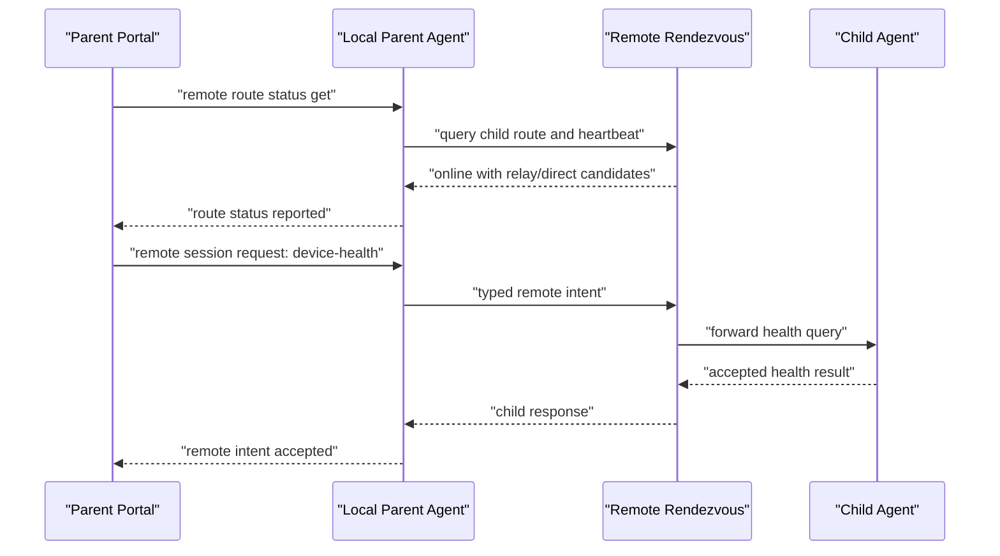
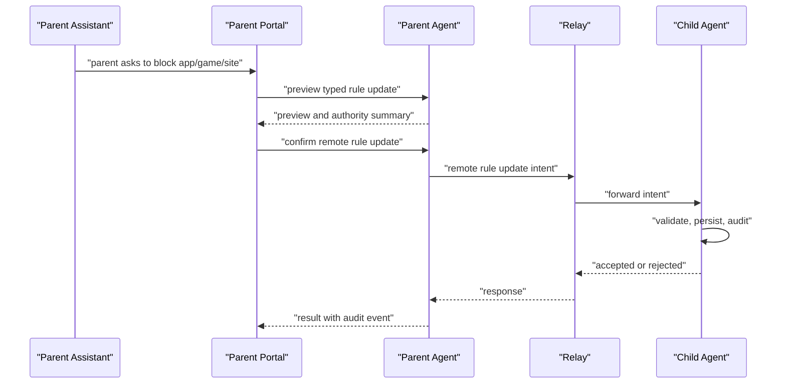
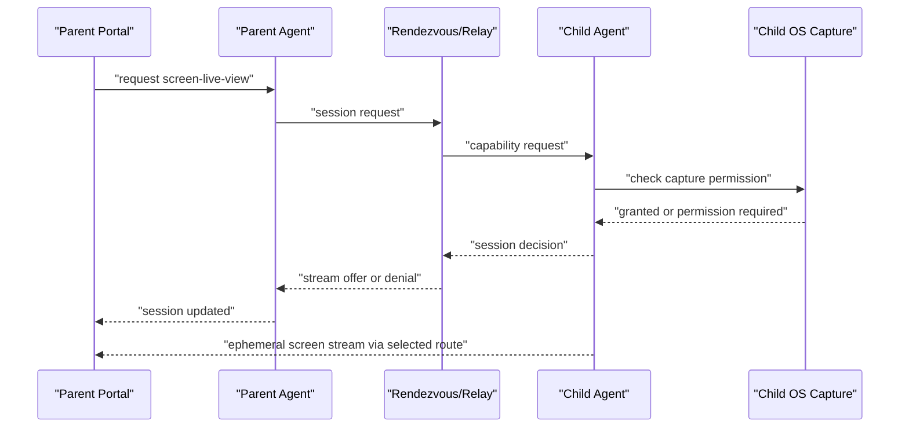

<!-- agent-capsule -->

> Agent Capsule
> Doc: Remote Capability Fabric V2 Plan
> Kind: architecture/reference documentation; read only when selected by plan route, source router, or assigned workpack.
> Read when: Only when this exact doc is named by the active route, index, feature doc, or assigned workpack.
> Stop rule: Do not continue into sibling docs, broad folders, source trees, or historical checkpoints unless this file gives an explicit next path.
> Proves: only the local scope, status, route, or contract stated by this file and its named proof/checklist rows.
> Does not prove: sibling plan completion, implementation correctness, product status, PR readiness, or broad DONE unless routed proof says so.
> Proof rule: If this file changes status or claims, update the owning feature/plan/checklist/proof route that makes the claim current.
> Snippet rule: fenced blocks in this document are contract/artifact/command examples only. They are not instructions to copy implementation code unless the surrounding section explicitly says the snippet is the public contract shape.

<!-- /agent-capsule -->

# Remote Capability Fabric V2 Plan

Status: second-pass architecture plan.

This document turns the RustDesk research into an Ocentra Parent end-to-end
plan: what to build, where it belongs, how the UI should expose it, how the
Rust service should route it, how a relay should fit, and how the proof
harnesses should demonstrate the product path.

The goal is not "remote desktop only." The goal is remote parent capability
beyond local/LAN:

- see child-device health from anywhere;
- see route and custody state;
- update rules remotely;
- answer approval requests remotely;
- query activity and reports remotely;
- request screen visibility where enabled;
- support live view and remote control as serious product capabilities;
- let the parent choose which tools are enabled in their household.

RustDesk is the working reference. Ocentra should borrow the architecture and
proof lessons, not the code or protocols.

## Current Ocentra Starting Point

Ocentra already has several pieces that should inform the remote fabric. Some
are TS migration surfaces and must not remain product authority:

- `packages/schema-domain/src/event-primitives.ts`
  defines migration-era `AgentRoute` values for `localhost`, `local-network`,
  and `cloud-relay`; new shared route truth belongs in Rust-owned contracts and
  generated DTOs.
- `crates/agent-protocol/src/transport.rs`
  mirrors those Rust route values.
- `packages/schema-domain/src/agent-protocol-defaults.ts`
  has migration-era route security policy defaults; Rust runtime/domain code
  must own final policy defaults before product consumers depend on them.
- `packages/parent-domain/src/lan-pairing-values.ts`
  already models trust state, reachability, controller lease rejection reasons,
  observer read-only state, and paired route behavior.
- `packages/parent-domain/src/lan-pairing-control.ts`
  already has parent intent envelopes and child-agent response envelopes.
- `crates/agent-service/src/lan_pairing.rs`
  already routes LAN commands, validates target/origin/lease state, returns
  accepted/rejected audit events, and continues allowed commands.
- `apps/portal` already has presentation routes and dev transport seams; the
  product UI path must go through HostBridge into Rust, not a TS-owned
  WebSocket state machine.
- `packages/portal-domain/src/routes.ts`
  includes a migration-era `remote-access` route token; final route IDs belong
  in Rust-owned bridge schema and generated DTOs.

The major gap is that these pieces are still LAN-shaped. The remote route,
remote session, capability grants, relay lifecycle, and remote UI are not first
class yet.

## Product Shape

Remote capability should be presented as a parent command center, not as a
developer transport page.

The parent should be able to answer these questions quickly:

1. Which child/device is selected?
2. Is the device online, stale, offline, or unreachable?
3. Which route is active: local, LAN, WAN direct, Ocentra relay, or
   parent-owned relay?
4. Which capabilities are enabled for this child and device?
5. Which capabilities are currently active?
6. What is blocked by missing OS permission, package state, policy, or
   platform limitation?
7. What can the parent do now?
8. What happened last, and was it accepted, denied, queued, or degraded?

The assistant should sit on top of the same model. It should not have special
hidden powers. When the parent asks, "show me what my child is doing," the
assistant should compile that into typed remote capability requests with
visible authority, route, and result state.

## UI End State

### Route: `#/remote-access`

Use the existing `PortalRoute.RemoteAccess` token. The route exists today but is
not rendered as its own product surface. The first UI pass should make it a real
screen.

Files to touch when implementation starts, after Rust-owned route/schema owners
exist:

- Rust-owned parent UI bridge schema and generated TS DTO output for route ID,
  route snapshot, and action/result shape.
- Pure presentation files for labels, nav placement, and rendering only.
- `apps/portal/src/portal-route-content.ts`
  - render `RemoteAccess` instead of falling through to overview.
- New portal modules:
  - `apps/portal/src/remote-access-route.ts`
  - `apps/portal/src/remote-device-route-panel.ts`
  - `apps/portal/src/remote-capability-panel.ts`
  - `apps/portal/src/remote-session-panel.ts`
  - `apps/portal/src/remote-audit-panel.ts`

### Screen Layout

Use an operational layout, not a marketing page.

Recommended sections:

1. Selected child/device strip
   - child label;
   - device label;
   - platform;
   - package/service state;
   - last heartbeat.

2. Route board
   - localhost;
   - LAN direct;
   - WAN direct;
   - Ocentra relay;
   - parent-owned relay;
   - queued/offline.

3. Capability grid
   - health;
   - activity/report query;
   - rule update;
   - approval decision;
   - screen snapshot;
   - live screen view;
   - remote input;
   - app control;
   - browser control;
   - game control;
   - location/device presence where platform allows it;
   - assistant action.

4. Session panel
   - no active session;
   - requested;
   - connecting;
   - active;
   - degraded;
   - denied;
   - ended.

5. Event/audit rail
   - latest accepted command;
   - latest denial reason;
   - route change;
   - capability change;
   - child-side stop;
   - relay fallback.

6. Assistant input
   - routes through typed actions;
   - can explain why a capability is unavailable;
   - can launch a request but not bypass grants.

### UI Copy Principle

Use product words, not protocol words:

- "Reachable at home" instead of `local-network`.
- "Remote relay" instead of `cloud-relay`.
- "Waiting for child device" instead of `queued`.
- "Screen permission needed on child device" instead of generic failure.
- "View only" and "Control" as separate visible states.

The protocol can stay precise. The UI should be calm and decisive.

## Domain Model

Keep the first V2 shared product contracts in Rust-owned schema/runtime crates.
`@ocentra-parent/schema-domain` and `@ocentra-parent/parent-domain` may only
hold temporary edge decoders, generated DTO consumers, or migration shims until
Rust-owned replacements are live.

Recommended new Rust-first owners:

- `crates/schema` for cross-boundary route, capability, session, desktop, and
  audit DTOs plus generated TypeScript.
- `crates/parent-runtime-core` for parent-facing actions, route snapshots, and
  read-model handoff.
- the owning Rust remote/runtime crate when behavior becomes domain-specific.

### Route Contracts

Model route as richer than the existing `AgentRoute` enum:

- route id;
- route kind;
- selected child device id;
- parent device id;
- pairing id;
- custody label;
- reachability;
- trust state;
- transport state;
- latency band;
- last heartbeat;
- stale/offline timestamps;
- relay provider id if relevant;
- fallback route id if relevant;
- rejection/degraded reason.

Candidate route kinds:

- `localhost`;
- `local-network`;
- `wan-direct`;
- `ocentra-relay`;
- `parent-owned-relay`;
- `queued`;
- `unavailable`.

Do not force every route kind into `AgentRoute` immediately. `AgentRoute` can
remain the broad protocol channel while the remote route read model carries the
specific route kind. Add new `AgentRoute` variants only when the Rust service
actually routes them.

### Capability Contracts

Capabilities should be product-level, not copied from RustDesk's permission
bits.

Initial capability names:

- `device-health`;
- `activity-summary`;
- `report-query`;
- `rule-update`;
- `approval-decision`;
- `screen-snapshot`;
- `screen-live-view`;
- `remote-input`;
- `app-control`;
- `browser-control`;
- `game-control`;
- `network-control`;
- `location-presence`;
- `assistant-action`;
- `file-transfer`;
- `clipboard-sync`;
- `terminal`;
- `remote-restart`.

Early V2 should implement the first group first:

- device health;
- activity/report query;
- rule update;
- approval decision;
- screen snapshot as permission-required or manual-required where not wired.

Remote desktop belongs in the same model:

- `screen-live-view` is view-only remote desktop;
- `remote-input` is remote control;
- `clipboard-sync`, `file-transfer`, `terminal`, and `remote-restart` are
  advanced support capabilities.

Capability state should include:

- disabled;
- available;
- permission-required;
- package-required;
- requested;
- approved;
- active;
- paused;
- revoked;
- denied;
- unavailable;
- degraded.

### Session Contracts

Remote session should be an explicit object:

- session id;
- route id;
- parent actor id;
- parent device id;
- child device id;
- capability set;
- requested at;
- expires at;
- state;
- route kind;
- custody label;
- child-visible label;
- parent-visible label;
- denial reason;
- audit event ids;
- stream descriptor only when a streaming capability is active.

Session states:

- drafted;
- requested;
- challenge-issued;
- child-permission-required;
- route-probing;
- connecting;
- active;
- degraded;
- paused;
- denied;
- expired;
- revoked;
- ended.

### Denial And Degraded Reasons

RustDesk has many implicit and explicit failure paths. Ocentra should make them
typed from the start.

Initial reasons:

- wrong-family;
- wrong-device;
- wrong-parent;
- wrong-origin;
- expired;
- replayed;
- malformed;
- stale;
- offline;
- revoked;
- unpaired;
- controller-lease-missing;
- controller-lease-expired;
- wrong-controller;
- observer-read-only;
- route-unavailable;
- relay-unavailable;
- relay-authentication-failed;
- os-permission-missing;
- platform-unsupported;
- package-not-installed;
- child-session-stopped;
- capability-disabled;
- capability-not-enabled-for-child;
- parent-confirmation-required;
- child-confirmation-required;
- update-in-progress;
- active-session-blocks-update.

## Protocol Boundary

The current command/event protocol should grow in one deliberate V2 family
rather than overloading LAN commands.

Recommended new command names:

- `agent.remote.route.status.get`
- `agent.remote.route.select`
- `agent.remote.route.revoke`
- `agent.remote.capability.status.get`
- `agent.remote.session.request`
- `agent.remote.session.cancel`
- `agent.remote.session.revoke`
- `agent.remote.approval.decision.send`
- `agent.remote.rule.update.send`
- `agent.remote.report.query`
- `agent.remote.screen.snapshot.request`
- `agent.remote.screen.live-view.request`
- `agent.remote.input.control.request`

Recommended new event names:

- `agent.remote.route.status.reported`
- `agent.remote.route.selected`
- `agent.remote.route.revoked`
- `agent.remote.capability.status.reported`
- `agent.remote.session.updated`
- `agent.remote.session.denied`
- `agent.remote.session.ended`
- `agent.remote.intent.accepted`
- `agent.remote.intent.rejected`
- `agent.remote.intent.queued`
- `agent.remote.screen.snapshot.reported`
- `agent.remote.stream.offer.reported`

Files:

- `crates/schema` grows shared remote DTOs, action/result shapes, route
  snapshots, constants, and generated TS output.
- `crates/parent-runtime-core` wires parent UI actions into Rust snapshots and
  results.
- Temporary TS edge adapters may wrap generated DTOs only where an untrusted TS
  boundary still needs validation.
- `crates/agent-protocol/src/transport.rs`
  adds Rust protocol route/session types.
- New `crates/agent-protocol/src/remote.rs`
  owns Rust remote protocol structs and enums.
- `crates/agent-protocol/src/constants/remote.rs`
  owns field names, command ids, event ids, status values, and test ids.

Do not put these strings directly into portal or service code.

## Rust Service Runtime

Mirror the LAN routing pattern. The existing `route_lan_command` function is
the local model to extend.

Recommended service modules:

- `crates/agent-service/src/remote_route.rs`
- `crates/agent-service/src/remote_session.rs`
- `crates/agent-service/src/remote_capability.rs`
- `crates/agent-service/src/remote_audit.rs`
- `crates/agent-service/src/remote_relay_client.rs`
- `crates/agent-service/src/remote_desktop_view.rs` later
- `crates/agent-service/src/remote_input_control.rs` later

Rust-owned service transport should route remote commands before the generic
command event builder, the same way LAN commands are routed today. That may
involve WebSocket on Rust parent/child transport, but product parent UI actions
must enter through HostBridge:

1. Parse command.
2. Run LAN route guard if route is local-network.
3. Run remote route/session guard if route is cloud relay or remote session.
4. Continue only if capability and session state allow it.
5. Build command-specific event.
6. Attach audit fields.

Runtime state should include:

- local child device identity;
- selected child device;
- paired/trusted registry;
- controller lease;
- remote route registry;
- active session registry;
- pending intent queue;
- relay client state;
- capability registry;
- audit writer.

Persistence can start local JSON, as LAN pairing does, then graduate to a
stronger store when the remote queue becomes durable.

## Relay And Rendezvous Shape

RustDesk separates rendezvous from relay. Ocentra should keep that concept but
use a product-specific protocol.

### Rendezvous Responsibilities

Rendezvous answers:

- Which device is this?
- Which family/account owns it?
- Is the child agent reachable?
- What route advertisements exist?
- Which relay candidates exist?
- Which parent is allowed to request this route?
- Is this request fresh, paired, and scoped?

It should not own child evidence by default.

### Relay Responsibilities

Relay moves typed envelopes or ephemeral stream bytes:

- remote intent envelope;
- child response envelope;
- session update;
- heartbeat;
- stream offer/answer/ICE-like route metadata if used later;
- remote desktop stream bytes only when live view/control is active.

Relay should be boring:

- authenticate envelope/session;
- pair endpoints;
- forward;
- meter;
- timeout;
- emit redacted route/session logs;
- store no child activity evidence by default.

### Rust-First Direction

Because Ocentra is Rust-first, the core relay/rendezvous implementation should
be Rust-first:

- new future crate: `crates/remote-relay` or `crates/ocentra-relay`;
- shared protocol structs in `crates/agent-protocol`;
- local dev relay process for deterministic harnesses;
- optional hosted adapter later.

Cloudflare can still be useful for account/control-plane/edge deployment, but
the protocol source of truth should stay in Rust-owned Ocentra contracts and
Rust structs.

### Deployment Modes

Support these modes as product choices:

1. Local only
   - loopback;
   - no remote.

2. Household LAN
   - direct parent-to-child service;
   - router/firewall proof.

3. Ocentra relay
   - parent away from home;
   - account/device routing;
   - no default child evidence custody.

4. Parent-owned relay
   - technical families self-host;
   - same protocol;
   - parent controls infrastructure.

5. Hybrid
   - attempt LAN/WAN direct;
   - fall back to relay;
   - UI shows what happened.

## End-To-End Flow 1: Remote Health

Implementation path:

- Rust-owned route/session contracts;
- protocol command/event constants;
- service remote route module;
- local fake/dev relay harness;
- portal route status panel.

## End-To-End Flow 2: Remote Rule Update

Important product point: the assistant compiles and explains. The agent service
validates and executes. The relay forwards. The child agent remains the
execution authority.

## End-To-End Flow 3: View-Only Remote Desktop

This is the remote desktop base. Keep it view-only first:

- no keyboard/mouse;
- no clipboard;
- no file transfer;
- no terminal;
- no restart.

That is not lowering ambition. It is making the first remote desktop slice
prove the stream, permission, route, session, and UI surfaces before attaching
input control.

## End-To-End Flow 4: Remote Control

Remote control attaches after live view:

1. Parent requests `remote-input`.
2. Child agent verifies the active screen-view session.
3. Capability state changes to `requested` or `permission-required`.
4. Child-device visible surface shows parent identity and active control state.
5. Parent input is converted to typed input events.
6. Child agent applies platform adapter.
7. Stop/revoke instantly disables input.

RustDesk uses `enigo`, platform-specific input services, Android
Accessibility, and platform-specific caveats. Ocentra should not start by
copying that stack. It should define the input capability and then implement
platform adapters one by one.

## Child-Device UI And OS State

Remote capability needs a child-device surface too.

Windows/macOS/Linux child desktop:

- tray or service status;
- active session label;
- parent identity;
- active capability list;
- stop/revoke;
- permission prompts;
- service health;
- update blocked while session active.

Android child agent:

- foreground service notification;
- package/service state;
- requested permission state;
- MediaProjection state for screen view;
- Accessibility state for input control later;
- stop/revoke action from notification or app.

Current Ocentra Android scaffold already has:

- `platforms/android/agent/app/src/main/AndroidManifest.xml`
  with foreground service and notifications;
- `platforms/android/agent/app/src/main/java/ca/ocentra/parent/agent/OcentraParentAgentService.java`
  with a foreground service notification;
- `platforms/android/agent/app/src/main/java/ca/ocentra/parent/agent/MainActivity.java`
  with a simple status surface.

RustDesk's Android reference shows what later screen/control requires:

- MediaProjection foreground service type;
- Accessibility service for input;
- boot receiver only when explicitly enabled;
- notification for login/session state;
- VirtualDisplay and encoder setup for screen capture.

Ocentra should add Android capabilities as honest staged states, then make each
permission/proof visible.

## Parent Desktop And Mobile

Parent desktop:

- `apps/parent-desktop` should remain a shell around HostBridge and
  Rust-owned parent route snapshots/read models.
- It should not execute child capture or policy work.
- It can hold local credentials, device registry cache, and relay connection
  state only through typed service boundaries.

Parent mobile:

- mobile parent should begin as observer/request/controller surface;
- no local model execution by default;
- can submit remote intents;
- can observe selected route and lease state;
- can request controller takeover if allowed;
- can later display live view if platform and stream support exist.

Existing parent-mobile migration contracts already encode observer/controller
handoff and cloud relay not implemented. V2 should turn that "not implemented"
into explicit Rust-owned remote route capability states.

## RustDesk Lessons By Layer

### UI

RustDesk has:

- remote ID entry;
- connect mode selection;
- active connection cards;
- permission board;
- accept/deny/disconnect/elevate controls;
- session timer;
- Android notifications.

Ocentra should borrow:

- selected device and route first;
- capability board;
- active session state;
- stop/revoke;
- exact denial reasons;
- route quality and fallback.

Ocentra should not copy:

- generic remote ID as primary UX;
- permanent unattended password as default;
- file/terminal/restart tools in the first product slice;
- hidden-screen/privacy mode as early product behavior.

### Transport

RustDesk has:

- rendezvous server;
- direct route attempt;
- NAT tests;
- relay fallback;
- forced relay mode;
- heartbeats;
- direct vs relay state.

Ocentra should borrow:

- direct first, relay second;
- route state visible to product UI;
- forced relay mode for proof harnesses;
- stale/offline/queued states;
- parent-owned relay option.

### Host Service

RustDesk has a long-running host service and per-session connection state.

Ocentra should borrow:

- child-agent service owns execution;
- parent portal never executes child capture/enforcement;
- session state lives in the service;
- capability changes are applied through service state, not UI assumptions.

### Capture And Control

RustDesk has:

- screen capture abstractions;
- platform-specific capture adapters;
- keyboard/mouse input adapters;
- Android MediaProjection and Accessibility patterns.

Ocentra should borrow:

- adapter boundary;
- permission-first capability state;
- platform-specific proof labels;
- view-only before input;
- stop/revoke as a runtime path.

## Implementation Slices

### Slice A: Remote Contract Foundation

Goal: create the typed remote vocabulary.

Files:

- `crates/schema` remote DTO/action/snapshot owner.
- generated TypeScript bridge DTO output.
- matching Rust serialization/round-trip/drift tests.

Proof:

- all remote route/capability/session states parse;
- invalid session state combinations reject;
- remote desktop view and remote input are separate capabilities;
- custody labels are explicit.

### Slice B: Protocol Mirror

Goal: portal and Rust service can speak remote intent language.

Files:

- `crates/schema` remote DTO/action/snapshot owner.
- `crates/parent-runtime-core` parent action/snapshot integration.
- generated TypeScript DTO consumers or TS edge decoder only if still needed.
- `crates/agent-protocol/src/remote.rs`
- `crates/agent-protocol/src/constants/remote.rs`
- Rust protocol tests.

Proof:

- TypeScript and Rust serialize same route/session/capability cases;
- command/event names are domain-owned;
- no raw app strings added.

### Slice C: Portal Remote Access Surface

Goal: make `#/remote-access` real.

Files:

- generated parent UI bridge DTO imports.
- pure presentation labels/nav/rendering files.
- `apps/portal/src/remote-access-route.ts`
- `apps/portal/src/remote-device-route-panel.ts`
- `apps/portal/src/remote-capability-panel.ts`
- `apps/portal/src/remote-session-panel.ts`

Proof:

- Playwright route renders remote route/capability/session panels;
- disconnected service state is visible;
- sample route status event updates UI;
- pending/unavailable states are clear.

### Slice D: Local Remote Runtime Harness

Goal: prove the end-to-end command path without real cloud yet.

Files:

- `crates/agent-service/src/remote_route.rs`
- `crates/agent-service/src/remote_session.rs`
- `crates/agent-service/src/remote_capability.rs`
- `crates/agent-service/src/remote_audit.rs`
- `scripts/test/remote-capability-local-proof.mjs`

Proof:

- parent requests remote health;
- child-agent accepts;
- wrong device rejects;
- observer read-only rejects write;
- revoked session rejects;
- active session blocks unsafe update.

### Slice E: Dev Relay Process

Goal: introduce relay without hosted complexity.

Files:

- future `crates/remote-relay` or `crates/ocentra-relay`;
- `scripts/test/remote-relay-loopback-proof.mjs`;
- docs checkpoint.

Proof:

- parent and child connect to local relay;
- relay forwards typed remote intent;
- relay does not store child evidence;
- forced relay mode works;
- timeout and stale route are visible.

### Slice F: Remote Visibility

Goal: add useful remote visibility before full streaming.

Capabilities:

- health;
- activity summary;
- report query;
- rule update;
- approval decision;
- screen snapshot permission state.

Proof:

- remote report query returns source/custody label;
- approval updates child service state;
- screen snapshot returns `permission-required` until OS permission is wired.

### Slice G: View-Only Remote Desktop

Goal: live screen view.

Files later:

- `crates/agent-service/src/remote_desktop_view.rs`;
- platform adapters under a clear crate/module boundary;
- portal stream viewer route/panel.

Proof:

- route/session/capability active;
- child visible session state active;
- parent sees stream or explicit permission-required state;
- no input control is active.

### Slice H: Remote Input Control

Goal: keyboard/mouse/touch control as a separate capability.

Proof:

- view session required;
- input grant separate;
- revoke disables input;
- platform unsupported states are honest.

## Validation And Harness Matrix

Start with these proof commands:

- `scripts/test/remote-capability-contract-proof.mjs`
- `scripts/test/remote-capability-local-proof.mjs`
- `scripts/test/remote-relay-loopback-proof.mjs`
- `scripts/test/remote-access-portal-proof.mjs`
- `scripts/test/remote-screen-permission-proof.mjs`

Later:

- `scripts/test/remote-desktop-view-only-proof.mjs`
- `scripts/test/remote-input-control-proof.mjs`
- `scripts/test/remote-android-screen-permission-proof.mjs`
- `scripts/test/remote-parent-mobile-controller-proof.mjs`

Each proof output should record:

- branch and commit;
- parent device;
- child device;
- route kind;
- relay mode;
- selected child;
- capability requested;
- session result;
- denial reason if any;
- custody label;
- whether child evidence left the child device;
- screenshots/log references where relevant.

## What Not To Do

Do not build this as a random cloud API glued onto the portal.

Do not put remote command strings directly in UI or Rust runtime code.

Do not make the first implementation a giant remote desktop branch.

Do not make the first implementation a weak status-only stub that cannot grow
into remote desktop.

Do not hide route/custody/session state from the parent.

Do not make assistant actions bypass service validation.

Do not copy RustDesk protocol schemas or source files.

## The Right First Product Slice

The first serious V2 slice should prove:

1. `#/remote-access` renders selected child, route, capability, session, and
   audit state.
2. A typed remote session can request `device-health`.
3. A typed remote session can request `rule-update` or `approval-decision`.
4. The Rust service validates route, pairing, controller/observer authority,
   session expiry, and capability state.
5. A local relay harness forwards the typed envelope.
6. The child-agent path accepts or rejects with a typed reason.
7. The parent UI updates from the real event path.
8. The proof output records custody and route state.

That gives Ocentra a real remote foundation. Remote desktop then becomes a
capability attached to the same system, not a separate product bolted on later.

## Open Design Decisions

These should be decided before implementation, not after the first relay exists:

- Should `wan-direct` be a first-class `AgentRoute`, or a remote route kind
  under a broader `cloud-relay`/remote channel?
- Should the first relay process live in `crates/agent-service` for speed or a
  new `crates/remote-relay` crate for cleaner ownership?
- What is the minimum parent-owned relay story for technical users?
- Which remote desktop codec/transport should be evaluated when view-only
  starts?
- Should screen snapshot be its own capability before live stream?
- Which child-visible session states are mandatory on Windows before Android?
- How should assistant approvals be confirmed in the UI before sending remote
  write intents?

## Next Step

Create a focused implementation prompt from Slice A through Slice D only. That
is the correct first engineering pass:

- contracts;
- protocol mirror;
- portal remote-access surface;
- local remote runtime harness.

It is narrow enough to finish and validate, but it keeps the end-to-end shape
needed for remote desktop, remote control, parent mobile, and parent-owned relay.
