<!-- agent-capsule -->

> Agent Capsule
> Doc: System Overview
> Kind: architecture overview.
> Read when: You need the end-to-end flow from parent UI to contracts, protocol, service, runtime, records, decisions, actions, and reports.
> Stop rule: Use this as orientation, then read the specific module README and feature/plan route.
> Proves: intended architecture only.
> Does not prove: implementation completion or validation.

<!-- /agent-capsule -->

# System Overview

Ocentra Parent is organized as a local-first product path:

```text
parent surface -> TypeScript contracts -> Rust protocol -> local service -> runtime crates -> journal/read model -> local decision/action/report -> parent surface
```

## End-To-End Shape

```mermaid
flowchart LR
  UI["Parent UI\nportal / desktop / mobile shell"]
  TSDomain["TypeScript domains\nschema + product contracts"]
  TSProtocol["agent-protocol-domain\ncommands/events"]
  RSProtocol["agent-protocol\nRust parity"]
  Service["agent-service\nlocal/LAN orchestration"]
  Runtime["Rust runtime crates\nfeature owners"]
  Eventing["ocentra-eventing\nevents / requests / journal"]
  Evidence["evidence refs\nrecords / citations"]
  ReadModel["SQLite/read models"]
  Decision["local evaluator + policy"]
  Action["proof-gated adapters"]
  Report["reports / audit / notifications"]

  UI --> TSDomain --> TSProtocol --> RSProtocol --> Service --> Runtime
  Runtime --> Eventing --> Evidence --> ReadModel --> Decision --> Action --> Report --> UI
```



## Ownership Layers

| Layer | Owns | Must not own |
| --- | --- | --- |
| Apps | UI/shell rendering and typed intents. | Schema truth, protocol names, runtime behavior. |
| TypeScript packages | Contracts, schemas, projections, route ids, protocol adapters. | Rust behavior, app UI implementation, private peer lifecycle. |
| Rust protocol | Wire constants and serde parity. | Runtime decisions. |
| Service | Local/LAN route handling and orchestration. | Product schema truth or feature private logic. |
| Runtime crates | Local behavior behind explicit owners. | Peer feature lifecycle by direct import. |
| Event/evidence/read models | Typed state movement and replayable records. | Product claims without proof. |

## Communication Rule

Feature-to-feature communication uses published contracts and typed state:

- schema and brand contracts;
- protocol command/event envelopes;
- eventing request/event surfaces;
- evidence refs;
- journal/read-model projections;
- service orchestration;
- proof-chain logs.

Direct sibling-feature lifecycle imports are migration debt.

## Read Next

- [Dependency Boundary Matrix](../DEPENDENCY_BOUNDARY_MATRIX.md)
- [Event Flow Map](../EVENT_FLOW_MAP.md)
- [Module Map](../MODULE_MAP.md)
- [Module README Coverage](../MODULE_README_COVERAGE.md)
- [Feature List](../feature-list.md)
- [Plan Index](../PLAN_INDEX.md)
