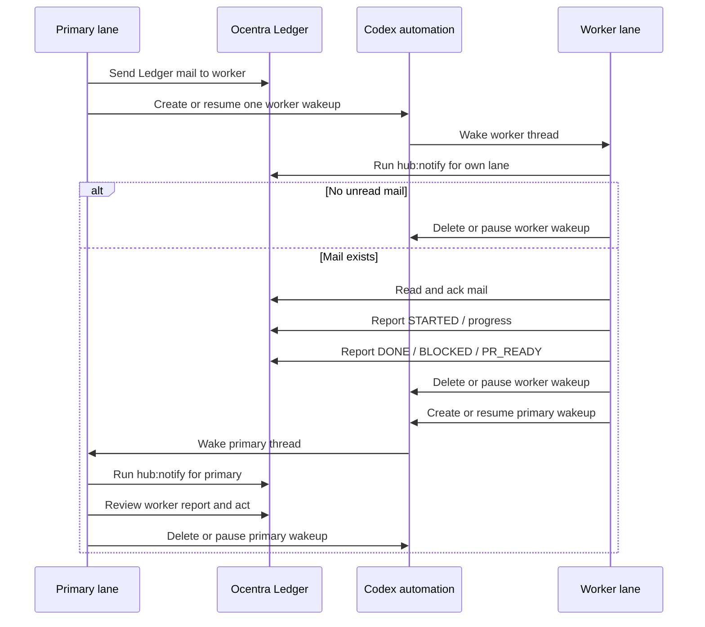

<!-- agent-capsule -->

> Agent Capsule
> Doc: Ocentra Ledger Worktree Coordination
> Kind: architecture/reference documentation; read only when selected by plan route, source router, or assigned workpack.
> Read when: Only when this exact doc is named by the active route, index, feature doc, or assigned workpack.
> Stop rule: Do not continue into sibling docs, broad folders, source trees, or historical checkpoints unless this file gives an explicit next path.
> Proves: only the local scope, status, route, or contract stated by this file and its named proof/checklist rows.
> Does not prove: sibling plan completion, implementation correctness, product status, PR readiness, or broad DONE unless routed proof says so.
> Proof rule: If this file changes status or claims, update the owning feature/plan/checklist/proof route that makes the claim current.
> Snippet rule: fenced blocks in this document are contract/artifact/command examples only. They are not instructions to copy implementation code unless the surrounding section explicitly says the snippet is the public contract shape.

<!-- /agent-capsule -->

# Ocentra Ledger Worktree Coordination

Ocentra Parent no longer owns live hub/ledger implementation. The product repo
owns product code, product docs, config, and thin Enforcer consumer aliases.

Live coordination implementation belongs in Ocentra Enforcer:

```text
E:\ocentra-enforcer
```

The actual event streams, identity files, runtime PID files, peer aliases, and
generated views live under the Enforcer ledger root, not this checkout.

## State Root

Set `LEDGER_ROOT` when a machine needs an explicit state location:

```powershell
$env:LEDGER_ROOT="E:\OcentraLedger\ocentra-parent"
npm run ledger:ensure
```

Without `LEDGER_ROOT`, this repo's Enforcer wrapper uses:

```text
E:\ocentra-enforcer\.ledger\ocentra-parent
```

The state root is disposable/rebuildable except for append-only event streams
and identity. Do not commit it to this repo.

## Lanes

Stable lane identities are explicit:

- `primary`: the user's main checkout and coordinator.
- `codex-a`: reusable Codex worktree lane.
- `codex-b`: reusable Codex worktree lane.
- `codex-c`: reusable Codex worktree lane.
- `codex-d` and `E-*`: additional reusable lanes when assigned.

Set `LEDGER_LANE` or `OCENTRA_PARENT_LEDGER_LANE` in worker shells when the
checkout path does not make the lane obvious. Enforcer coordination aliases
infer common `codex-a`/`codex-b`/`E-A` path names, but explicit lane identity
wins.

## Commands

Verify the Enforcer coordination root:

```powershell
npm run ledger:root
```

Start the local browser/API daemon:

```powershell
npm run ledger:ensure
```

Then open:

```text
http://127.0.0.1:8787/
```

Check the current state:

```powershell
npm run ledger:root
npm run ledger:doctor
npm run ledger:workers
npm run ledger:tasks
```

Send work to a lane:

```powershell
npm run hub:message -- --lane codex-b --subject "V1 slice" --body "Do the assigned work and report DONE with validation."
```

Read and acknowledge mail:

```powershell
npm run hub:inbox
npm run hub:ack
```

Claim and release edit paths:

```powershell
npm run hub:lock -- --paths "packages/activity-domain" --reason "activity status slice"
npm run hub:unlock -- --paths "packages/activity-domain"
```

Report work state:

```powershell
npm run hub:report -- --summary "STARTED activity status slice"
npm run hub:heartbeat -- --state alive --note "minute wake"
```

The old `hub:*` and `lanes:*` names are compatibility aliases that call Ledger.
They do not write `.hub` files.

## Session Leases

Ledger records Codex session leases as thread wake records for a lane, not as
exclusive lane ownership. Repo hooks use the Codex hook `session_id` to record
or refresh the current thread identity for wake routing. Several chats may be
active for the same lane at once, and exact-file claims are the write gate that
prevents collisions.

One thread may opt into manual-only hook behavior:

```powershell
npm run hub:thread:upgrade
```

Inspect the current lane/session view without changing anything:

```powershell
npm run hub:thread-mode
```

That command may only be run from the thread that most recently received a real
`UserPromptSubmit` for the lane. It does not accept a target `--session-id`, so
one thread cannot silently retarget another. Codex hooks currently expose
`session_id`, so manual-only mode treats that active session as the thread
identity available to the hook. In manual-only mode, auto hooks such as
`SessionStart`, `PostToolUse`, and `Stop` do not claim or refresh the lane
lease for that session; only a real `UserPromptSubmit` in the same thread may
do that. Restore the default behavior with:

```powershell
npm run hub:thread:default
```

`hub:thread-mode` is read-only. It reports the lane's active hook session, the
most recent real user-prompt session, and any explicit write-grant sessions so
duplicate-thread confusion stays visible without weakening the upgrade guard.

Explicit user prompts now create writable grants instead of lane takeovers.
When a real `UserPromptSubmit` arrives from another thread on the same lane,
the compatibility layer keeps the existing lease owner but records writable
authority for the prompted session. That means multiple user-directed threads
may write on the same lane at the same time, while auto hooks still keep
single-owner lease semantics.

A prompted coordinator thread may also delegate writable access to spawned
subagent sessions:

```powershell
npm run hub:delegate:grant -- --session-id 019ec463-0620-7a03-a937-8af8e89dc04a --reason "policy-control test worker"
npm run hub:delegate:revoke -- --session-id 019ec463-0620-7a03-a937-8af8e89dc04a
```

Those grant commands may only be run from the thread that most recently
received a real user prompt for the lane. They do not transfer coordination
ownership or the active lease; they only authorize additional writable
sessions. Treat the human user as the super-user: the single-owner rule is for
AI auto hooks and background Codex behavior, not for explicit user-directed
threads or coordinator-delegated workers. Manual-only still changes future
auto-hook behavior for that session only.

Idle liveness should stay outside Codex chat. A watcher or daemon may write
Ledger heartbeat events, but idle workers should not spend chat turns reporting
that nothing changed.

## Targeted Codex Wakeups

Codex hooks are not timers; they only run when a Codex thread is already active.
Codex automations are timers; they can wake a thread, but an always-on
five-minute loop spends tokens even when no Ledger work exists. The coordination
default is therefore event-shaped:

1. The sender writes Ledger mail or a semantic handoff report.
2. The sender creates or resumes one targeted Codex automation for the intended
   recipient thread.
3. The recipient automation runs the lane notifier prefilter first.
4. If there is no wake-worthy Ledger work, the automation deletes or pauses
   itself without doing product or coordination work.
5. If work exists, the recipient reads and acks the Ledger mail, does the
   assignment or review, reports `DONE`, `BLOCKED`, or `PR_READY`, then creates
   or resumes a targeted primary wakeup.
6. Primary wakes, acts on the worker report, and deletes or pauses the primary
   wakeup after the report is handled.

Keep paused per-lane automations available as templates, but do not leave worker
minute automations running while lanes are parked. A slow primary safety-net
automation may remain active only until targeted wakeups are proven reliable on
every active PC.



The cheap prefilter command is:

```powershell
npm run hub:notify -- --lane primary --exit-code
npm run hub:notify -- --lane codex-b --exit-code
```

For workers, the notifier wakes only for unread inbox mail. For `primary`, it
also wakes for worker report summaries beginning with `PR_READY`, `DONE`, or
`BLOCKED`. Routine `STARTED`, progress, and heartbeat events should not wake a
Codex thread.

## Guard

The pre-commit hook calls:

```powershell
npm run ledger:guard
```

The guard checks unread Ledger messages, ownership conflicts, and changed files
outside active claims. `primary` may coordinate without claims; worker lanes
should claim intended paths before editing.

Use the bypass environment variables only for deliberate emergency commits:

```powershell
$env:OCENTRA_PARENT_SKIP_LANE_GUARD="1"
$env:OCENTRA_PARENT_SKIP_HUB_GUARD="1"
```

## Enforcer Ownership Policy

Do not reintroduce `tools/ocentra-ledger` or a Parent-owned ledger submodule.
Coordination code changes belong in `E:\ocentra-enforcer`; this product repo
keeps only the Enforcer config and thin npm aliases.

Generated coordination files belong under the Enforcer ledger root, not under
this product repo.
