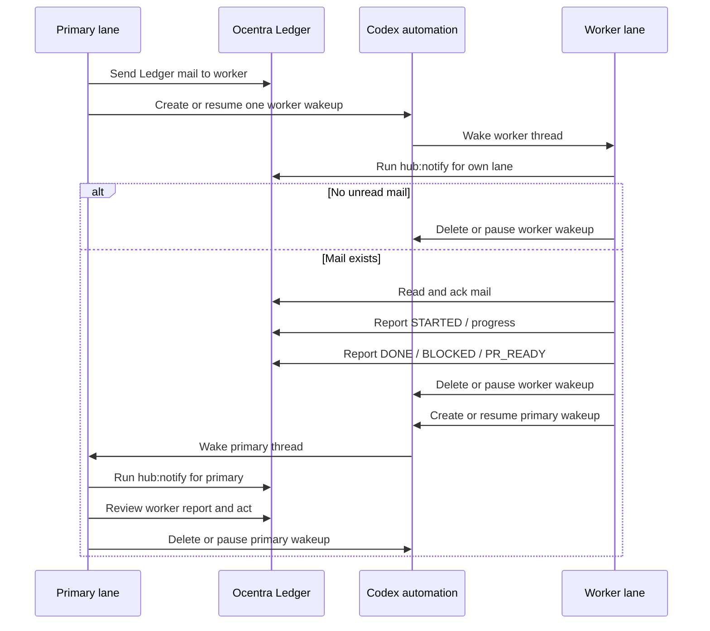

# Ocentra Ledger Worktree Coordination

Ocentra Parent no longer keeps live hub state in this product repo. The product
repo owns code, docs, scripts, and the pinned Ledger submodule only.

Live coordination state belongs in Ocentra Ledger:

```text
tools/ocentra-ledger
```

That path is a git submodule pointing at `ocentra/OcentraParentHub`. The actual
event streams, identity files, runtime PID files, peer aliases, and generated
views are external to this checkout.

## State Root

Set `LEDGER_ROOT` when a machine needs an explicit state location:

```powershell
$env:LEDGER_ROOT="E:\OcentraLedger\ocentra-parent"
npm run ledger:ensure
```

Without `LEDGER_ROOT`, Ledger uses:

```text
~/.ocentra/ledger/ocentra-parent
```

The state root is disposable/rebuildable except for append-only event streams
and identity. Do not commit it to this repo.

## Lanes

Stable lane identities are explicit:

- `primary`: the user's main checkout and coordinator.
- `codex-a`: reusable Codex worktree lane.
- `codex-b`: reusable Codex worktree lane.
- `codex-c`: reusable Codex worktree lane.
- `codex-d` and `E-*`: additional reusable lanes when assigned.

Set `LEDGER_LANE` or `OCENTRA_PARENT_LEDGER_LANE` in worker shells when the
checkout path does not make the lane obvious. The compatibility wrappers infer
common `codex-a`/`codex-b`/`E-A` path names, but explicit lane identity wins.

## Commands

Install/build the pinned Ledger submodule:

```powershell
npm run ledger:install
```

If the submodule is missing after a fresh pull, the Ledger wrapper initializes
`tools/ocentra-ledger` automatically on the first command.

Start the local browser/API daemon:

```powershell
npm run ledger:ensure
```

Then open:

```text
http://127.0.0.1:8787/
```

Check the current state:

```powershell
npm run ledger:root
npm run ledger:doctor
npm run ledger:workers
npm run ledger:tasks
```

Send work to a lane:

```powershell
npm run hub:message -- --lane codex-b --subject "V1 slice" --body "Do the assigned work and report DONE with validation."
```

Read and acknowledge mail:

```powershell
npm run hub:inbox
npm run hub:ack
```

Claim and release edit paths:

```powershell
npm run hub:lock -- --paths "packages/activity-domain" --reason "activity status slice"
npm run hub:unlock -- --paths "packages/activity-domain"
```

Report work state:

```powershell
npm run hub:report -- --summary "STARTED activity status slice"
npm run hub:heartbeat -- --state alive --note "minute wake"
```

The old `hub:*` and `lanes:*` names are compatibility aliases that call Ledger.
They do not write `.hub` files.

## Session Leases

Ledger also tracks one active Codex session lease per worker lane. Repo hooks use
the Codex hook `session_id` to claim or refresh the lease. If two chats are open
for the same lane, the first active session keeps the lane and the second hook
marks that chat read-only. The read-only duplicate may answer questions and
inspect status, but it must not ack mail, edit files, claim paths, heartbeat, or
report work unless the user explicitly retargets that lane.

Idle liveness should stay outside Codex chat. A watcher or daemon may write
Ledger heartbeat events, but idle workers should not spend chat turns reporting
that nothing changed.

## Targeted Codex Wakeups

Codex hooks are not timers; they only run when a Codex thread is already active.
Codex automations are timers; they can wake a thread, but an always-on
five-minute loop spends tokens even when no Ledger work exists. The coordination
default is therefore event-shaped:

1. The sender writes Ledger mail or a semantic handoff report.
2. The sender creates or resumes one targeted Codex automation for the intended
   recipient thread.
3. The recipient automation runs the lane notifier prefilter first.
4. If there is no wake-worthy Ledger work, the automation deletes or pauses
   itself without doing product or coordination work.
5. If work exists, the recipient reads and acks the Ledger mail, does the
   assignment or review, reports `DONE`, `BLOCKED`, or `PR_READY`, then creates
   or resumes a targeted primary wakeup.
6. Primary wakes, acts on the worker report, and deletes or pauses the primary
   wakeup after the report is handled.

Keep paused per-lane automations available as templates, but do not leave worker
minute automations running while lanes are parked. A slow primary safety-net
automation may remain active only until targeted wakeups are proven reliable on
every active PC.



The cheap prefilter command is:

```powershell
npm run hub:notify -- --lane primary --exit-code
npm run hub:notify -- --lane codex-b --exit-code
```

For workers, the notifier wakes only for unread inbox mail. For `primary`, it
also wakes for worker report summaries beginning with `PR_READY`, `DONE`, or
`BLOCKED`. Routine `STARTED`, progress, and heartbeat events should not wake a
Codex thread.

## Guard

The pre-commit hook calls:

```powershell
npm run ledger:guard
```

The guard checks unread Ledger messages, ownership conflicts, and changed files
outside active claims. `primary` may coordinate without claims; worker lanes
should claim intended paths before editing.

Use the bypass environment variables only for deliberate emergency commits:

```powershell
$env:OCENTRA_PARENT_SKIP_LANE_GUARD="1"
$env:OCENTRA_PARENT_SKIP_HUB_GUARD="1"
```

## Submodule Policy

Do not gitignore `tools/ocentra-ledger`. The parent repo tracks only the
submodule pointer and `.gitmodules`; Ledger code changes are committed in
`E:\OcentraParentHub` and then the parent repo pointer is advanced.

Generated Ledger files belong under `LEDGER_ROOT`, not under this product repo.
