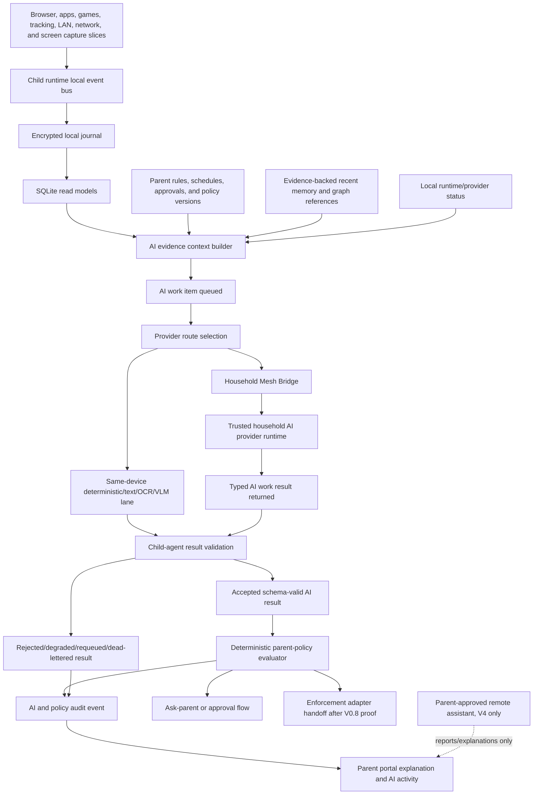

# AI Plan

This folder is the single working plan location for local AI safety contracts,
local model runtime, evidence context building, provider routing, AI job queues,
memory and knowledge graph, TabAgent reuse, screen OCR/VLM routing, policy
handoff, parent explanations, and later parent-approved remote assistant
boundaries.

- [AI Source Index](source-index.md)
- [TabAgent Source Index](tabagent-source-index.md)
- [Current AI Snapshot](current-ai-snapshot.md)
- [V0.6 Local AI Contracts Plan](v0-6-local-ai-contracts-plan.md)
- [V0.7 Local AI Runtime And Dry-Run Plan](v0-7-local-ai-runtime-and-dry-run-plan.md)
- [V0.7 AI Context Builder Plan](v0-7-ai-context-builder-plan.md)
- [V0.7 AI Model Routing And Queue Plan](v0-7-ai-model-routing-and-queue-plan.md)
- [Household AI Provider Mesh Plan](household-ai-provider-mesh-plan.md)
- [V0.7 AI Memory Graph Plan](v0-7-ai-memory-graph-plan.md)
- [V0.7 TabAgent Reuse Plan](v0-7-tabagent-reuse-plan.md)
- [V0.8 Policy Enforcement Handoff Plan](v0-8-policy-enforcement-handoff-plan.md)
- [V1 Screen OCR VLM Plan](v1-screen-ocr-vlm-plan.md)
- [V4 Remote Parent Assistant Plan](v4-remote-parent-assistant-plan.md)
- [Model And Runtime Candidate Strategy](model-and-runtime-candidate-strategy.md)
- [V0.7 AI Test Blueprint](v0-7-ai-test-blueprint.md)
- [AI UI/UX Requirements Guide](ui-ux-requirements-guide.md)
- [AI Proof Pack Template](proof-pack-template.md)
- [Real AI Analysis And Pipeline Proof Matrix](real-ai-analysis-and-pipeline-proof-matrix.md)
- [AI Plan Implementation Checklist](implementation-checklist.md)
- [Pasted Content Coverage Audit](pasted-content-coverage-audit.md)

The rule remains:

```text
AI safety authority is local to the evidence-owning child agent.
AI may execute on the same device or on a trusted paired household AI provider.
AI consumes typed evidence, parent rules, recent context, and evidence-backed memory.
AI does not scan the OS, browser, network, files, screenshots, or apps directly.
AI providers are workers only and cannot decide household policy.
AI output is schema-valid evidence, not household authority.
Parent-authored policy decides allow, warn, time-limit, ask-parent, block, or unknown.
Enforcement adapters consume policy decisions, not raw AI/provider output.
Remote/API AI is disabled for normal child safety.
Remote/API AI may be parent-approved later for explanations and reports only.
TabAgent may be reused only behind Ocentra-owned contracts.
```

## How It Works



## Household AI Provider Mesh

The [Household AI Provider Mesh Plan](household-ai-provider-mesh-plan.md) is the
single detailed plan for distributed local-household AI execution.

Every Rust runtime may expose child-agent, parent-controller, parent-observer,
and/or ai-provider roles. The child-agent role owns evidence truth,
configuration application, AI work ledger, result validation, policy authority,
enforcement handoff, audit, and read models for its device.

The ai-provider role may execute bounded AI work for a trusted paired household
peer. It cannot decide policy, apply configuration, or issue enforcement. It
returns schema-valid results that the evidence-owning child agent validates
before policy consumes them.

The mesh is decentralized. There is no central LAN queue. Each child agent owns
its own AI work ledger. Other devices advertise capability, heartbeat, resource
state, and eligibility. The child agent selects providers and grants leases.

`ocentra-eventing` remains local runtime infrastructure. Cross-device
coordination uses the Household Mesh Bridge, which translates selected local
events into typed LAN messages and republishes validated incoming messages into
the receiving runtime's local bus.

## Where We Are

- The repo already has AI expectations, TabAgent reuse architecture, local AI
  provider runtime boundary docs, and a local AI context builder spec.
- `packages/parent-domain` already contains local AI input/result/runtime,
  provider scheduler, model artifact, context-builder, memory graph, and parent
  assistant contracts with tests.
- `crates/agent-service` already contains local AI runtime status, model
  registry, runtime cache, chat generation request/result, provider scheduler,
  runtime provider proof read model, and parent assistant runtime/service files.
- `crates/agent-core` already contains policy dry-run evaluator, activity store
  memory graph, screen evidence store, browser/app/game/network evidence stores,
  and enforcement policy dispatch proof pieces.
- Existing proof scripts cover local AI runtime/provider status, local AI chat,
  provider scheduler, API provider authorization, parent assistant routing, and
  activity parent-assistant runtime.
- The portal has local AI runtime details and memory graph visibility pieces,
  but the AI product surface is not yet a complete operator view.
- Browser, screen, app/game, LAN, tracking, and activity plans now need one AI
  plan to define how AI consumes their typed evidence without owning capture.

## Where We Want To Be

Ocentra Parent needs a local-first AI system that:

- treats AI as a core safety subsystem, not a scattered helper;
- consumes only typed evidence and parent-authored policy context;
- runs deterministic classifiers before heavier models;
- uses the current local text model lane for reasoning over typed evidence,
  summaries, explanations, and unknown/degraded states;
- adds OCR and guided VLM lanes for screen evidence without making screenshots
  permanent or remote by default;
- maintains evidence-backed recent memory and graph references without allowing
  derived memory to become unexplained truth;
- routes AI jobs through a bounded local queue with model/provider status,
  resource limits, and safe degraded states;
- can delegate execution to trusted household providers without moving evidence
  ownership, policy authority, enforcement authority, or audit ownership away
  from the child agent;
- validates model output before policy consumes it;
- journals AI results, policy decisions, model/runtime refs, prompt/template
  versions, parent-rule refs, and source evidence refs;
- gives parents a readable explanation with citations to evidence and rules;
- keeps remote/API AI outside normal child-device safety, with explicit
  parent-approved data custody when used for explanations or reports.
- proves real browser-use, app-use, and timed-cadence capture artifacts can be
  analyzed by AI before AI analysis is called PR-ready;
- leaves final trigger-to-capture-to-analysis-to-policy proof to the required
  [Screen AI Pipeline Plan](../screen-ai-pipeline-plan/README.md) once screen
  and AI prerequisites are merged or explicitly stacked.

## Parallel Coordination Rules

- Lock the workpack doc and exact implementation paths before editing.
- Fill [AI Plan Implementation Checklist](implementation-checklist.md) and the
  assigned workpack checklist before reporting `DONE` or PR-ready.
- Do not create a second AI truth. Keep `docs/expectations/ai.md`,
  `docs/features/local-ai-safety-evaluator.md`,
  `docs/features/parent-assistant-actions.md`,
  `docs/architecture/local-ai-and-tabagent-reuse.md`,
  `docs/architecture/local-ai-provider-runtime-boundary.md`, and
  `docs/architecture/local-ai-evidence-context-builder.md` as source inputs.
- Build TypeScript Effect Schema contracts first, Rust parity second, real
  stored-evidence/context builder proof third, runtime/provider queue fourth,
  policy handoff fifth, portal visibility sixth, and enforcement handoff only
  after dry-run proof exists.
- Every worker report must name the workpack, touched paths, validation,
  product-doc updates, proof artifacts, UI snapshots if UI changed, and
  remaining non-claims.

## Workpack Checklist

| Step | Workpack                                                                                                                | Target State                                                                                                        |
| ---- | ----------------------------------------------------------------------------------------------------------------------- | ------------------------------------------------------------------------------------------------------------------- |
| 01   | [Source index and repo reconciliation](workpacks/01-source-index-and-repo-reconciliation.md)                            | AI source truth, docs, TabAgent references, and pasted requirements are reconciled before implementation.           |
| 02   | [Current AI snapshot and gap map](workpacks/02-current-ai-snapshot-and-gap-map.md)                                      | Existing contracts, service proofs, UI surfaces, and gaps are named with no duplicate truth.                        |
| 03   | [Contract boundary and Effect schemas](workpacks/03-contract-boundary-and-effect-schemas.md)                            | Local AI input/result/runtime/memory/graph schemas are complete and parser-tested.                                  |
| 04   | [Rust protocol parity for AI contracts](workpacks/04-rust-protocol-parity-for-ai-contracts.md)                          | Rust crossing AI shapes mirror TypeScript contracts and pass parity tests.                                          |
| 05   | [LocalModelRuntimeStatus hardening](workpacks/05-local-model-runtime-status-hardening.md)                               | Runtime status covers configured, unconfigured, unavailable, loading, loaded, degraded, and failed states.          |
| 06   | [LocalProviderCapability hardening](workpacks/06-local-provider-capability-hardening.md)                                | Provider capability, task support, privacy mode, resource class, and fallback order are typed.                      |
| 07   | [AI job queue contract](workpacks/07-ai-job-queue-contract.md)                                                          | AI jobs are bounded, lease-aware, deduplicated, auditable, replayable, and source-referenced.                       |
| 08   | [AI provider routing contract](workpacks/08-ai-provider-routing-contract.md)                                            | Deterministic, same-device, household provider, mobile fallback, and remote assistant routes are explicit.          |
| 09   | [Local evidence context builder V1](workpacks/09-local-evidence-context-builder-v1.md)                                  | Context builder assembles the smallest valid context from stored evidence and parent rules.                         |
| 10   | [Evidence reference normalization](workpacks/10-evidence-reference-normalization.md)                                    | Browser, app/game, network, screen, location, LAN, parent-action, and policy refs share common custody fields.      |
| 11   | [Parent rule context builder](workpacks/11-parent-rule-context-builder.md)                                              | AI context receives explicit parent rules, schedules, approvals, and policy versions.                               |
| 12   | [Prompt template version registry](workpacks/12-prompt-template-version-registry.md)                                    | Prompts/templates are versioned, minimized, tested, and auditable.                                                  |
| 13   | [Deterministic no-model classifier lane](workpacks/13-deterministic-no-model-classifier-lane.md)                        | Known domains/apps/games/platforms and structured metadata classify before model calls.                             |
| 14   | [Local text LLM adapter boundary](workpacks/14-local-text-llm-adapter-boundary.md)                                      | The current local text model lane is contract-bound and cannot scan sources directly.                               |
| 15   | [Local text LLM execution dry-run adapter](workpacks/15-local-text-llm-execution-dry-run-adapter.md)                    | Local text inference can run in dry-run with typed inputs, typed outputs, and invalid-output rejection.             |
| 16   | [Output parser and schema validator](workpacks/16-output-parser-and-schema-validator.md)                                | Model output must decode into contracts before policy sees it.                                                      |
| 17   | [Degraded timeout invalid-output handling](workpacks/17-degraded-timeout-invalid-output-handling.md)                    | Timeout, overload, invalid JSON, low confidence, and missing evidence degrade safely.                               |
| 18   | [Deterministic policy evaluator integration](workpacks/18-deterministic-policy-evaluator-integration.md)                | Policy consumes valid AI evidence and parent rules while AI cannot override stricter rules.                         |
| 19   | [AI result journal SQLite ingest](workpacks/19-ai-result-journal-sqlite-ingest.md)                                      | AI results and policy outputs are journaled and replayable into read models.                                        |
| 20   | [Parent explanation read model](workpacks/20-parent-explanation-read-model.md)                                          | Portal explanations cite evidence refs, parent rules, prompt versions, and model/runtime state.                     |
| 21   | [Memory reference contract](workpacks/21-memory-reference-contract.md)                                                  | Memory refs include source evidence, policy/action refs, confidence, expiry, and index version.                     |
| 22   | [Short-window recent activity memory](workpacks/22-short-window-recent-activity-memory.md)                              | Recent activity supports local safety decisions without becoming permanent unbounded memory.                        |
| 23   | [Evidence-backed semantic memory](workpacks/23-evidence-backed-semantic-memory.md)                                      | Semantic memory is derived, local, source-cited, and invalidatable.                                                 |
| 24   | [Knowledge graph reference contract](workpacks/24-knowledge-graph-reference-contract.md)                                | Graph refs are typed, source-cited, local, and not direct enforcement truth.                                        |
| 25   | [Minimal graph edges for safety context](workpacks/25-minimal-graph-edges-for-safety-context.md)                        | Child/device/app/site/policy/evidence/decision edges exist before broad graph expansion.                            |
| 26   | [TabAgent code audit and reuse map](workpacks/26-tabagent-code-audit-and-reuse-map.md)                                  | TabAgent and TabAgentServer reference files are mapped to Ocentra-owned boundaries.                                 |
| 27   | [TabAgent native bridge reuse candidate](workpacks/27-tabagent-native-bridge-reuse-candidate.md)                        | Native bridge lessons are translated into Ocentra route/status contracts only.                                      |
| 28   | [TabAgent model lifecycle cache reuse candidate](workpacks/28-tabagent-model-lifecycle-cache-reuse-candidate.md)        | Model load/cache/progress ideas are adapted without mixing model cache with evidence storage.                       |
| 29   | [TabAgent memory graph reuse candidate](workpacks/29-tabagent-memory-graph-reuse-candidate.md)                          | TabAgent graph ideas become source-cited Ocentra memory/graph contracts.                                            |
| 30   | [OCR worker lane](workpacks/30-ocr-worker-lane.md)                                                                      | OCR extraction is local, temporary, evidence-linked, deletion-proved, and screen-plan aligned.                      |
| 31   | [Guided VLM worker lane](workpacks/31-guided-vlm-worker-lane.md)                                                        | VLM answers guided safety questions only and never receives unbounded permanent image custody.                      |
| 32   | [Household AI provider mesh and remote assistant boundary](workpacks/32-family-ai-hub-and-remote-assistant-boundary.md) | Household LAN provider mesh and remote/API assistant are separate, with child-agent authority preserved.            |
| 33   | [Browser URL video AI lane](workpacks/33-browser-url-video-ai-lane.md)                                                  | Managed browser URL/video metadata feeds AI as typed evidence, not direct browser access.                           |
| 34   | [Browser social feed signup AI lane](workpacks/34-browser-social-feed-signup-ai-lane.md)                                | Social/signup/feed signals are classified only from typed managed browser evidence.                                 |
| 35   | [Browser game cloud game AI lane](workpacks/35-browser-game-cloud-game-ai-lane.md)                                      | Browser games and cloud games route through browser evidence plus game-specific policy refs.                        |
| 36   | [App game unknown classifier lane](workpacks/36-app-game-unknown-classifier-lane.md)                                    | Unknown apps/games classify from stored app/game evidence, catalog refs, and screen summaries.                      |
| 37   | [Tracking location safety analysis lane](workpacks/37-tracking-location-safety-analysis-lane.md)                        | Tracking AI explains expected-place, stale/offline, nearby-place ambiguity, and parent acknowledgement.             |
| 38   | [Screen OCR VLM router lane](workpacks/38-screen-ocr-vlm-router-lane.md)                                                | Screen evidence chooses OCR, VLM, text model, or deterministic fallback by scope and policy.                        |
| 39   | [Device hardware model fit lane](workpacks/39-device-hardware-model-fit-lane.md)                                        | Device hardware, GPU/CPU/RAM, model fit, and unavailable states are visible and tested.                             |
| 40   | [Model catalog artifact integrity lane](workpacks/40-model-catalog-artifact-integrity-lane.md)                          | Local model artifacts are verified, versioned, resumable, and not confused with evidence.                           |
| 41   | [Llama GGUF runtime packaging lane](workpacks/41-llama-gguf-runtime-packaging-lane.md)                                  | llama.cpp/GGUF runtime packaging, paths, acceleration settings, and install status are product-grade.               |
| 42   | [Inference settings template governance lane](workpacks/42-inference-settings-template-governance-lane.md)              | Inference settings, prompt versions, and template changes are governed and regression-tested.                       |
| 43   | [AI activity portal surface lane](workpacks/43-ai-activity-portal-surface-lane.md)                                      | AI activity, job state, result refs, and explanations are visible without raw child data exposure.                  |
| 44   | [Provider API authorization custody lane](workpacks/44-provider-api-authorization-custody-lane.md)                      | External/API providers remain parent-authorized and outside normal child safety.                                    |
| 45   | [Remote redacted report assistant lane](workpacks/45-remote-redacted-report-assistant-lane.md)                          | Parent reports can use local or parent-approved remote explanation with citations and retention state.              |
| 46   | [Security privacy negative gates lane](workpacks/46-security-privacy-negative-gates-lane.md)                            | Tests prove AI cannot directly scan, enforce, upload raw screenshots, or use unsourced memory.                      |
| 47   | [Performance resource battery proof lane](workpacks/47-performance-resource-battery-proof-lane.md)                      | AI jobs respect provider class, resource limits, queue backpressure, foreground safety, and battery/thermal states. |
| 48   | [Rollout checklist and PR gate](workpacks/48-rollout-checklist-and-pr-gate.md)                                          | AI work cannot merge as complete without docs, tests, proof packs, and UI screenshots where relevant.               |
