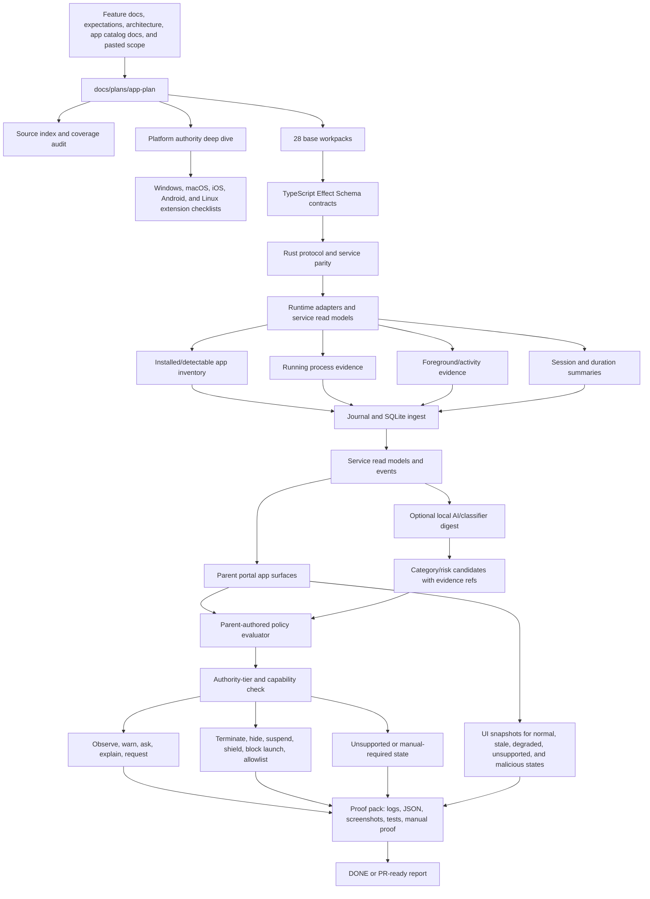

# Native Apps Plan

This folder is the single working plan location for native installed app
evidence, app inventory, app identity, app sessions, app policy targets, app
control authority tiers, and parent-facing app UI/UX requirements.

Shared native app/game evidence-spine work and the native game product slice now
route through [App + Game Plan](../app-game-plan/README.md). Keep this folder as
the app-only product slice and bridge back to the shared app/game plan whenever
implementation would otherwise duplicate low-level evidence, runtime, journal,
policy, or proof paths.

- [Native App Source Index](source-index.md)
- [Current Native App Snapshot](current-app-snapshot.md)
- [V0.5 Native Apps Full Scope Plan](v0-5-native-apps-full-scope-plan.md)
- [V0.5 Native Apps Platform Deep Dive](v0-5-native-apps-platform-deep-dive.md)
- [V0.5 Native Apps Test Blueprint](v0-5-native-apps-test-blueprint.md)
- [Native Apps UI/UX Requirements Guide](ui-ux-requirements-guide.md)
- [Native Apps Implementation Checklist](implementation-checklist.md)
- [Pasted Content Coverage Audit](pasted-content-coverage-audit.md)

The rule remains:

```text
Installed app inventory is evidence, not current use.
Running process evidence proves process use, not foreground use.
Foreground evidence proves active use, not app content.
AI classification is evidence, not authority.
Parent policy decides allow, observe, warn, ask, limit, block, or manual-required.
Enforcement requires platform adapter and authority-tier proof.
```

## How It Works



## Where We Are

- `origin/main` already has app/game session contracts in
  `packages/activity-domain`, app-control catalog and authoring contracts in
  `packages/parent-domain`, Rust protocol mirrors in `crates/agent-protocol`,
  SQLite-backed app/game observation helpers in `crates/agent-core`, scoped
  app time-limit enforcement proof in `crates/agent-core`, and live activity /
  policy-preview surfaces in `apps/portal`.
- Current docs already separate browser games from native app/game evidence.
  Browser games and web apps stay in [browser-plan](../browser-plan/README.md).
  Native games and launchers are adjacent game scope. This folder narrows the
  app side: non-browser native, installed, packaged, desktop, mobile, utility,
  social, video, AI, risk, and unknown apps.
- Existing product docs keep broad app blocking manual-required unless a
  platform adapter proves the authority tier, setup, action, rollback, and
  audit state.
- The newest platform source makes the plan stricter: no platform should be
  described as simply unsupported unless the plan lists normal-app,
  permissioned, managed-device, admin/root/system-extension, kiosk/single-app,
  and proof-gate paths where relevant.

## Where We Want To Be

Ocentra Parent needs an end-to-end native app subsystem that:

- inventories installed and detectable native apps honestly;
- merges app identity from package id, bundle id, AppUserModelId, desktop entry,
  executable path, publisher, signature, hash, token, parent label, and display
  name without treating display name as identity;
- observes running process/package/app activity without claiming content;
- proves foreground/activity state separately from running state;
- derives running and foreground duration from stored evidence, not portal
  refresh;
- journals app evidence before portal, policy, AI, or enforcement use;
- replays evidence into SQLite read models;
- classifies unknown/risk apps from stored evidence or digests only;
- compiles parent app rules against proved identity, category, schedule,
  approval, and authority-tier capability;
- supports observe, warn, ask, time-limit, terminate, hide, suspend, shield,
  block-launch, allowlist, and manual-required states only where proof exists;
- makes platform setup cost visible to parents before stronger controls are
  claimed;
- renders inventory, running, foreground, unknown, risk, policy, capability,
  child request, stale, degraded, unsupported, and manual-required states in the
  parent UI;
- keeps Windows, macOS, Linux, Android, iOS, MDM, device-owner, supervised,
  Endpoint Security, AppLocker/App Control, Screen Time, ManagedSettings,
  cgroups/systemd, AppArmor/SELinux, Flatpak, Snap, signing, store, and
  entitlement claims platform-specific until proof exists.

## Parallel Coordination Rules

- Lock the workpack doc and exact implementation/docs paths before editing.
- Fill [Native Apps Implementation Checklist](implementation-checklist.md) and
  the assigned workpack's `## AI Worker Checklist` before reporting `DONE` or
  PR-ready.
- Do not create a second app-control truth. Keep
  `docs/features/app-game-control.md`,
  `docs/expectations/app-game-evidence.md`,
  `docs/architecture/app-game-evidence-sessions.md`, and the app-control
  catalog docs as source inputs.
- Build TypeScript domain contracts first, Rust protocol/service parity second,
  journal/read-model wiring third, portal consumption fourth, and real
  platform proof only after those surfaces are aligned.
- Every worker report must name the workpack, touched paths, validation,
  product-doc updates, authority-tier proof, and manual-required gaps.

## Workpack Checklist

| Step | Workpack                                                                                                                     | Target State                                                                                                                                         |
| ---- | ---------------------------------------------------------------------------------------------------------------------------- | ---------------------------------------------------------------------------------------------------------------------------------------------------- |
| 01   | [Contract boundary and Effect schemas](workpacks/01-contract-boundary-and-effect-schemas.md)                                 | App inventory, runtime, session, policy, authority, approval, and action states are schema-backed before runtime code consumes them.                 |
| 02   | [Source index and doc reconciliation](workpacks/02-source-index-and-doc-reconciliation.md)                                   | Existing app/game and app-control docs stay source-of-truth inputs and this plan links them without duplicating claims.                              |
| 03   | [Current app snapshot and gap map](workpacks/03-current-app-snapshot-and-gap-map.md)                                         | Current code, proof, UI, and platform gaps are documented before implementation begins.                                                              |
| 04   | [App identity model](workpacks/04-app-identity-model.md)                                                                     | Multiple evidence fields can identify one app without display-name-only matching.                                                                    |
| 05   | [Installed app inventory model](workpacks/05-installed-app-inventory-model.md)                                               | Inventory rows include source, confidence, installed state, category candidates, and no-use claim guards.                                            |
| 06   | [Windows installed app inventory adapter](workpacks/06-windows-installed-app-inventory-adapter.md)                           | Registry, Start Menu, known path, metadata, signature, and hash sources populate partial inventory.                                                  |
| 07   | [Windows Store UWP AppX inventory adapter](workpacks/07-windows-store-uwp-appx-inventory-adapter.md)                         | Microsoft Store/UWP/AppX identity is represented separately from Win32 executable identity.                                                          |
| 08   | [Windows process runtime evidence adapter](workpacks/08-windows-process-runtime-evidence-adapter.md)                         | Process snapshots/start/exit produce typed runtime evidence.                                                                                         |
| 09   | [Windows foreground app evidence adapter](workpacks/09-windows-foreground-app-evidence-adapter.md)                           | Foreground-window evidence proves active use without content claims.                                                                                 |
| 10   | [Cross-platform authority matrix](workpacks/10-cross-platform-authority-matrix.md)                                           | Windows, macOS, Linux, Android, and iOS capabilities are represented by authority tier and proof state.                                              |
| 11   | [App category and risk taxonomy](workpacks/11-app-category-and-risk-taxonomy.md)                                             | App categories and risk candidates are policy inputs with source/confidence, not automatic decisions.                                                |
| 12   | [App sessionization and duration engine](workpacks/12-app-sessionization-and-duration-engine.md)                             | Running and foreground duration are derived from stored evidence and replayable.                                                                     |
| 13   | [Journal and SQLite app ingest](workpacks/13-journal-and-sqlite-app-ingest.md)                                               | App evidence is stored and replayable before consumers use it.                                                                                       |
| 14   | [App read models and service events](workpacks/14-app-read-models-and-service-events.md)                                     | Service emits app inventory/running/foreground/session/capability read models through typed protocol.                                                |
| 15   | [Parent portal app inventory running session surfaces](workpacks/15-parent-portal-app-inventory-running-session-surfaces.md) | Parent UI renders service-backed app inventory, running, foreground, session, unknown, and capability states.                                        |
| 16   | [New app and unknown app approval flow](workpacks/16-new-app-and-unknown-app-approval-flow.md)                               | New/unknown apps can request approval where adapter proof exists or report/ask where not.                                                            |
| 17   | [Risk app detection](workpacks/17-risk-app-detection.md)                                                                     | VPN/proxy, remote desktop, torrent/download, installer, AI/chat, messaging/social/video, and unknown risk states are first-class.                    |
| 18   | [Policy target compiler for app rules](workpacks/18-policy-target-compiler-for-app-rules.md)                                 | App targets compile only with identity, category, evidence, authority, and capability proof.                                                         |
| 19   | [Time budget schedule bonus-time integration](workpacks/19-time-budget-schedule-bonus-time-integration.md)                   | App schedules and budgets consume session summaries and preserve bonus/approval/audit refs.                                                          |
| 20   | [Child-facing app warning block request UX](workpacks/20-child-facing-app-warning-block-request-ux.md)                       | Child UX explains warnings, limits, and approval requests without shame or parent diagnostics.                                                       |
| 21   | [Windows owned-process terminate time-limit proof](workpacks/21-windows-owned-process-terminate-time-limit-proof.md)         | Scoped Windows owned-process time limit/terminate proof remains distinct from broad app blocking.                                                    |
| 22   | [Broad blocking proof gates](workpacks/22-broad-blocking-proof-gates.md)                                                     | AppLocker, App Control, MDM, Device Owner, ManagedSettings, Endpoint Security, cgroups/systemd, and similar paths stay manual-required until proved. |
| 23   | [App AI classifier digest boundary](workpacks/23-app-ai-classifier-digest-boundary.md)                                       | AI consumes stored evidence/digests and cannot scan the OS or enforce directly.                                                                      |
| 24   | [Platform extension checklist and proof routing](workpacks/24-platform-extension-checklist-and-proof-routing.md)             | Platform-specific MAC/IOS/ANDROID/LINUX checklist rows route to proof packs without bloating the MVP base.                                           |
| 25   | [Install and uninstall approval handoff](workpacks/25-install-and-uninstall-approval-handoff.md)                             | Install/uninstall approvals stay platform-specific and custody-gated.                                                                                |
| 26   | [Performance and service health](workpacks/26-performance-and-service-health.md)                                             | Inventory, runtime polling, journaling, replay, policy, and portal rendering stay bounded.                                                           |
| 27   | [E2E and manual proof artifacts](workpacks/27-e2e-and-manual-proof-artifacts.md)                                             | App claims have stored JSON/screenshots/proof outputs and manual-required labels.                                                                    |
| 28   | [Rollout checklist and PR gate](workpacks/28-rollout-checklist-and-pr-gate.md)                                               | App work updates docs/checklists only when proof changes status and cannot merge with no-claim violations.                                           |

## Progress Reconciliation - 2026-06-02

Checked items below mean concrete proof exists in merged `main` or current
source files. They do not mark the whole native app plan complete.

- [x] V0.5.2 app/game evidence research/spec exists.
- [x] App/game evidence contracts exist in `packages/activity-domain`.
- [x] App-control catalog and authoring contracts exist in `packages/parent-domain`.
- [x] Rust app/game session protocol/read-model mirrors exist in
      `crates/agent-protocol`.
- [x] SQLite-backed app/game observation helpers exist in `crates/agent-core`.
- [x] Scoped Windows owned-process app time-limit proof exists in
      `crates/agent-core` and focused proof scripts.
- [x] Portal live activity and policy-preview surfaces can render service-backed
      evidence and policy states.
- [x] Existing docs keep broad installed-app blocking manual-required.
- [ ] App-only inventory and identity quality are not product-complete.
- [ ] Parent-visible app catalog and app dashboard are not product-complete.
- [ ] New/unknown app approval and polished child request UX remain incomplete.
- [ ] Broad blocking remains manual-required outside scoped owned-process proof.
- [ ] macOS, Linux, Android, iOS, MDM, supervised/device-owner, Endpoint
      Security, AppLocker/App Control, Screen Time, ManagedSettings,
      signing/store/entitlement, and kiosk/single-app claims remain
      platform-specific/manual-required until separate proof exists.

## Planning Expansion - 2026-06-02

- [x] Native app plan folder created with source index, current snapshot, full
      scope plan, platform deep dive, test blueprint, UI/UX guide,
      implementation checklist, coverage audit, and 28 workpacks.
- [x] Doc 2 test blueprint integrated with evidence invariants, minimum serious
      MVP test set, fixture matrices, CI/manual gates, merge blockers,
      platform-specific no-claim gates, and final quality bar.
- [x] All 28 workpacks expanded to browser-plan style with full source inputs,
      where-we-are/target state, scope, touched paths, tests/proof, repeated AI
      worker checklist, proof-pack requirements, doc-update rules, and
      manual-required gaps.
- [x] Platform extension checklist stays separate from base MVP workpacks.
