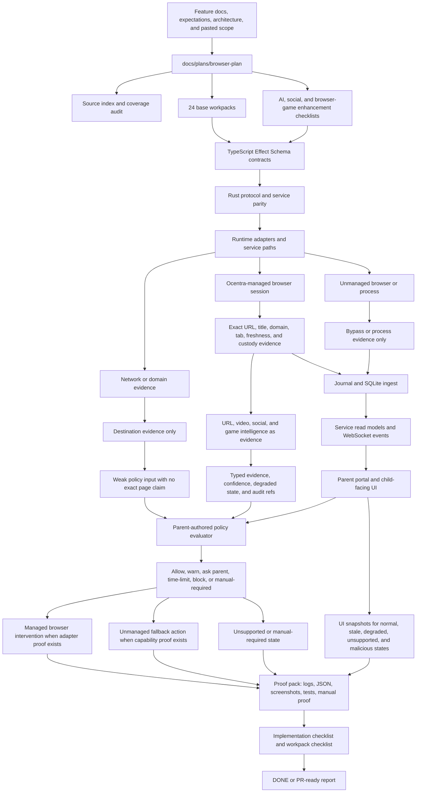

# Browser Plan

This folder is the single working plan location for managed browser evidence,
browser policy authoring, unmanaged browser fallback, browser intervention, and
parent-facing browser UI/UX requirements.

- [Browser Source Index](source-index.md)
- [Current Browser Snapshot](current-browser-snapshot.md)
- [V0.5 Managed Browser Full Scope Plan](v0-5-managed-browser-full-scope-plan.md)
- [Browser Plan Implementation Checklist](implementation-checklist.md)
- [Pasted Content Coverage Audit](pasted-content-coverage-audit.md)
- [V0.5 Browser URL And Video AI Intelligence Plan](v0-5-browser-url-video-ai-intelligence-plan.md)
- [V0.5 Social Platform Account Feed And Gating Plan](v0-5-social-platform-account-feed-gating-plan.md)
- [Social Platform Account Feed Workpacks](social-platform-account-feed/README.md)
- [V0.5 Browser Games Cloud Gaming And Game Portal Gating Plan](v0-5-browser-games-cloud-gaming-gating-plan.md)
- [Browser Games Cloud Gaming Workpacks](browser-games-cloud-gaming/readme.md)
- [V0.5 Managed Browser Test Blueprint](v0-5-managed-browser-test-blueprint.md)
- [Browser UI/UX Requirements Guide](ui-ux-requirements-guide.md)

The rule remains:

```text
Managed browser proves exact URL/tab.
Unmanaged browser proves bypass/process use only.
Network/domain proves destination only.
AI classification is evidence, not authority.
Parent policy decides the action.
Social account/feed gates need evidence, policy, approval, and audit.
Browser games need game-specific evidence, not generic web blocking.
Extension is optional helper, not foundation.
```

## How It Works



## Where We Are

- `origin/main` already has browser evidence contracts in
  `packages/activity-domain`, browser policy authoring/catalog contracts in
  `packages/parent-domain`, browser WebSocket adapter contracts in
  `packages/agent-protocol-domain`, Rust protocol mirrors in
  `crates/agent-protocol`, runtime bridge/session/store code in
  `crates/agent-core`, service read-model/status/policy APIs in
  `crates/agent-service`, and portal browser status/intervention panels in
  `apps/portal`.
- Existing proof scripts cover managed browser profile matrix,
  service-backed browser evidence, managed browser intervention, V0.8
  browser/domain adapter proof, Windows managed/unmanaged enforcement, browser
  performance health, and browser-plan artifact manifest indexing.
- Existing docs already define the claim boundary. This folder does not replace
  those source docs. It indexes them and turns them into an implementation and
  proof plan.
- Current implementation can represent managed session status, tab-list
  evidence, active state as `unknown`, stale/degraded states, unmanaged browser
  fallback, browser policy update protocol, and portal visibility.
- The browser URL/video intelligence plan is now documented as a browser-owned
  enhancement path. It remains planning-only until URL shape, metadata, local AI,
  memory, policy, enforcement, and UI proof exists.
- The social platform/account/feed gating plan is now documented as a
  browser-owned enhancement path for managed web surfaces, with native apps,
  connectors, mobile, policy, and screen evidence kept as adjacent boundaries.
- The social platform/account/feed workpack folder now gives those enhancement
  rows a focused README and proof-root map without adding runtime, UI, native
  app, connector, or enforcement claims.
- The browser games/cloud gaming/game portal plan is now documented as a
  browser-owned enhancement path for managed web games, with native games and
  launchers kept under app/game-control evidence.
- The browser games/cloud gaming workpack folder now gives those enhancement
  rows a focused README and proof-root map without adding contracts, runtime,
  UI, native game control, cloud-streamed frame analysis, or enforcement
  claims.

## Where We Want To Be

Ocentra Parent needs an end-to-end managed browser subsystem that:

- inventories installed and running browsers honestly;
- launches Edge/Chrome/Chrome for Testing inside Ocentra-owned profiles;
- consumes only Ocentra-launched loopback browser bridges;
- maps URL/title/domain/tab evidence into typed contracts;
- journals browser evidence before portal, policy, or AI use;
- replays evidence into SQLite read models;
- classifies URL/page/video meaning through typed local AI evidence without
  letting AI directly enforce;
- routes video/social semantics to parent policy and adjacent social/video
  source docs without pretending URL metadata proves actual content;
- gates social account creation, secondary-account attempts, feeds, reels,
  shorts, livestreams, messaging routes, and upload/post flows only when
  evidence and adapter capability prove the action;
- classifies browser game portals, WebGL/canvas games, unblocked game sites,
  cloud gaming, game accounts, purchases, UGC/multiplayer risk, and educational
  games without pretending generic URL or canvas evidence proves exact content;
- labels active-tab certainty honestly;
- detects unmanaged browser use as bypass/process evidence only;
- compiles parent browser rules against proved capabilities;
- proves warn/block/intervention actions before product claims;
- renders capability, degraded, stale, manual-required, unsupported, and
  unmanaged states in the parent UI;
- keeps Windows, macOS, Linux, Android, iOS, Safari, Firefox, and mobile browser
  claims platform-specific until real proof exists.

## Parallel Coordination Rules

- Lock the workpack doc and exact implementation paths before editing.
- Fill [Browser Plan Implementation Checklist](implementation-checklist.md) and
  the assigned workpack's `## AI Worker Checklist` before reporting `DONE` or
  PR-ready.
- Do not create a second browser-control truth. Keep
  `docs/features/browser-web-control.md`,
  `docs/expectations/browser-evidence.md`, and
  `docs/architecture/browser-url-tab-evidence-capture.md` as source inputs.
- Build TypeScript domain contracts first, Rust protocol/service parity second,
  journal/read-model wiring third, portal consumption fourth, and real browser
  proof only after those surfaces are aligned.
- Every worker report must name the workpack, touched paths, validation,
  product-doc updates, and manual-required gaps.

## Workpack Checklist

| Step | Workpack                                                                                         | Target State                                                                                                                                      |
| ---- | ------------------------------------------------------------------------------------------------ | ------------------------------------------------------------------------------------------------------------------------------------------------- |
| 01   | [Contract boundary and Effect schemas](workpacks/01-contract-boundary-and-effect-schemas.md)     | Browser inventory, session, evidence, policy, intervention, and unmanaged fallback contracts are schema-backed before runtime code consumes them. |
| 02   | [Source index and doc reconciliation](workpacks/02-source-index-and-doc-reconciliation.md)       | Existing browser docs stay source-of-truth inputs and this plan links them without duplicating claims.                                            |
| 03   | [Browser inventory model](workpacks/03-browser-inventory-model.md)                               | Installed/running browser rows, support tiers, reason codes, and capability flags are typed.                                                      |
| 04   | [Windows browser inventory adapter](workpacks/04-windows-browser-inventory-adapter.md)           | Windows registry/path/AppX/process evidence can populate inventory without URL claims.                                                            |
| 05   | [Cross-platform inventory matrix](workpacks/05-cross-platform-inventory-matrix.md)               | macOS, Linux, Android, iOS, Safari, Firefox, and mobile states are represented as platform-specific/manual-required until proof exists.           |
| 06   | [Managed profile store](workpacks/06-managed-profile-store.md)                                   | Ocentra-owned profile roots are created, repaired, redacted, and rejected when unsafe.                                                            |
| 07   | [Managed Chromium launcher](workpacks/07-managed-chromium-launcher.md)                           | Edge/Chrome launch through managed profiles, random loopback ports, and tracked sessions.                                                         |
| 08   | [Bridge custody and security](workpacks/08-bridge-custody-and-security.md)                       | Only Ocentra-launched loopback bridges for current sessions are consumed.                                                                         |
| 09   | [CDP version and target adapter](workpacks/09-cdp-version-and-target-adapter.md)                 | `/json/version` and `/json/list` map page targets safely and redact debugger endpoints.                                                           |
| 10   | [Tab evidence mapper](workpacks/10-tab-evidence-mapper.md)                                       | Raw bridge targets become typed URL/title/domain/tab evidence with honest active-state certainty.                                                 |
| 11   | [Active-tab proof model](workpacks/11-active-tab-proof-model.md)                                 | Target lists stay `unknown` until focus/activation proof exists.                                                                                  |
| 12   | [Journal and SQLite browser ingest](workpacks/12-journal-and-sqlite-browser-ingest.md)           | Browser evidence is stored and replayable before any portal, policy, or AI consumer sees it.                                                      |
| 13   | [Browser read models and service events](workpacks/13-browser-read-models-and-service-events.md) | Service emits browser status/evidence/intervention read models over typed protocol.                                                               |
| 14   | [Portal browser status surfaces](workpacks/14-portal-browser-status-surfaces.md)                 | Parent UI renders managed session, evidence, unmanaged, stale, degraded, and custody labels.                                                      |
| 15   | [Browser policy authoring manifest](workpacks/15-browser-policy-authoring-manifest.md)           | Portal policy UI renders from typed manifests and sends typed update commands, including managed Chrome/Edge policy-writer inputs.                |
| 16   | [Policy target compiler](workpacks/16-policy-target-compiler.md)                                 | Exact URL, domain, category, video, search, unmanaged, and action targets compile only with required capability proof.                            |
| 17   | [Managed intervention and block page](workpacks/17-managed-intervention-and-block-page.md)       | Managed warn/block/redirect behavior is proved before product claims.                                                                             |
| 18   | [Unmanaged browser detection](workpacks/18-unmanaged-browser-detection.md)                       | Browser-like processes outside managed sessions are reported as bypass/process evidence only.                                                     |
| 19   | [Unmanaged fallback UX and actions](workpacks/19-unmanaged-fallback-ux-and-actions.md)           | Report, warn, terminate, relaunch, and OS block states are capability-gated and visible.                                                          |
| 20   | [Windows AppLocker and App Control proof](workpacks/20-windows-applocker-app-control-proof.md)   | OS-level unmanaged browser prevention remains manual/real-proof-gated until validated.                                                            |
| 21   | [Extension and native host boundary](workpacks/21-extension-and-native-host-boundary.md)         | Extension/native-host support is optional, managed-profile-only, and separately proved.                                                           |
| 22   | [Performance and service health](workpacks/22-performance-and-service-health.md)                 | Inventory, bridge polling, journaling, replay, and portal rendering stay bounded.                                                                 |
| 23   | [E2E and manual proof artifacts](workpacks/23-e2e-and-manual-proof-artifacts.md)                 | Real browser claims have stored JSON/screenshots/proof outputs and manual-required labels.                                                        |
| 24   | [Rollout, checklist, and PR gate](workpacks/24-rollout-checklist-and-pr-gate.md)                 | Browser work updates docs/checklists only when proof changes status and cannot merge with no-claim violations.                                    |

## Progress Reconciliation - 2026-06-02

Checked items below mean concrete proof exists in merged `main` or current
source files. They do not mark the whole browser plan complete.

- [ ] Browser URL/tab evidence research/spec exists.
- [ ] Browser evidence contracts exist in `packages/activity-domain`.
- [ ] Browser policy authoring/catalog contracts exist in `packages/parent-domain`.
- [ ] Browser policy command/event adapter exists in `packages/agent-protocol-domain`.
- [ ] Rust browser protocol/read-model/state mirrors exist in `crates/agent-protocol`.
- [ ] Managed launch planning rejects default/unowned profile paths in `crates/agent-core`.
- [ ] CDP bridge polling maps `/json/version` and `/json/list` page targets with active state `unknown`.
- [ ] Browser events can be recorded through the activity journal and SQLite path.
- [ ] Portal can render managed browser status, browser evidence summary, and browser intervention state.
- [ ] Real/proof scripts exist for managed-browser matrix, service proof, intervention proof, and Windows managed/unmanaged enforcement.
- [ ] Full browser inventory/read model is not product-complete.
- [ ] Active-tab proof is not complete beyond target-list/unknown handling.
- [ ] Managed warning/block is proof-gated and not a general product claim.
- [ ] Unmanaged exact URL evidence remains not claimed.
- [ ] AppLocker/App Control enforcement needs real platform proof before stronger claims.
- [ ] macOS, Linux, Android, iOS, Safari, Firefox, extension/native-host, stores/signing, and mobile browser control remain platform-specific/manual-required until separate proof exists.
