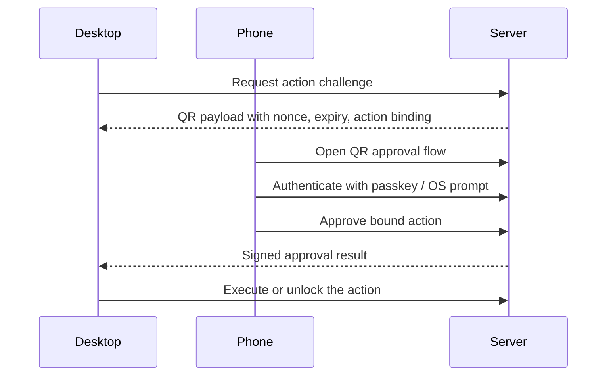

# Phone QR Approval Model

This document defines the desktop-to-phone approval bridge.

## Model summary

A desktop can display a QR challenge. The parent scans it with the phone that already carries the parent's passkey or OS-native approval factor. The phone approves a single action and returns a signed response to the desktop session.

## Challenge requirements

- Action-bound.
- Household-bound.
- Parent-bound.
- Desktop-bound.
- Target-bound.
- Short-lived.
- Nonce-bound.
- Replay-rejected.
- Audit-recorded.

## Sequence

## Required checks

- The QR payload must fail if reused.
- The approval must fail if the action or household changes.
- The approval must fail if the target session changes.
- The approval must expire quickly.
- The approval must be auditable.

## Negative cases

- Scanning the wrong QR code must not approve the action.
- A replayed QR or approval response must be rejected.
- Approving on the wrong household must fail.
- Approving after expiry must fail.

## UI implication

The desktop surface should say what is being approved, where the approval is being sent, and when the QR expires. Do not hide the action in generic login copy.