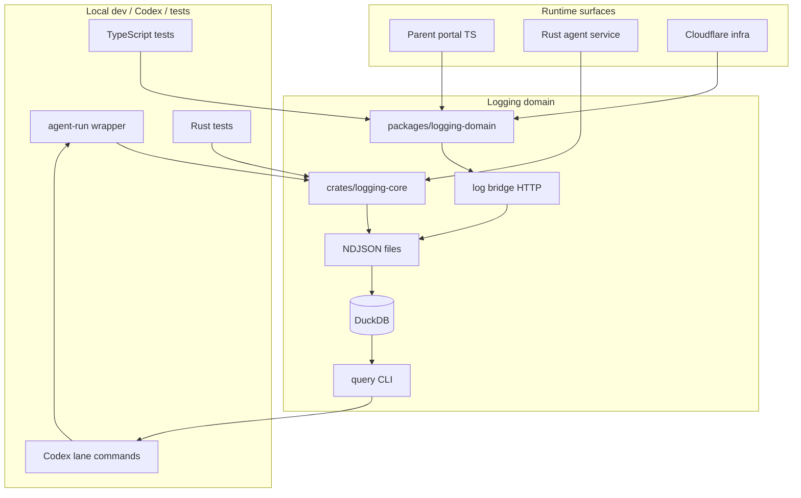

# Parent Logging Architecture

## Purpose

Define the target architecture for OcentraParent logging-domain parity.

This document exists because the current parent implementation conflates two different domains:

```text
production data custody / privacy proof contracts
local development / test / agent observability
```

Both are needed. They must be separate.

## Required architecture split

OcentraParent logging has three modes.

### 1. Local dev observability

Used by developers, tests, Codex, local agents, local portal, and validation wrappers.

Properties:

```text
local-only
workspace-owned
append-only NDJSON first
DuckDB query/index second
raw artifacts stored locally
high-density summaries returned to Codex/humans
safe to use for code development and debugging
not an Ocentra-hosted data custody claim
not a production telemetry pipeline
```

### 2. Product/runtime safe logging

Used by production-facing app/agent paths.

Properties:

```text
redaction-safe
minimal operational fields
explicit custody boundaries
no raw child activity by default
no screenshots/browser history/message content unless explicitly covered by separate product contracts
```

The current parent logging-domain proof/read-model contracts mostly belong here.

### 3. Cloudflare infra logging

Used by future parent Cloudflare infra, separate from local portal/agent runtime.

Properties:

```text
separate infra
separate scope
can reuse bridge/NDJSON/DuckDB for tests
runtime production storage may differ
must not be hardcoded into generic parent logging
```

This mirrors games: Cloudflare is separate infra, while main app domains share one logger/pipeline.

## Target high-level flow



## Package responsibilities

### `packages/logging-domain`

Owns TypeScript-side logging contracts and local query tooling.

Must own:

```text
- existing production-safe proof/read-model exports
- dev/test log types
- bridge payload types
- bridge transport
- NDJSON path/layout helpers
- NDJSON writer
- DuckDB ingest/query store
- app-log storage for TS app surfaces
- scripts for bridge, ingest, rebuild, query, inspect/view
```

Must not own:

```text
- Rust-only stdout/stderr capture internals
- child runtime raw evidence policy decisions
- production support data custody beyond existing explicit contracts
- feature-specific business rules
```

### `crates/logging-core`

Owns Rust-side local dev/agent logging primitives.

Must own:

```text
- Rust event structs
- log level/source/fields values
- NDJSON append writer
- artifact writer
- command-run event writer
- diagnostic event writer
- redaction helpers
- local-only path resolution
```

Must not own:

```text
- DuckDB query implementation initially
- TypeScript package exports
- portal UI rendering
- production support privacy contract read models
```

### `scripts/dev/agent-run.mjs`

Owns command execution capture and evidence packet printing.

Must own:

```text
- spawning cargo/npm/node commands
- capturing stdout/stderr
- writing raw artifacts
- parsing common diagnostics
- writing agent_run and diagnostic NDJSON rows
- triggering ingest
- printing compact summaries
```

Must not own:

```text
- LLM summarization
- rewriting source code
- architecture decisions
```

## Scope model

Parent scopes are explicit and must be stable.

Required scopes:

```text
parent-agent
parent-portal
parent-cloudflare
parent-codex
parent-test
```

Recommended DB files:

```text
packages/logging-domain/db/parent-agent-log.duckdb
packages/logging-domain/db/parent-portal-log.duckdb
packages/logging-domain/db/parent-cloudflare-log.duckdb
packages/logging-domain/db/parent-codex-log.duckdb
packages/logging-domain/db/parent-test-log.duckdb
```

Recommended NDJSON root:

```text
packages/logging-domain/logs/<scope>/...
```

Local app/dev runtime root may also use:

```text
.logs/<scope>/ndjson/...
.logs/<scope>/<scope>-log.duckdb
```

But the query CLI must know how to resolve both package-local and workspace-local roots.

## Required NDJSON event classes

The parent local-dev-observability pipeline must support these logical event classes.

```text
log
run_summary
test_result
agent_run
agent_diagnostic
artifact_ref
```

### `log`

General structured log event.

Fields:

```text
ts
schemaVersion
scope
source
level
message
fields
runId
correlationId
file
line
column
stack
origin
environment
```

### `agent_run`

One executed command.

Fields:

```text
type = agent_run
schemaVersion
runId
commandId
laneId
machine
workspace
cwd
command
startedAt
endedAt
durationMs
status
exitCode
stdoutArtifact
stderrArtifact
summary
```

### `agent_diagnostic`

One parsed failure/warning/diagnostic.

Fields:

```text
type = agent_diagnostic
schemaVersion
diagnosticId
runId
commandId
kind
severity
signature
file
line
column
message
rawArtifact
rawStartLine
rawEndLine
```

### `artifact_ref`

Reference to local raw evidence.

Fields:

```text
type = artifact_ref
schemaVersion
artifactId
runId
commandId
path
kind
sha256
byteLength
lineCount
createdAt
retention
```

## Storage layout

Recommended local layout:

```text
.logs/
  parent-codex/
    ndjson/
      agent-run/YYYY-MM-DD/*.ndjson
      diagnostics/YYYY-MM-DD/*.ndjson
    artifacts/
      <runId>/<commandId>/stdout.log
      <runId>/<commandId>/stderr.log
      <runId>/<commandId>/metadata.json
    parent-codex-log.duckdb
```

Package-local test layout:

```text
packages/logging-domain/logs/
  parent-test/
  parent-agent/
  parent-portal/
  parent-cloudflare/
  parent-codex/
```

Keep paths local and relative where possible. Never write under user-global paths unless explicitly configured.

## Portal logging target

Current portal dev logging posts to:

```text
/__ocentra-parent-dev-log
```

Target state must choose one of two options.

### Preferred option: route portal dev logs through bridge-compatible API

Portal dev logger should send to the local log bridge when enabled.

Resolution order:

```text
1. import.meta.env.VITE_OCENTRA_PARENT_LOG_BRIDGE_URL
2. window global injected dev config
3. default http://127.0.0.1:<bridge-port>
4. no-op if unavailable
```

### Acceptable option: implement `/__ocentra-parent-dev-log` as a compatibility endpoint

If this endpoint remains, it must write to the same NDJSON layout as the bridge and must be covered by tests.

Unacceptable state:

```text
portal fetches /__ocentra-parent-dev-log and nothing receives it
```

## Agent-service logging target

Current agent service writes direct `.logs/dev/*.ndjson` from `crates/agent-service/src/dev_log.rs`.

Target state:

```text
crates/agent-service
  depends on crates/logging-core
  uses logging_core::dev_log or logging_core::writer
  does not implement its own local NDJSON writer
```

The `/api/dev/log-snapshot` endpoint can remain, but it must not be treated as the primary log query system.

## Cloudflare logging target

Parent Cloudflare is separate infra. It should use the same TypeScript package contracts and test-log infrastructure, but it must have a separate scope:

```text
parent-cloudflare
```

Do not hardcode parent generic logging to Cloudflare.

## Query surfaces

Minimum CLI commands:

```text
npm run logs:query -- stats --scope=parent-codex
npm run logs:query -- failed --scope=parent-codex
npm run logs:query -- by-run <runId> --scope=parent-codex
npm run logs:query -- diagnostics --run-id <runId>
npm run logs:query -- search <query> --scope=parent-agent
npm run logs:query -- context <query> --scope=parent-portal
```

Codex-facing aliases:

```text
npm run agent:query -- latest-failures
npm run agent:query -- by-run <runId>
npm run codex:evidence -- latest-failures
```

The query output must be compact by default and expand only with explicit flags:

```text
--include-logs
--include-artifacts
--raw
```

## High-density output rules

Default query output must include:

```text
run_id
command_id
status
exit_code
duration
unique diagnostics
file:line:column
short message
raw artifact pointer
next query command
```

Default query output must not include:

```text
full stdout
full stderr
full test log wall
full stack traces unless diagnostics require them
```

## Privacy and custody boundary

Local-dev-observability is local-only.

Required language in docs and README:

```text
Local dev logs are developer-owned workspace artifacts. They are not uploaded to Ocentra services by default. They are not production support bundles. They are not child-data custody claims. Production support/custody contracts remain separate and must explicitly opt into any export/upload workflow.
```

## Implementation sequence

1. Preserve existing parent logging-domain exports.
2. Add TypeScript parity modules from games, adapted to parent scopes.
3. Add parent logging scripts.
4. Add Rust logging-core crate.
5. Move agent-service dev logging to Rust logging-core.
6. Fix portal dev logging endpoint/path.
7. Add Codex/agent diagnostics wrappers.
8. Add validation scripts.
9. Update README and docs.

## Acceptance criteria

```text
- npm run build --workspace @ocentra-parent/logging-domain passes
- npm run test --workspace @ocentra-parent/logging-domain passes
- cargo test -p ocentra-parent-logging-core passes
- cargo test -p ocentra-parent-agent-service passes
- npm run logs:bridge starts a local bridge
- npm run agent:run -- node -e "process.exit(2)" records a failed run
- npm run agent:query -- latest-failures returns compact failure output
- portal dev logs have an implemented receiver or use bridge transport
- no parent generic log path defaults to Cloudflare scope
- production proof contracts still build and export
```
