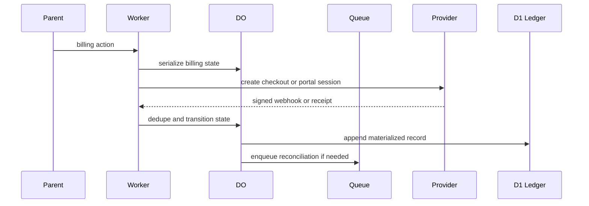

# Cloudflare Billing Control Plane

Purpose: define the server boundary for monetization, not the provider-specific product logic.

## Boundary

- Worker routes handle checkout creation, portal sessions, billing status, webhook ingestion, and admin actions.
- Durable Objects serialize per-household or per-account billing writes and idempotency markers.
- D1 stores queryable ledgers and dashboard views.
- Queues handle retries, dead-letter processing, and reconciliation jobs.
- Wrangler owns local development, deploy configuration, and secret injection.

## Why this shape

- Billing traffic is low-volume and coordination-heavy.
- Per-object serialization is a better fit than broad shared state.
- Hosted provider flows reduce payment surface area in the browser.
- Queue-backed retries and reconciliation are a clean fit for delayed provider events.

## Required state model

| State              | Owner                | Notes                                                           |
| ------------------ | -------------------- | --------------------------------------------------------------- |
| Billing account    | D1 + DO              | Canonical billing identity for a household or parent account.   |
| Payment attempt    | DO                   | Session initialization, provider refs, and idempotency markers. |
| Provider event     | DO + D1              | Event timeline and dedupe marker.                               |
| Referral record    | D1                   | Qualification, credit grants, and revocation history.           |
| Entitlement record | D1 + signed snapshot | Access decision and audit trail.                                |

## Flow

## Failure conditions

- No client-side provider secrets.
- No provider event accepted without signature verification.
- No dashboard write bypasses the Worker/DO boundary.
- No reconciliation job mutates state without a ledger entry.
