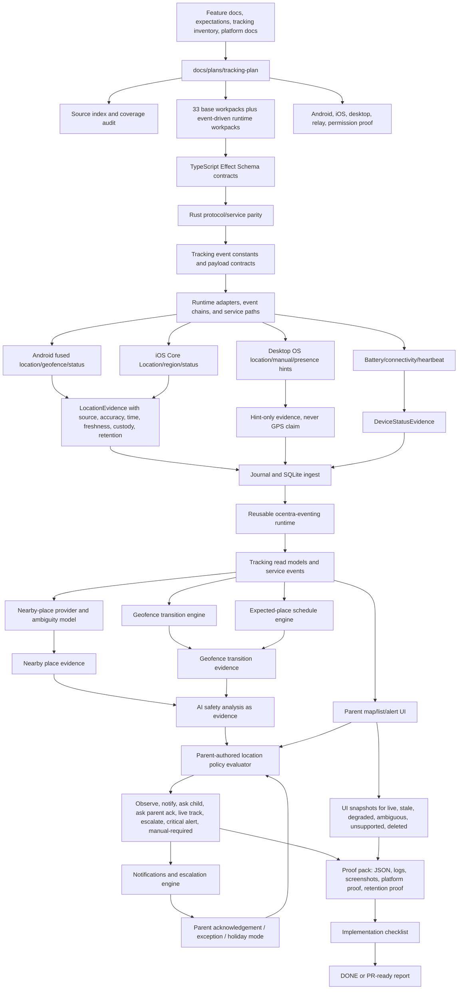

# Tracking Plan

> **2026-08-15 code-audit authority:** use `PLAN_STATE.md`,
> `source-index.md`, `CODE_AUDIT.md`, and `WORKPACK_INDEX.md` for current
> implementation ownership and Phase 1 status. Older sections below preserve
> historical proof/checkpoint context; `packages/tracking-domain`, the
> `codex/tracking-plan-full-continuation-a` branch, and the named
> `scripts/test/tracking-*.mjs` commands are not present current execution
> routes.

This folder is the single working plan location for location evidence,
geofence rules, expected-place schedules, device status, nearby-place
intelligence, AI safety analysis, parent acknowledgements, alerts, escalation,
child check-ins, temporary live tracking, missing-device mode, and tracking
UI/UX requirements.

- [Tracking Source Index](source-index.md)
- [Current Tracking Snapshot](current-tracking-snapshot.md)
- [V0.5 Location Tracking Full Scope Plan](v0-5-location-tracking-full-scope-plan.md)
- [V0.5 Location AI Safety Analysis Plan](v0-5-location-ai-safety-analysis-plan.md)
- [V0.5 Location Platform Deep Dive](v0-5-location-platform-deep-dive.md)
- [V0.5 Location Test Blueprint](v0-5-location-test-blueprint.md)
- [Tracking UI/UX Requirements Guide](ui-ux-requirements-guide.md)
- [Tracking Proof Tiers](proof-tiers.md)
- [Tracking And Eventing Real Test Matrix](event-driven-runtime-test-matrix.md)
- [Tracking Plan Implementation Checklist](implementation-checklist.md)
- [Pasted Content Coverage Audit](pasted-content-coverage-audit.md)
- [Repo Organization Goal](repo-organization-goal.md)
- [Repo Organization Movement Map](repo-organization-movement-map.md)
- [Repo Domain Organization Cleanup Plan](../../architecture/repo-domain-organization-cleanup-plan.md)

The `v0-5` filenames follow the planning draft. They are not a roadmap
completion claim. The owning feature remains
`docs/features/location-geofence-device-status.md`, with roadmap ownership in
V5 parent policy product, V6 mobile agents, and V3 notifications until the
roadmap is explicitly changed.

The rule remains:

```text
Location evidence proves where the child device was reported.
Geofence evidence proves transition relative to a configured place.
Schedule context proves where the child was expected to be.
Nearby-place intelligence suggests nearby place categories with ambiguity.
AI classification is evidence, not authority.
Parent policy decides alert/action.
Parent acknowledgement and exceptions are first-class.
No precise location is inferred from LAN/IP/pairing.
No emergency/critical claim is made from one weak signal.
Never turn uncertainty into accusation.
CI proves contracts, logic, simulation, and hosted build/test coverage.
Physical devices prove mobile background behavior.
Authority-enrolled devices prove hard control.
Until the required tier exists, product claims remain manual-required,
authority-required, or not-claimed.
```

## Event-Driven Runtime Rule

Tracking is not a polling-only feature and not a portal-owned workflow.

Tracking runtime behavior must consume the reusable Rust eventing plan and crate
instead of creating a private tracking bus. Parent tracking event contracts must
live in the protocol/domain boundary before runtime publishers use them, and the
portal may only send typed parent intents and render service read models.

Tracking runtime and decisions are Rust-owned. TypeScript may own portal UI,
read-model rendering, and protocol-facing schema mirrors, but it must not become
the tracking runtime brain. For current Rust organization:

- `crates/agent-core` owns tracking state helpers, local durable state,
  projection/query helpers, and platform-neutral tracking runtime behavior that
  should not live in WebSocket transport. Current tracking core code is grouped
  under `crates/agent-core/src/tracking/` instead of root-level tracking files.
- `crates/agent-protocol` owns Rust-crossing tracking structs, constants,
  command names, event names, field names, and state labels.
- `crates/agent-service` owns transport/orchestration only.
- New Rust tracking tests should live under crate-level `tests/` folders when
  the behavior is exposed through a public crate API. Existing private transport
  seams may stay source-adjacent only until they are replaced with a real public
  crate boundary.

Tracking must also stay DRY with adjacent lanes. Do not duplicate generic
eventing, journal, replay, evidence-ref, custody/retention, provider-status,
read-model projection, LAN presence, network evidence, browser/app/game
activity, notification-provider, or AI-provider machinery inside tracking.
Tracking should add only tracking-specific evidence meaning, state machines,
policy-evidence preparation, and safety boundaries, then consume shared
infrastructure through typed contracts.

The required event chain is:

```text
parent intent/config
  -> validated Rust command
  -> tracking config event
  -> child-agent command event
  -> tracking evidence event
  -> detection/cascade event
  -> AI/nearby-place analysis event when needed
  -> policy decision event
  -> live tracking / notification / escalation event
  -> audit event
  -> portal read-model event
```

Parent config chain:

```text
portal parent changes tracking config
  -> local API validates request
  -> parent_controller.parent_action.received
  -> tracking.config.change_requested
  -> policy.evaluation.requested
  -> policy.decision.completed
  -> tracking.config.change_approved or tracking.config.change_rejected
  -> child_agent.command.forward_requested
  -> child_agent.command.received
  -> tracking.config.applied
  -> audit.entry.committed
  -> portal.read_model.updated
```

Tracking evidence chain:

```text
location.evidence.observed
  -> geofence.transition.evaluated
  -> expected_place.status.evaluated
  -> nearby_place.analysis.requested if needed
  -> nearby_place.analysis.completed
  -> tracking.detection.completed
  -> ai.analysis.requested if ambiguity/risk requires it
  -> ai.analysis.completed
  -> policy.evaluation.requested
  -> policy.decision.completed
  -> tracking.live_mode.start_requested or notification.intent.created or escalation.intent.created
  -> child_agent.command.received if live mode/cadence changes
  -> notification.dispatch.requested if parent must be informed
  -> notification.dispatch.result_observed
  -> audit.entry.committed
  -> portal.read_model.updated
```

Tracking event work must coordinate with
`docs/plans/eventing-plan/03-event-taxonomy-and-parent-integration.md` and
`docs/plans/eventing-plan/05-implementation-workpacks.md`. It must not hide
tracking behavior under generic `device.*` events once runtime code starts
publishing location, geofence, nearby-place, live-tracking, retention,
notification, or escalation behavior.

Every tracking event chain must carry:

- event id;
- correlation id;
- causation id;
- child/profile/device aggregate key;
- evidence refs;
- policy/rule refs where applicable;
- custody and retention state;
- capability/provider state;
- idempotency key for commands;
- TTL/deadline for live tracking and notification/escalation;
- audit refs;
- uncertainty codes where location, nearby-place, or AI can overclaim.

Must-not-shortcut rules:

```text
location says bad place -> notify/block directly
AI says danger -> live track directly
nearby-place says bar/shop/school -> accuse child directly
portal button -> child-agent command directly
weak/stale/offline sample -> critical alert directly
replay event -> resend notification or restart live tracking
```

## Implementation-First Rule

The continuation branch has useful proof accounting, but proof accounting is not
implementation progress by itself. Future tracking implementation slices must
use this order:

```text
PLAN -> CODE -> TEST -> RUN/FIX -> PROOF -> DOC
```

Do not add another `tracking-*-proof.ts`, `tracking-*-proof.test.ts`, aggregate
proof, readiness proof, bridge proof, claim gate, artifact inventory proof, or
proof JSON refresh unless real source behavior was implemented and tested first.
The required test matrix is
`docs/plans/tracking-plan/event-driven-runtime-test-matrix.md`; each future
event-driven tracking workpack must state which matrix categories apply, which
commands passed, and which CI/manual tiers remain.

A tracking implementation handoff must name:

```text
Assigned workpack:
Real source behavior added:
Runtime/domain/service/UI files changed:
Tests added/changed:
Focused commands run:
Proof artifact generated after tests:
What this proves:
What this does not prove:
Docs/checklists updated:
```

If `Real source behavior added` is empty, do not call the work an
implementation slice.

## How It Works



## Where We Are

- `docs/features/location-geofence-device-status.md` exists, and the feature is
  now planned/in progress from focused contract proof.
- `docs/expectations/location-geofence.md` defines the correct boundary:
  location is separate from LAN/IP/pairing and must carry source, accuracy,
  timestamp, custody, retention, stale-state, and permission state.
- `docs/device-location-tracking-capability-guide.md` explains capability
  states, live tracking, location history, geofences, check-ins, last known
  location, custody, and platform limits.
- `docs/device-location-tracking-schema-proposal.md` sketches authoring,
  policy, effective-policy, update-protocol, and capability-registry shapes.
- `docs/tracking-control-settings-inventory.md` preserves 338 raw tracking
  settings as design input, not implementation proof.
- Current inventory includes location posture modes: Off, Last known, Check-in,
  Arrival alerts, Temporary live, and Missing device.
- Current inventory already names degraded states such as service-disabled,
  manual-required, offline-last-known-only, and battery-throttled.
- Runtime TypeScript contracts now exist for the focused tracking contract
  spine in `packages/activity-domain` and `packages/parent-domain`, with proof
  roots under `output/tracking-plan-proof/`.
- The reusable Rust `crates/ocentra-eventing` crate now exists with its own
  runtime proof path, but tracking has not yet consumed it through first-class
  `tracking.*`, `location.*`, `geofence.*`, `expected_place.*`,
  `nearby_place.*`, `notification.*`, or `escalation.*` contracts and ordered
  runtime chains.
- The proof-tier system in `proof-tiers.md` now separates P0/P1/P2 code
  readiness from P4/P5/P6 product claims. Missing physical-device or
  enrolled-device evidence is a `manual_required` or `authority_required`
  product-claim gap, not a generic CI failure.
- P1 fixture/simulation proof now exists for deterministic geofence
  transition evaluation, expected-place decision evaluation, retention delete
  read-model filtering, parent-owned retention export, UI-visible
  deleted-history hiding, parent acknowledgement impact, child check-in
  resolution, and Rust ActivityStore tracking event ingest into SQLite. The
  proof artifacts are written by
  `scripts/test/tracking-plan-runtime-proof.mjs`.
- The same runtime proof now records a P1 parent portal tracking-state fixture
  route and test for first-target UI states, renders local proof artifact
  references, and captures a local rendered parent-route screenshot under
  `output/tracking-plan-proof/30-parent-and-child-ui-ux-surfaces/`. Live
  parent/child UI, hosted screenshots, accessibility, and live service-backed
  evidence citations are not product-complete.
- `scripts/test/tracking-plan-service-read-model-proof.mjs` now records P2
  service-boundary proof for the narrow
  `agent.activity.tracking.read-model.get` command. The Rust service reads
  tracking event rows from the shared ActivityStore SQLite query store and
  reports citation IDs in `trackingReadModel`; the parent portal consumes that
  event as a narrow live summary, while richer product read models remain
  pending.
- `scripts/test/tracking-plan-pre-device-proof.mjs` now closes the pre-device
  accounting gap. It reruns the tracking contract/runtime/service proof stack,
  runs the child mobile scaffold proof stack, confirms Android debug package
  proof through the existing Android artifact gate, and writes
  `output/tracking-plan-proof/pre-device-gap-closure/proof-summary.json` plus
  Android Studio, iOS simulator, WSL/local, and physical-device proof plans.
- `scripts/test/tracking-plan-wsl-local-proof.mjs` now records P3 WSL/local
  replay proof for the narrow tracking read-model proof stack. It captures the
  WSL2/Ubuntu toolchain, the Windows-hosted linked-worktree Git mapping,
  contract build output, service read-model proof, and Rust core tracking
  read-model test under `output/tracking-plan-proof/wsl-local-replay/`, with
  companion WP32/WP33 artifacts
  `output/tracking-plan-proof/32-journal-sqlite-and-read-model-proof/19-wsl-local-replay-proof.json`
  and
  `output/tracking-plan-proof/33-proof-gates-fixtures-rollout-and-pr-gate/17-wsl-local-proof.json`.
- WP33 tracked `proof-summary.json` records `minimumSeriousMvpAuditSummary`;
  the runtime proof also writes the full `minimumSeriousMvpAudit` into
  generated
  `output/tracking-plan-proof/33-proof-gates-fixtures-rollout-and-pr-gate/00-run-metadata.json`.
  These audits are first-checkpoint reconciliations only; they explicitly block
  product-complete, PR-ready, and full-scope claims until the remaining proof
  gaps are closed.
- The continuation branch has since added Android emulator foreground/background
  and local-geofence artifacts, iOS simulator/package-routing artifacts,
  hosted parent-route screenshot and accessibility artifacts, hosted
  service-backed citation/evidence drawer/report/retention/notification/action
  artifacts, WSL/local replay artifacts, and authority-enrollment
  manual-required proof. These artifacts make the CI/local gates explicit, but
  physical Android/iOS behavior, enrolled-device authority, provider delivery,
  actual child-device delivery/runtime execution, production workers, and full
  product parent/child UI remain not product-complete until their higher-tier
  evidence exists.
- The continuation branch is now classified as checkpoint/proof reconciliation
  until the next implementation slice adds real event-driven source behavior.
  Future proof refreshes must be receipts after real code and tests, not the
  primary deliverable.

## Where We Want To Be

Ocentra Parent needs an end-to-end tracking subsystem that:

- captures mobile/desktop location evidence with explicit source, accuracy,
  timestamp, freshness, custody, retention, and permission state;
- distinguishes live, recent, stale, last-known, offline-last-known-only,
  permission-denied, service-disabled, battery-throttled, unavailable, and
  adapter-error states;
- supports parent-defined home, school, activity, safe-zone, restricted-zone,
  temporary-trip, and custom geofences;
- evaluates enter, exit, and dwell transitions with accuracy and grace-period
  handling;
- models expected-place schedules from parent rules, calendar events, recurring
  schedules, and temporary exceptions;
- represents parent acknowledgement, holiday mode, exceptions, false-alarm
  handling, and check-in requests as first-class state;
- performs nearby-place analysis with ambiguity, not accusations;
- uses AI only as structured safety analysis evidence;
- never escalates or alerts purely from AI without parent policy;
- supports Android foreground/background location, geofence transitions,
  battery/connectivity, and degraded states with proof;
- supports iOS Core Location, region monitoring, significant-change, visits,
  background states, and degraded states with proof;
- treats desktop LAN/IP/Wi-Fi as hint-only unless OS location service proof
  exists;
- supports parent map/list/alert UI with accuracy circle, freshness, status,
  evidence drawer, retention controls, and delete/export;
- generates notifications and escalation only with evidence, rule refs,
  severity, acknowledgement state, and audit refs;
- proves retention/delete and avoids Ocentra-hosted location storage by default.

## First Target Is Not Final Scope

The "Minimum Serious MVP" named in the full-scope plan is the first credible
checkpoint. It is not the final tracking goal, and it is not a replacement for
the 33 workpacks. Passing that checkpoint can justify continuing from a
code-ready/proof-ready slice, but it cannot justify a product-complete,
PR-ready, or full-scope claim unless the assigned runtime, UI, product-doc,
platform, and proof-tier requirements are also filled.

The pre-device gate is also not final scope. Passing
`node scripts/test/tracking-plan-pre-device-proof.mjs` means the CI/local
tracking proof stack, mobile scaffold proof stack, Android package artifact
gate, and manual proof plans are in order before device work starts. It does
not prove physical Android/iOS behavior, enrolled-device authority, hosted full
UI accessibility, or production readiness.

The WSL/local replay gate is a P3 local-machine proof only. Passing
`npm run test:tracking-plan-wsl-local-proof` proves this Windows-hosted
linked worktree can replay the narrow tracking read-model proof stack through
WSL with an explicit Git mapping. It does not prove Android/iOS background
delivery, mobile permission grants, enrolled-device authority, hosted full UI
accessibility, notification/provider delivery, or production pilot readiness.

## Organization Cleanup Is A First-Class Tracking Gate

Tracking is also the first proof slice for the repo-wide domain/protocol/runtime
organization cleanup in
[Repo Domain Organization Cleanup Plan](../../architecture/repo-domain-organization-cleanup-plan.md).
The A lane should keep tracking work on
`codex/tracking-plan-full-continuation-a`, organize tracking before adding more
feature behavior, and avoid PR-ready claims until the branch has a meaningful
canonical-boundary cleanup with validation. A should start by reading the
organization plan and producing a movement map, not by writing code. The cleanup
target is contract-first ownership, not folder cosmetics: shared contracts in
domain packages and protocol crates, reusable Rust logic in the correct crate,
portal code as a consumer/projection layer, feature/package/crate-owned tests,
feature-owned proof roots, and proof/tests that validate real canonical
boundaries instead of duplicate local lookalikes. If tests, proofs, scripts, or
contracts move, this tracking plan, the affected workpack docs, and checklist
paths must move with them.

## Parallel Coordination Rules

- Lock the workpack doc and exact implementation/docs paths before editing.
- Fill [Tracking Plan Implementation Checklist](implementation-checklist.md)
  and the assigned workpack's AI worker checklist before reporting `DONE` or
  PR-ready.
- Do not create a second tracking-control truth. Keep
  `docs/features/location-geofence-device-status.md`,
  `docs/expectations/location-geofence.md`,
  `docs/device-location-tracking-capability-guide.md`,
  `docs/device-location-tracking-schema-proposal.md`, and
  `docs/tracking-control-settings-inventory.md` as source inputs.
- Build Rust runtime ownership first, Rust/TypeScript protocol parity second,
  tracking event contracts third, journal/read-model/event-chain wiring fourth,
  portal consumption fifth, and real platform proof only after those surfaces
  are aligned.
- Every worker report must name the workpack, touched paths, validation,
  product-doc updates, platform proof state, custody/retention proof, and
  manual-required gaps.
- Every proof claim must list required proof tier, current proof tier, status,
  artifact path, and missing proof reason. Do not fail a checklist item because
  P4/P5 proof is unavailable in GitHub CI; fail it only if the plan or code
  pretends that missing proof exists.

## Workpack Checklist

| Step | Workpack                                                                                                             | Target State                                                                                                                                                            |
| ---- | -------------------------------------------------------------------------------------------------------------------- | ----------------------------------------------------------------------------------------------------------------------------------------------------------------------- |
| 01   | [Source index and repo reconciliation](workpacks/01-source-index-and-repo-reconciliation.md)                         | Existing tracking feature, expectation, inventory, platform, notification, AI, custody, policy, and assistant docs remain source inputs without duplicate claims.       |
| 02   | [Current tracking snapshot and gap map](workpacks/02-current-tracking-snapshot-and-gap-map.md)                       | Current repo state, proof, gaps, manual-required states, and future-roadmap-only states are documented.                                                                 |
| 03   | [Contract boundary and Effect schemas](workpacks/03-contract-boundary-and-effect-schemas.md)                         | Location, device status, geofence, expected-place, alert, acknowledgement, retention, AI, and capability contracts are schema-backed before runtime code consumes them. |
| 04   | [Location evidence model](workpacks/04-location-evidence-model.md)                                                   | Location samples carry source, coordinates/hints, accuracy, timestamp, freshness, custody, retention, permission, confidence, and reason codes.                         |
| 05   | [Device status model](workpacks/05-device-status-model.md)                                                           | Heartbeat, last sample, sync, pending uploads, battery, charging, low-power, connectivity, and degraded reasons are typed.                                              |
| 06   | [Permission and capability status model](workpacks/06-permission-and-capability-status-model.md)                     | Android/iOS/desktop permission states, background capability, service-disabled, manual-required, stale, and unavailable states are explicit.                            |
| 07   | [Retention and custody model](workpacks/07-retention-and-custody-model.md)                                           | Last-known-only, 24h, 7d, 30d, custom, delete-on-resolution, export, local-only, family-relay, and parent-approved-cloud modes are typed and testable.                  |
| 08   | [Android foreground location adapter](workpacks/08-android-foreground-location-adapter.md)                           | Fused/current/last-known foreground location evidence is captured with permission and degraded states.                                                                  |
| 09   | [Android background location and geofence adapter](workpacks/09-android-background-location-and-geofence-adapter.md) | Background permission, geofence enter/exit/dwell, background delivery, active geofence limits, and battery-throttle behavior are proof-gated.                           |
| 10   | [Android battery connectivity and status adapter](workpacks/10-android-battery-connectivity-and-status-adapter.md)   | Battery, charging, low-power, connectivity, heartbeat, and pending upload status are captured.                                                                          |
| 11   | [iOS Core Location foreground adapter](workpacks/11-ios-core-location-foreground-adapter.md)                         | When-in-use/current/last-known iOS location evidence is captured with permission state.                                                                                 |
| 12   | [iOS background region significant-change adapter](workpacks/12-ios-background-region-significant-change-adapter.md) | Always authorization, region monitoring, significant-change, visits, background modes, and degraded states are proof-gated.                                             |
| 13   | [Desktop location and presence hint model](workpacks/13-desktop-location-and-presence-hint-model.md)                 | Windows/macOS/Linux OS location, Wi-Fi/LAN/home presence, manual check-in, and IP coarse hint are represented without GPS overclaim.                                    |
| 14   | [Geofence rule model](workpacks/14-geofence-rule-model.md)                                                           | Home, school, activity, safe-zone, restricted-zone, temporary-trip, circle/polygon, schedule, grace, and accuracy requirements are typed.                               |
| 15   | [Geofence transition engine](workpacks/15-geofence-transition-engine.md)                                             | Enter, exit, dwell, low-accuracy ambiguity, stale rejection, grace-period handling, and evidence/rule refs are implemented.                                             |
| 16   | [Expected-place schedule engine](workpacks/16-expected-place-schedule-engine.md)                                     | Recurring, calendar, temporary, home/school/activity, late/early/exit grace, and not-where-expected logic are implemented.                                              |
| 17   | [Parent acknowledgement and exception model](workpacks/17-parent-acknowledgement-and-exception-model.md)             | Acknowledge safe, expected, holiday, trip, false alarm, suppress, still-alert-for-critical, and expiry are first-class.                                                 |
| 18   | [Child check-in flow](workpacks/18-child-check-in-flow.md)                                                           | Parent can ask child to check in; child can reply safe/help/share/call; unresolved check-ins can escalate by rule.                                                      |
| 19   | [Nearby-place provider abstraction](workpacks/19-nearby-place-provider-abstraction.md)                               | Google/Apple/OSM/parent-defined/local POI providers map places with radius, distance, category, confidence, and ambiguity.                                              |
| 20   | [Google Places and POI provider adapter](workpacks/20-google-places-and-poi-provider-adapter.md)                     | Provider-specific query limits, field masks, mapping, and failure behavior are testable behind the nearby-place abstraction.                                            |
| 21   | [Place risk taxonomy and ambiguity model](workpacks/21-place-category-taxonomy-and-ambiguity-model.md)               | Hospital, school, cinema, mall, bar, nightclub, liquor, casino, hotel, transit, park, friend-area, out-of-town, remote-area, and unknown are typed.                     |
| 22   | [Local parent-defined place database](workpacks/22-local-parent-defined-place-database.md)                           | Parent-defined home/school/friend/activity/restricted/safe zones can override or enrich provider POIs.                                                                  |
| 23   | [AI location safety analysis contracts](workpacks/23-ai-location-safety-analysis-contracts.md)                       | AI input/output for expected-place, nearby-place risk, route anomaly, emergency context, stale/offline, and notification support are schema-backed.                     |
| 24   | [AI provider routing](workpacks/24-ai-provider-routing.md)                                                           | Child local, parent local, family AI hub, parent-approved remote, metadata-only/no-AI modes are capability-gated.                                                       |
| 25   | [Policy compiler for tracking rules](workpacks/25-policy-compiler-for-tracking-rules.md)                             | Location, geofence, expected-place, place-risk, stale/offline, battery, check-in, and escalation targets compile only with required proof.                              |
| 26   | [Alert severity and notification model](workpacks/26-alert-severity-and-notification-model.md)                       | Info, watch, warning, urgent, critical alerts cite evidence, rule, severity, channels, acknowledgement, and audit refs.                                                 |
| 27   | [Escalation engine](workpacks/27-escalation-engine.md)                                                               | Parent-unacknowledged, child-checkin-missing, offline-after-alert, critical-place, and left-expected-place escalation chains are rule-based.                            |
| 28   | [Temporary live tracking mode](workpacks/28-temporary-live-tracking-mode.md)                                         | Parent-approved temporary live tracking has duration, permission, battery, expiry, and audit proof.                                                                     |
| 29   | [Missing-device mode](workpacks/29-missing-device-mode.md)                                                           | Last known, battery, connectivity, offline state, pending upload, contact action, and prominent UI are implemented.                                                     |
| 30   | [Parent and child UI/UX surfaces](workpacks/30-parent-and-child-ui-ux-surfaces.md)                                   | Map/list/status, alert cards, evidence drawer, exception editor, child check-in, live tracking, missing-device, and retention UI are covered.                           |
| 31   | [Platform extension checklists and proof routing](workpacks/31-platform-extension-checklists-and-proof-routing.md)   | Android, iOS, desktop, managed-device, store/privacy, and manual proof extensions are routed without bloating base contracts.                                           |
| 32   | [Journal SQLite and read-model proof](workpacks/32-journal-sqlite-and-read-model-proof.md)                           | Location/status/geofence/check-in evidence is journaled, replayed, queryable, deletable, and cited.                                                                     |
| 33   | [Proof gates fixtures rollout and PR gate](workpacks/33-proof-gates-fixtures-rollout-and-pr-gate.md)                 | Test fixtures, platform manual proof, Playwright, retention proof, source audit, coverage audit, and implementation checklist block false claims.                       |
| 34   | [Tracking event contracts and protocol constants](workpacks/34-tracking-event-contracts-and-protocol-constants.md)   | Tracking/location/geofence/expected-place/nearby-place/live-mode/notification/escalation event constants and schema-backed payloads exist before runtime publish.       |
| 35   | [Parent tracking config command event flow](workpacks/35-parent-tracking-config-command-event-flow.md)               | Parent tracking config changes travel through validated Rust service, policy, child-agent command, audit, and portal projection instead of portal-local state.          |
| 36   | [Tracking detection cascade event flow](workpacks/36-tracking-detection-cascade-event-flow.md)                       | Location evidence becomes ordered geofence/expected-place/nearby-place/AI/policy/live-mode/notification/audit/read-model events without unsafe shortcuts.               |
| 37   | [Tracking event journal replay and projection](workpacks/37-tracking-event-journal-replay-and-projection.md)         | Tracking events are journaled and replayed into read models without re-executing notifications, live tracking, or child-agent commands.                                 |
| 38   | [Tracking notification and escalation event flow](workpacks/38-tracking-notification-and-escalation-event-flow.md)   | Notification intent, provider dispatch result, receipt, quiet-hours retry, escalation, and manual-required state are modeled as policy-authorized events.               |
| 39   | [Tracking portal event read model proof](workpacks/39-tracking-portal-event-read-model-proof.md)                     | Parent and child tracking UI surfaces render from service/event projections, not portal-owned business decisions.                                                       |

## Platform Extension Checklists

Android extension workpacks:

```text
ANDROID-01 foreground location permission UX
ANDROID-02 background location settings-page UX
ANDROID-03 fused location sample proof
ANDROID-04 last-known location proof
ANDROID-05 geofence enter/exit/dwell proof
ANDROID-06 100-geofence limit handling
ANDROID-07 battery saver / low power degraded proof
ANDROID-08 device offline and pending-upload proof
ANDROID-09 foreground service notification proof if used
ANDROID-10 app-killed/reboot behavior proof
ANDROID-11 Play policy / privacy disclosure proof
ANDROID-12 managed-device/Device Owner tracking extension if needed
```

iOS extension workpacks:

```text
IOS-01 When In Use authorization UX
IOS-02 Always authorization UX
IOS-03 Core Location sample proof
IOS-04 region monitoring enter/exit proof
IOS-05 significant-change proof
IOS-06 visits proof
IOS-07 background modes proof
IOS-08 low-power/app-terminated degraded proof
IOS-09 local notification proof
IOS-10 MDM/supervised locate/lost-mode proof if applicable
IOS-11 App Store privacy disclosure proof
IOS-12 child check-in iOS UX proof
```

Desktop extension workpacks:

```text
DESKTOP-01 Windows location service sample/hint proof
DESKTOP-02 macOS location service sample/hint proof
DESKTOP-03 Linux location service/manual-checkin proof
DESKTOP-04 LAN/home Wi-Fi presence hint proof
DESKTOP-05 IP coarse hint no-GPS guard
DESKTOP-06 battery/connectivity desktop proof
DESKTOP-07 missing laptop mode proof
DESKTOP-08 desktop notification proof
```

## Progress Reconciliation - 2026-06-02

Checked items below mean planning/source artifacts exist. They do not mark the
feature product-complete.

- [ ] Feature doc exists.
- [ ] Expectation doc exists.
- [ ] Capability guide exists.
- [ ] Schema proposal exists.
- [ ] Raw tracking settings inventory exists.
- [ ] First-class tracking plan folder exists.
- [ ] Location evidence contracts are not product-complete.
- [ ] Geofence transition runtime proof is not product-complete.
- [ ] Expected-place schedule engine is not product-complete.
- [ ] Nearby-place/AI safety analysis is not product-complete.
- [ ] Parent acknowledgement/exception system is not product-complete.
- [ ] Android background permission proof is not complete.
- [ ] iOS background/region proof is not complete.
- [ ] Journal/SQLite/read-model proof has CI/local coverage but is not
      product-complete. A P2 service command/read-model proof exists for SQLite
      tracking rows and citation IDs, the parent portal consumes it as a narrow
      live summary, hosted service-data/citation/evidence/report/retention rows
      are screenshot/accessibility proved, and WSL/local replay artifacts exist.
      Platform runtime, child-device delivery, provider delivery, production
      workers, and product-ready claims remain pending.
- [ ] Retention/delete/export P1 checkpoint proof exists: delete/export proof
      and UI-visible deleted-history hiding are fixture-proved. Product
      live-service retention settings remain pending.
- [ ] Tracking UI/UX has hosted parent-route screenshot/accessibility coverage
      but is not product-complete. The branch now covers the P1 fixture surface,
      P2 service-read-model summary, service-backed citation detail, evidence
      drawer, child-safe check-in, child-runtime disclosure/consent card, family
      dashboard rollup, report/export, report/policy consumer, retention
      settings, notification parent-surface, parent action readiness,
      missing-device, unsupported/manual platform rows, parent overview/devices
      shell screenshots, artifact inventory, and accessibility assertions.
      Actual child-device delivery/runtime execution and full product
      parent/child UI remain pending.
- [ ] Pre-device proof gate exists and passed locally on 2026-06-03 through
      `node scripts/test/tracking-plan-pre-device-proof.mjs`; artifact root:
      `output/tracking-plan-proof/pre-device-gap-closure/`. This does not mark
      physical-device, authority, full product parent/child UI, provider
      delivery, or production-pilot proof complete.
- [ ] WSL/local replay proof exists and passed locally on 2026-06-04 through
      `npm run test:tracking-plan-wsl-local-proof`; artifact root:
      `output/tracking-plan-proof/wsl-local-replay/`. This does not mark
      Android/iOS physical-device behavior, enrolled-device authority, provider
      delivery, actual child-device runtime execution, full product parent/child
      UI, or production-pilot proof complete.
