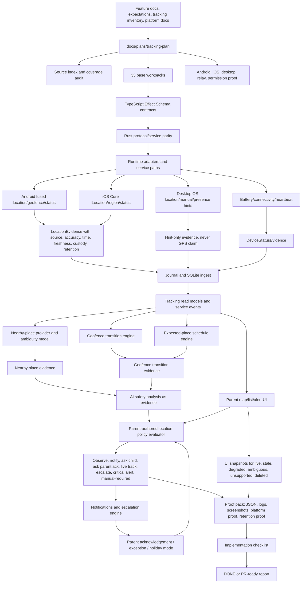

# Tracking Plan

This folder is the single working plan location for location evidence,
geofence rules, expected-place schedules, device status, nearby-place
intelligence, AI safety analysis, parent acknowledgements, alerts, escalation,
child check-ins, temporary live tracking, missing-device mode, and tracking
UI/UX requirements.

- [Tracking Source Index](source-index.md)
- [Current Tracking Snapshot](current-tracking-snapshot.md)
- [V0.5 Location Tracking Full Scope Plan](v0-5-location-tracking-full-scope-plan.md)
- [V0.5 Location AI Safety Analysis Plan](v0-5-location-ai-safety-analysis-plan.md)
- [V0.5 Location Platform Deep Dive](v0-5-location-platform-deep-dive.md)
- [V0.5 Location Test Blueprint](v0-5-location-test-blueprint.md)
- [Tracking UI/UX Requirements Guide](ui-ux-requirements-guide.md)
- [Tracking Plan Implementation Checklist](implementation-checklist.md)
- [Pasted Content Coverage Audit](pasted-content-coverage-audit.md)

The `v0-5` filenames follow the planning draft. They are not a roadmap
completion claim. The owning feature remains
`docs/features/location-geofence-device-status.md`, with roadmap ownership in
V5 parent policy product, V6 mobile agents, and V3 notifications until the
roadmap is explicitly changed.

The rule remains:

```text
Location evidence proves where the child device was reported.
Geofence evidence proves transition relative to a configured place.
Schedule context proves where the child was expected to be.
Nearby-place intelligence suggests nearby place categories with ambiguity.
AI classification is evidence, not authority.
Parent policy decides alert/action.
Parent acknowledgement and exceptions are first-class.
No precise location is inferred from LAN/IP/pairing.
No emergency/critical claim is made from one weak signal.
Never turn uncertainty into accusation.
```

## How It Works



## Where We Are

- `docs/features/location-geofence-device-status.md` exists, and the feature is
  now planned/in progress from focused contract proof.
- `docs/expectations/location-geofence.md` defines the correct boundary:
  location is separate from LAN/IP/pairing and must carry source, accuracy,
  timestamp, custody, retention, stale-state, and permission state.
- `docs/device-location-tracking-capability-guide.md` explains capability
  states, live tracking, location history, geofences, check-ins, last known
  location, custody, and platform limits.
- `docs/device-location-tracking-schema-proposal.md` sketches authoring,
  policy, effective-policy, update-protocol, and capability-registry shapes.
- `docs/tracking-control-settings-inventory.md` preserves 338 raw tracking
  settings as design input, not implementation proof.
- Current inventory includes location posture modes: Off, Last known, Check-in,
  Arrival alerts, Temporary live, and Missing device.
- Current inventory already names degraded states such as service-disabled,
  manual-required, offline-last-known-only, and battery-throttled.
- Runtime TypeScript contracts now exist for the focused tracking contract
  spine in `packages/activity-domain` and `packages/parent-domain`, with proof
  roots under `output/tracking-plan-proof/`.
- Platform permission proof, Android/iOS background behavior proof, provider
  runtime, alert delivery, UI, Rust journal/read-model proof, and
  retention/delete/export proof are not product-complete.

## Where We Want To Be

Ocentra Parent needs an end-to-end tracking subsystem that:

- captures mobile/desktop location evidence with explicit source, accuracy,
  timestamp, freshness, custody, retention, and permission state;
- distinguishes live, recent, stale, last-known, offline-last-known-only,
  permission-denied, service-disabled, battery-throttled, unavailable, and
  adapter-error states;
- supports parent-defined home, school, activity, safe-zone, restricted-zone,
  temporary-trip, and custom geofences;
- evaluates enter, exit, and dwell transitions with accuracy and grace-period
  handling;
- models expected-place schedules from parent rules, calendar events, recurring
  schedules, and temporary exceptions;
- represents parent acknowledgement, holiday mode, exceptions, false-alarm
  handling, and check-in requests as first-class state;
- performs nearby-place analysis with ambiguity, not accusations;
- uses AI only as structured safety analysis evidence;
- never escalates or alerts purely from AI without parent policy;
- supports Android foreground/background location, geofence transitions,
  battery/connectivity, and degraded states with proof;
- supports iOS Core Location, region monitoring, significant-change, visits,
  background states, and degraded states with proof;
- treats desktop LAN/IP/Wi-Fi as hint-only unless OS location service proof
  exists;
- supports parent map/list/alert UI with accuracy circle, freshness, status,
  evidence drawer, retention controls, and delete/export;
- generates notifications and escalation only with evidence, rule refs,
  severity, acknowledgement state, and audit refs;
- proves retention/delete and avoids Ocentra-hosted location storage by default.

## Parallel Coordination Rules

- Lock the workpack doc and exact implementation/docs paths before editing.
- Fill [Tracking Plan Implementation Checklist](implementation-checklist.md)
  and the assigned workpack's AI worker checklist before reporting `DONE` or
  PR-ready.
- Do not create a second tracking-control truth. Keep
  `docs/features/location-geofence-device-status.md`,
  `docs/expectations/location-geofence.md`,
  `docs/device-location-tracking-capability-guide.md`,
  `docs/device-location-tracking-schema-proposal.md`, and
  `docs/tracking-control-settings-inventory.md` as source inputs.
- Build TypeScript domain contracts first, Rust protocol/service parity second,
  journal/read-model wiring third, portal consumption fourth, and real platform
  proof only after those surfaces are aligned.
- Every worker report must name the workpack, touched paths, validation,
  product-doc updates, platform proof state, custody/retention proof, and
  manual-required gaps.

## Workpack Checklist

| Step | Workpack                                                                                                             | Target State                                                                                                                                                            |
| ---- | -------------------------------------------------------------------------------------------------------------------- | ----------------------------------------------------------------------------------------------------------------------------------------------------------------------- |
| 01   | [Source index and repo reconciliation](workpacks/01-source-index-and-repo-reconciliation.md)                         | Existing tracking feature, expectation, inventory, platform, notification, AI, custody, policy, and assistant docs remain source inputs without duplicate claims.       |
| 02   | [Current tracking snapshot and gap map](workpacks/02-current-tracking-snapshot-and-gap-map.md)                       | Current repo state, proof, gaps, manual-required states, and future-roadmap-only states are documented.                                                                 |
| 03   | [Contract boundary and Effect schemas](workpacks/03-contract-boundary-and-effect-schemas.md)                         | Location, device status, geofence, expected-place, alert, acknowledgement, retention, AI, and capability contracts are schema-backed before runtime code consumes them. |
| 04   | [Location evidence model](workpacks/04-location-evidence-model.md)                                                   | Location samples carry source, coordinates/hints, accuracy, timestamp, freshness, custody, retention, permission, confidence, and reason codes.                         |
| 05   | [Device status model](workpacks/05-device-status-model.md)                                                           | Heartbeat, last sample, sync, pending uploads, battery, charging, low-power, connectivity, and degraded reasons are typed.                                              |
| 06   | [Permission and capability status model](workpacks/06-permission-and-capability-status-model.md)                     | Android/iOS/desktop permission states, background capability, service-disabled, manual-required, stale, and unavailable states are explicit.                            |
| 07   | [Retention and custody model](workpacks/07-retention-and-custody-model.md)                                           | Last-known-only, 24h, 7d, 30d, custom, delete-on-resolution, export, local-only, family-relay, and parent-approved-cloud modes are typed and testable.                  |
| 08   | [Android foreground location adapter](workpacks/08-android-foreground-location-adapter.md)                           | Fused/current/last-known foreground location evidence is captured with permission and degraded states.                                                                  |
| 09   | [Android background location and geofence adapter](workpacks/09-android-background-location-and-geofence-adapter.md) | Background permission, geofence enter/exit/dwell, background delivery, active geofence limits, and battery-throttle behavior are proof-gated.                           |
| 10   | [Android battery connectivity and status adapter](workpacks/10-android-battery-connectivity-and-status-adapter.md)   | Battery, charging, low-power, connectivity, heartbeat, and pending upload status are captured.                                                                          |
| 11   | [iOS Core Location foreground adapter](workpacks/11-ios-core-location-foreground-adapter.md)                         | When-in-use/current/last-known iOS location evidence is captured with permission state.                                                                                 |
| 12   | [iOS background region significant-change adapter](workpacks/12-ios-background-region-significant-change-adapter.md) | Always authorization, region monitoring, significant-change, visits, background modes, and degraded states are proof-gated.                                             |
| 13   | [Desktop location and presence hint model](workpacks/13-desktop-location-and-presence-hint-model.md)                 | Windows/macOS/Linux OS location, Wi-Fi/LAN/home presence, manual check-in, and IP coarse hint are represented without GPS overclaim.                                    |
| 14   | [Geofence rule model](workpacks/14-geofence-rule-model.md)                                                           | Home, school, activity, safe-zone, restricted-zone, temporary-trip, circle/polygon, schedule, grace, and accuracy requirements are typed.                               |
| 15   | [Geofence transition engine](workpacks/15-geofence-transition-engine.md)                                             | Enter, exit, dwell, low-accuracy ambiguity, stale rejection, grace-period handling, and evidence/rule refs are implemented.                                             |
| 16   | [Expected-place schedule engine](workpacks/16-expected-place-schedule-engine.md)                                     | Recurring, calendar, temporary, home/school/activity, late/early/exit grace, and not-where-expected logic are implemented.                                              |
| 17   | [Parent acknowledgement and exception model](workpacks/17-parent-acknowledgement-and-exception-model.md)             | Acknowledge safe, expected, holiday, trip, false alarm, suppress, still-alert-for-critical, and expiry are first-class.                                                 |
| 18   | [Child check-in flow](workpacks/18-child-check-in-flow.md)                                                           | Parent can ask child to check in; child can reply safe/help/share/call; unresolved check-ins can escalate by rule.                                                      |
| 19   | [Nearby-place provider abstraction](workpacks/19-nearby-place-provider-abstraction.md)                               | Google/Apple/OSM/parent-defined/local POI providers map places with radius, distance, category, confidence, and ambiguity.                                              |
| 20   | [Google Places and POI provider adapter](workpacks/20-google-places-and-poi-provider-adapter.md)                     | Provider-specific query limits, field masks, mapping, and failure behavior are testable behind the nearby-place abstraction.                                            |
| 21   | [Place risk taxonomy and ambiguity model](workpacks/21-place-category-taxonomy-and-ambiguity-model.md)               | Hospital, school, cinema, mall, bar, nightclub, liquor, casino, hotel, transit, park, friend-area, out-of-town, remote-area, and unknown are typed.                     |
| 22   | [Local parent-defined place database](workpacks/22-local-parent-defined-place-database.md)                           | Parent-defined home/school/friend/activity/restricted/safe zones can override or enrich provider POIs.                                                                  |
| 23   | [AI location safety analysis contracts](workpacks/23-ai-location-safety-analysis-contracts.md)                       | AI input/output for expected-place, nearby-place risk, route anomaly, emergency context, stale/offline, and notification support are schema-backed.                     |
| 24   | [AI provider routing](workpacks/24-ai-provider-routing.md)                                                           | Child local, parent local, family AI hub, parent-approved remote, metadata-only/no-AI modes are capability-gated.                                                       |
| 25   | [Policy compiler for tracking rules](workpacks/25-policy-compiler-for-tracking-rules.md)                             | Location, geofence, expected-place, place-risk, stale/offline, battery, check-in, and escalation targets compile only with required proof.                              |
| 26   | [Alert severity and notification model](workpacks/26-alert-severity-and-notification-model.md)                       | Info, watch, warning, urgent, critical alerts cite evidence, rule, severity, channels, acknowledgement, and audit refs.                                                 |
| 27   | [Escalation engine](workpacks/27-escalation-engine.md)                                                               | Parent-unacknowledged, child-checkin-missing, offline-after-alert, critical-place, and left-expected-place escalation chains are rule-based.                            |
| 28   | [Temporary live tracking mode](workpacks/28-temporary-live-tracking-mode.md)                                         | Parent-approved temporary live tracking has duration, permission, battery, expiry, and audit proof.                                                                     |
| 29   | [Missing-device mode](workpacks/29-missing-device-mode.md)                                                           | Last known, battery, connectivity, offline state, pending upload, contact action, and prominent UI are implemented.                                                     |
| 30   | [Parent and child UI/UX surfaces](workpacks/30-parent-and-child-ui-ux-surfaces.md)                                   | Map/list/status, alert cards, evidence drawer, exception editor, child check-in, live tracking, missing-device, and retention UI are covered.                           |
| 31   | [Platform extension checklists and proof routing](workpacks/31-platform-extension-checklists-and-proof-routing.md)   | Android, iOS, desktop, managed-device, store/privacy, and manual proof extensions are routed without bloating base contracts.                                           |
| 32   | [Journal SQLite and read-model proof](workpacks/32-journal-sqlite-and-read-model-proof.md)                           | Location/status/geofence/check-in evidence is journaled, replayed, queryable, deletable, and cited.                                                                     |
| 33   | [Proof gates fixtures rollout and PR gate](workpacks/33-proof-gates-fixtures-rollout-and-pr-gate.md)                 | Test fixtures, platform manual proof, Playwright, retention proof, source audit, coverage audit, and implementation checklist block false claims.                       |

## Platform Extension Checklists

Android extension workpacks:

```text
ANDROID-01 foreground location permission UX
ANDROID-02 background location settings-page UX
ANDROID-03 fused location sample proof
ANDROID-04 last-known location proof
ANDROID-05 geofence enter/exit/dwell proof
ANDROID-06 100-geofence limit handling
ANDROID-07 battery saver / low power degraded proof
ANDROID-08 device offline and pending-upload proof
ANDROID-09 foreground service notification proof if used
ANDROID-10 app-killed/reboot behavior proof
ANDROID-11 Play policy / privacy disclosure proof
ANDROID-12 managed-device/Device Owner tracking extension if needed
```

iOS extension workpacks:

```text
IOS-01 When In Use authorization UX
IOS-02 Always authorization UX
IOS-03 Core Location sample proof
IOS-04 region monitoring enter/exit proof
IOS-05 significant-change proof
IOS-06 visits proof
IOS-07 background modes proof
IOS-08 low-power/app-terminated degraded proof
IOS-09 local notification proof
IOS-10 MDM/supervised locate/lost-mode proof if applicable
IOS-11 App Store privacy disclosure proof
IOS-12 child check-in iOS UX proof
```

Desktop extension workpacks:

```text
DESKTOP-01 Windows location service sample/hint proof
DESKTOP-02 macOS location service sample/hint proof
DESKTOP-03 Linux location service/manual-checkin proof
DESKTOP-04 LAN/home Wi-Fi presence hint proof
DESKTOP-05 IP coarse hint no-GPS guard
DESKTOP-06 battery/connectivity desktop proof
DESKTOP-07 missing laptop mode proof
DESKTOP-08 desktop notification proof
```

## Progress Reconciliation - 2026-06-02

Checked items below mean planning/source artifacts exist. They do not mark the
feature product-complete.

- [x] Feature doc exists.
- [x] Expectation doc exists.
- [x] Capability guide exists.
- [x] Schema proposal exists.
- [x] Raw tracking settings inventory exists.
- [x] First-class tracking plan folder exists.
- [ ] Location evidence contracts are not product-complete.
- [ ] Geofence transition runtime proof is not product-complete.
- [ ] Expected-place schedule engine is not product-complete.
- [ ] Nearby-place/AI safety analysis is not product-complete.
- [ ] Parent acknowledgement/exception system is not product-complete.
- [ ] Android background permission proof is not complete.
- [ ] iOS background/region proof is not complete.
- [ ] Journal/SQLite/read-model proof is not complete.
- [ ] Retention/delete/export proof is not complete.
- [ ] Tracking UI/UX is not product-complete.
