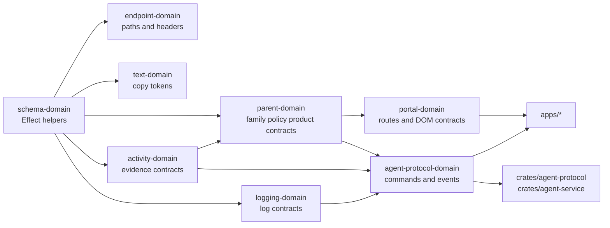

# Packages

The `packages/` workspace owns shared TypeScript contracts. Runtime apps and
Rust crates consume these packages instead of inventing local strings, routes,
event names, field names, or policy shapes.

## Package Ownership

| Package                 | Owns                                                                                                                                    |
| ----------------------- | --------------------------------------------------------------------------------------------------------------------------------------- |
| `schema-domain`         | Effect Schema helpers and branded decode helpers.                                                                                       |
| `endpoint-domain`       | Endpoint paths, HTTP/header constants, version constants, and endpoint brands.                                                          |
| `text-domain`           | Schema-backed display text tokens and shared copy values.                                                                               |
| `activity-domain`       | Capture, evidence, journal, query, browser, app/game, network, screen, and activity report contracts.                                   |
| `parent-domain`         | Family, parent, child, policy, enforcement, AI, LAN, mobile, browser/app/game/network/screen control, and product capability contracts. |
| `logging-domain`        | Structured operational logging/redaction contracts.                                                                                     |
| `portal-domain`         | Portal route ids, DOM ids, nav/section contracts, and dev command descriptors.                                                          |
| `agent-protocol-domain` | WebSocket command/event envelopes and shared agent protocol contracts.                                                                  |

## Rules

- Use Effect Schema.
- Do not add Zod.
- Do not create manual string brands.
- Do not place runtime literals in app or crate code when a package should own
  them.
- Add tests with every contract.
- Mirror Rust-crossing contracts into `crates/agent-protocol`.

## Connected Docs

- [Contract expectations](../docs/expectations/contracts.md)
- [Policy expectations](../docs/expectations/policy.md)
- [Product constitution](../docs/product-constitution.md)
- [Product capability checklist](../docs/product-capability-checklist.md)
