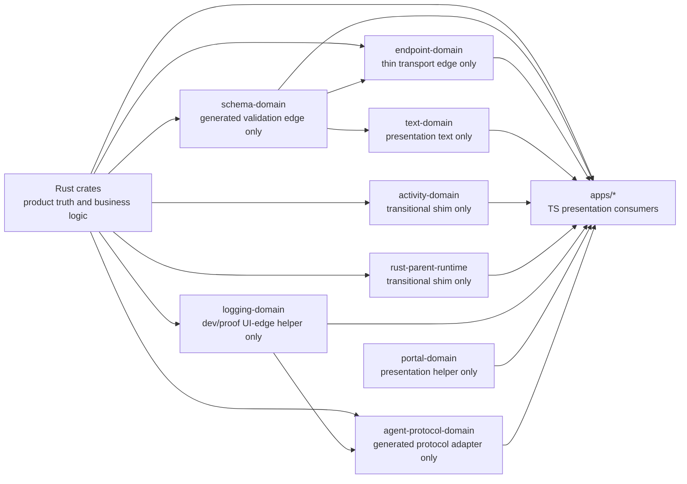

# Packages

The `packages/` workspace contains shared TypeScript surfaces around a
Rust-first parent architecture. Rust owns product contracts, business logic,
read models, and product-path state; these packages remain only as
presentation-only helpers, generated/thin adapters, or transitional shims
during the cutover.

## Package Disposition

| Surface | End-state disposition | Allowed remaining TS role |
| ------- | --------------------- | ------------------------- |
| `schema-domain` | Generated/thin only | Temporary generated validation or edge decoder only; never canonical. |
| `endpoint-domain` | Generated/thin only if still needed | Thin transport/edge adapter only; no product logic. |
| `text-domain` | Stay narrow only | Pure presentation text/helpers only. |
| `activity-domain` | Remove as business owner | Transitional shim only until Rust replacement is live. |
| `rust-parent-runtime` | Remove as business owner | Transitional shim only until Rust replacement is live. |
| `logging-domain` | Stay narrow only | Dev/proof/UI-edge helper only; Rust owns product logs. |
| `portal-domain` | Stay narrow only | Pure presentation helpers only; no product contracts, logic, or snapshots. |
| `agent-protocol-domain` | Generated/thin only | Temporary generated/thin protocol adapter; never canonical. |

## Rules

- Use Effect Schema only at untrusted TypeScript edges or generated validation
  edges.
- Do not add Zod.
- Do not create manual string brands.
- Product-path literals, contracts, and business rules belong in Rust, not in
  these TS packages.
- Do not present empty directories or `.gitkeep` files as test coverage.
- Add tests with every contract that actually owns a contract surface.
- Generate or mirror TS edge artifacts from the current Rust bridge target
  instead of hand-authoring new product-truth contracts here.

## Connected Docs

- [Contract expectations](../docs/expectations/contracts.md)
- [Policy expectations](../docs/expectations/policy.md)
- [Product constitution](../docs/product-constitution.md)
- [Product capability checklist](../docs/product-capability-checklist.md)
