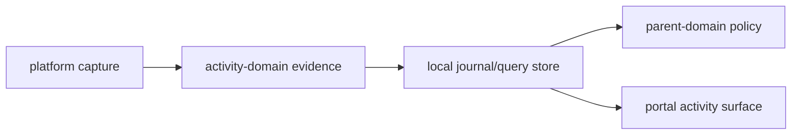

# @ocentra-parent/activity-domain

Shared activity and evidence contracts for child-device observations.

## Owns

- Capture source and status contracts.
- Browser URL/tab evidence shapes.
- App/game session contracts.
- Network flow summary contracts.
- Screen evidence summary contracts.
- Tracking location, device-status, geofence, nearby-place, and read-model
  evidence contracts.
- Journal/query/read-model primitives.
- Activity surface and family aggregation contracts.

## Must Not Own

- Parent policy authoring or enforcement decisions. Use `parent-domain`.
- WebSocket transport envelopes. Use `agent-protocol-domain`.
- Portal routes or UI layout.
- Claims that a platform can capture or enforce behavior before proof exists.

## Flow

## Connected Docs

- [Capture expectations](../../docs/expectations/capture.md)
- [Browser evidence expectations](../../docs/expectations/browser-evidence.md)
- [App/game evidence expectations](../../docs/expectations/app-game-evidence.md)
- [Network flow expectations](../../docs/expectations/network-flow-evidence.md)
- [Screen evidence expectations](../../docs/expectations/screen-evidence.md)
- [Location/geofence expectations](../../docs/expectations/location-geofence.md)
- [Product capability checklist](../../docs/product-capability-checklist.md)

## Gaps To Fill

- Social evidence needs first-class expectation docs and contracts.
- Tracking evidence now has focused contract proof; platform adapters, Rust
  journal/SQLite ingest, retention/delete/export runtime, provider runtime,
  and UI proof remain open.
- Activity reports need complete parent-facing history, trend, and assistant
  query flows.
- Evidence contracts must keep unknown/degraded/unavailable states explicit.
