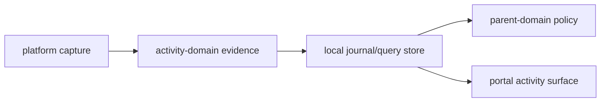

# @ocentra-parent/activity-domain

Shared activity and evidence contracts for child-device observations.

## Owns

- Capture source and status contracts.
- Browser URL/tab evidence shapes.
- Social/video source privacy evidence summaries that cite typed managed-browser,
  parent-provided, connector-authorization, screen-summary, and manual-required
  source refs without raw content custody.
- Social/video AI signal aggregate summaries that link source/privacy refs to
  candidate AI analysis, risk/benefit signal, and route gate/action refs without
  raw content, final policy, UI, alert delivery, or enforcement claims.
- App/game identity, inventory, and session contracts.
- App/game activity-surface source status row contracts that expose backend
  source-kind counts, latest observed timestamps, capability state, and
  evidence refs without UI or policy claims.
- Network flow summary contracts.
- Screen evidence summary contracts.
- Screen evidence remote/retention/live-view boundary contracts that keep raw
  screenshot retention, live view, and raw remote upload outside the default
  local summary path.
- Screen detector prompt pack and output contracts that keep local screen
  analysis detector-specific, schema-bound, and privacy-negative without
  claiming model quality or enforcement authority.
- Optional screen raw-retention and live-view preflight contracts that require
  explicit parent approval, audit refs, custody labels, TTL/delete or
  no-retention behavior, platform-proof refs for live view, and no remote input
  control before those non-default modes can be represented.
- Screen evidence settings UI proof contracts that build disabled, observe-only,
  and strict dry-run parent intent drafts from the real settings schemas without
  claiming child-agent persistence.
- Screen local AI resource scheduler proof contracts that type OCR/VLM jobs,
  prioritize policy-blocking work, enforce one heavy local screen AI lane per
  child device, and keep pixel/snippet caps plus no-remote-AI/no-raw-retention
  custody explicit.
- Screen evidence family AI hub routing contracts that require child-local
  analysis first, keep selected hard-visual routing inside local household LAN
  custody, and reject raw retention, remote/API fallback, and Ocentra-hosted
  processing claims.
- Screen intelligence router and managed-browser structured extraction
  contracts that check typed evidence before screenshot capture, skip screenshots
  when structured evidence is enough, and fail closed for protected or
  credential-risk surfaces.
- Screen managed-browser CDP screenshot capture contracts that keep page,
  viewport, and crop screenshots tied to a managed browser target, URL/title
  evidence refs, encrypted temp queue custody, deletion proof, and no desktop,
  live-screencast, remote-upload, or raw-retention defaults.
- Screen child disclosure UX contracts that require visible local status,
  child-device custody, audit refs, no hidden active capture, no raw screenshot
  path exposure, and no raw remote upload.
- Screen-AI browser trigger proof rows that compose typed browser AI
  input/result contracts with screen-analysis result contracts for managed URL,
  browser-video, social-feed, and cloud-game trigger states without claiming UI,
  enforcement, remote AI, authenticated social, cloud-frame, or mobile parity.
- Tracking location, device-status, geofence, nearby-place, and read-model
  evidence contracts plus P1 deterministic geofence, expected-place, retention
  delete, parent-owned export, local parent-defined place store, and tracking
  event ingest helpers.
- Journal/query/read-model primitives.
- Activity surface and family aggregation contracts.

## Must Not Own

- Parent policy authoring or enforcement decisions. Use `parent-domain`.
- WebSocket transport envelopes. Use `agent-protocol-domain`.
- Portal routes or UI layout.
- Claims that a platform can capture or enforce behavior before proof exists.

## Flow

## Connected Docs

- [Capture expectations](../../docs/expectations/capture.md)
- [Browser evidence expectations](../../docs/expectations/browser-evidence.md)
- [App/game evidence expectations](../../docs/expectations/app-game-evidence.md)
- [Network flow expectations](../../docs/expectations/network-flow-evidence.md)
- [Screen evidence expectations](../../docs/expectations/screen-evidence.md)
- [Location/geofence expectations](../../docs/expectations/location-geofence.md)
- [Product capability checklist](../../docs/product-capability-checklist.md)

## Gaps To Fill

- Social/video source privacy summaries now have
  `social-video-source-privacy-proof`; first-class UI, notification, connector,
  native adapter, final policy, and enforcement proof remain open.
- Social/video AI signal aggregate summaries now have
  `social-video-ai-signal-aggregate-proof`; runtime AI execution, rendered UI,
  alert delivery, connector/native adapters, final policy, and enforcement proof
  remain open.
- Screen-AI browser trigger proof now has
  `screen-ai-browser-trigger-proof`; live trigger producers, authenticated
  social surfaces, cloud-streamed frame analysis, mobile browser parity, UI,
  final policy, and enforcement proof remain open.
- Screen local AI resource scheduler proof now has
  `screen-local-ai-resource-scheduler-proof`; production OCR/VLM quality,
  broad trigger producers, and full capture-to-policy pipeline completion
  remain separate proof gates.
- Screen detector prompts now have `screen-detector-prompt-pack-proof`;
  production model quality, live inference, policy action, and enforcement proof
  remain open.
- Screen family AI hub routing now has
  `screen-family-ai-hub-routing-proof`; real LAN hub runtime/discovery,
  production model quality, UI, policy, and enforcement proof remain open.
- Screen intelligence routing now has
  `screen-router-structured-extraction-proof`; real managed-browser
  DOM/accessibility producer integration, portal rendering, final policy, and
  enforcement proof remain open.
- Screen child disclosure UX now has `screen-child-disclosure-ux-proof`;
  production child app, OS notification/tray/foreground overlay, and
  service-persisted disclosure state remain open.
- Optional raw-retention/live-view preflight proof now has
  `screen-optional-retention-live-preflight-proof`; runtime retention
  enablement, live transport/relay/cache, platform permission prompts, parent
  UI persistence, privacy/legal approval, and production adapters remain open.
- Screen managed-browser CDP screenshot capture now has
  `screen-managed-browser-cdp-capture-proof`; production URL-trigger ownership,
  OCR/VLM quality, policy action, enforcement, live view, and raw retention
  remain separate proof gates.
- Tracking evidence now has focused contract proof plus P1 deterministic
  runtime, local parent-defined place store proof, and Rust ActivityStore ingest
  proof; platform adapters, provider runtime, and live service-backed UI proof
  remain open.
- Activity reports need complete parent-facing history, trend, and assistant
  query flows.
- Evidence contracts must keep unknown/degraded/unavailable states explicit.
- App/game source status rows are backend evidence summaries only; portal
  rendering, policy consumption, and adapter execution remain separate proof
  gates.
