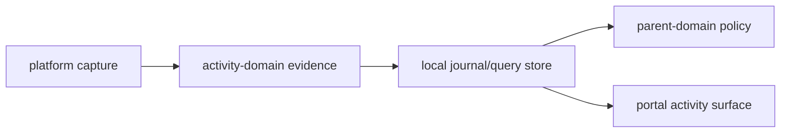

# @ocentra-parent/activity-domain

Shared activity and evidence contracts for child-device observations.

## Owns

- Capture source and status contracts.
- Browser URL/tab evidence shapes.
- Social/video source privacy evidence summaries that cite typed managed-browser,
  parent-provided, connector-authorization, screen-summary, and manual-required
  source refs without raw content custody.
- Social/video AI signal aggregate summaries that link source/privacy refs to
  candidate AI analysis, risk/benefit signal, and route gate/action refs without
  raw content, final policy, UI, alert delivery, or enforcement claims.
- App/game identity, inventory, and session contracts.
- Network flow summary contracts.
- Screen evidence summary contracts.
- Tracking location, device-status, geofence, nearby-place, and read-model
  evidence contracts plus P1 deterministic geofence, expected-place, retention
  delete, parent-owned export, local parent-defined place store, and tracking
  event ingest helpers.
- Journal/query/read-model primitives.
- Activity surface and family aggregation contracts.

## Must Not Own

- Parent policy authoring or enforcement decisions. Use `parent-domain`.
- WebSocket transport envelopes. Use `agent-protocol-domain`.
- Portal routes or UI layout.
- Claims that a platform can capture or enforce behavior before proof exists.

## Flow

## Connected Docs

- [Capture expectations](../../docs/expectations/capture.md)
- [Browser evidence expectations](../../docs/expectations/browser-evidence.md)
- [App/game evidence expectations](../../docs/expectations/app-game-evidence.md)
- [Network flow expectations](../../docs/expectations/network-flow-evidence.md)
- [Screen evidence expectations](../../docs/expectations/screen-evidence.md)
- [Location/geofence expectations](../../docs/expectations/location-geofence.md)
- [Product capability checklist](../../docs/product-capability-checklist.md)

## Gaps To Fill

- Social/video source privacy summaries now have
  `social-video-source-privacy-proof`; first-class UI, notification, connector,
  native adapter, final policy, and enforcement proof remain open.
- Social/video AI signal aggregate summaries now have
  `social-video-ai-signal-aggregate-proof`; runtime AI execution, rendered UI,
  alert delivery, connector/native adapters, final policy, and enforcement proof
  remain open.
- Tracking evidence now has focused contract proof plus P1 deterministic
  runtime, local parent-defined place store proof, and Rust ActivityStore ingest
  proof. Tracking POI provider adapter proof now covers bounded Google Places
  nearby requests, minimal production field masks, category mapping, ambiguity,
  and unavailable-provider degradation; live provider credentials, production
  provider setup, provider delivery, platform adapters, and live service-backed
  UI proof remain open.
- Activity reports need complete parent-facing history, trend, and assistant
  query flows.
- Evidence contracts must keep unknown/degraded/unavailable states explicit.
