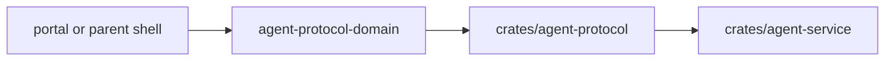

# @ocentra-parent/agent-protocol-domain

Protocol adapters, event parsers, and transport helpers built on canonical
`@ocentra-parent/schema-domain` contracts for localhost, LAN, and related
service-backed flows.

## Owns

- Adapter and parser helpers that sit between canonical `schema-domain`
  contracts and transport/runtime consumers.
- Package-local command builders, message codecs, read-model parsers, and
  protocol defaults that do not become shared schema authority.
- Transport-facing helpers for activity, browser, screen, enforcement, network,
  LAN, tracking, social, app-game, and parent-assistant flows when those
  payloads are already canonically defined elsewhere.

## Must Not Own

- Canonical command, event, read-model, or branded schema ownership. That
  belongs in `@ocentra-parent/schema-domain`.
- Product policy semantics or runtime business logic that belong in owning
  domain packages.
- Endpoint paths or portal-only UI projections.
- Rust implementation details or Rust mirror ownership.

## Flow

## Connected Docs

- [Contract expectations](../../docs/expectations/contracts.md)
- [LAN pairing expectations](../../docs/expectations/lan-pairing.md)
- [Real evidence proof](../../docs/expectations/real-evidence-proof.md)

## Gaps To Fill

- Add new helpers here only after canonical contracts already exist in
  `schema-domain`.
- Keep Rust parity exact before service/runtime claims upgrade.
- Do not let adapter/parser helpers drift back into local schema ownership or
  product-authority behavior.
