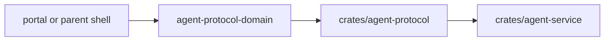

# @ocentra-parent/agent-protocol-domain

Shared WebSocket command/event contracts for localhost, LAN, and future relay
transports.

## Owns

- Agent command names and payload schemas.
- Agent event names and payload schemas.
- Security envelope fields and validation.
- Protocol defaults that must match Rust.
- Adapter-specific command/event contracts for activity, browser policy,
  parent assistant, LAN, enforcement product-control runtime state, and related
  paths.
- V0.9 signed LAN discovery/relay spine payloads for add-device read models,
  including adapter rows, signed proof rows, route safety rows, and relay/cache
  rows consumed by the Rust service and parent surfaces.
- V0.9 LAN source-matrix payloads that carry 20 workpack rows and discovery
  source rows from product contracts into service-backed portal diagnostics.
- Enforcement policy-dispatch read-model event parsing for the service-backed
  V0.8 dispatch proof path.
- Enforcement supported-adapter runtime proof event parsing, including the
  integrity runtime audit read model carried by
  `agent.enforcement.supported-adapter-runtime-proof.reported` and its nested
  V0.8 integrity alert/status bridge and notification provider status boundary.
- Tracking read-model command/event names and the `trackingReadModel` payload
  field for the service-backed
  `agent.activity.tracking.read-model.get` proof path, including active
  kind/device/capability count summaries and latest active row metadata.
- App/game boundary read-model command/event names and the
  `appGameBoundaryReadModel` payload field for the service-backed
  authority/classifier row-count proof path.
- App/game notification readiness read-model command/event names, payload
  field, parser, and no-claim booleans for service-backed local notification
  intent readiness rows.
- Activity app-use and games read-model event parsing for backend-owned
  app/game source freshness rows, while product semantics stay in
  `activity-domain`.
- Network product-readiness status command/event names and payload field
  constants for service-backed row13a custody and row51a product-readiness
  materializer outputs.
- Network runtime event contracts for the local eventing spine, including
  flow/domain/classification, AI advisory, policy, enforcement dry-run/result,
  audit, and portal read-model update shapes mirrored from `crates/agent-protocol`.

## Must Not Own

- Product policy semantics that belong in `parent-domain`.
- Evidence schemas that belong in `activity-domain`.
- Endpoint paths that belong in `endpoint-domain`.
- Rust implementation details.

## Flow

## Connected Docs

- [Contract expectations](../../docs/expectations/contracts.md)
- [LAN pairing expectations](../../docs/expectations/lan-pairing.md)
- [Real evidence proof](../../docs/expectations/real-evidence-proof.md)

## Gaps To Fill

- Every new remote, notification, mobile, social, or location command must be
  introduced here only after product/domain contracts exist.
- Rust parity tests must cover exact field and enum values before the service
  claims support.
- V0.8 product-control runtime state is parsed from
  `agent.enforcement.product-control-spine.reported` by the
  `enforcement-product-control-adapter` export; product semantics stay in
  `parent-domain`.
- V0.8 policy-dispatch runtime state is parsed from
  `agent.enforcement.policy-dispatch.reported` by the
  `enforcement-policy-dispatch-adapter` export.
- V0.8 supported-adapter runtime proof is parsed from
  `agent.enforcement.supported-adapter-runtime-proof.reported` by the
  `enforcement-supported-adapter-runtime-proof-adapter` export; the event also
  carries the integrity audit read model for result, timer, rollback,
  child-status, parent-override, permission-loss, heartbeat, and tamper/manual
  visibility, plus nested permission-loss, stale-heartbeat, stopped-or-removed,
  and tamper/manual alert/status bridge rows and queued, delivered, failed,
  unavailable, and manual-required provider status rows.
- Integrity audit events are parent-visible proof state only. Broad
  app/domain/browser blocking, notification delivery, tamper resistance, mobile
  enforcement, stealth/persistence, and privilege escalation stay unclaimed
  until separate platform proof exists.
- V0.9 signed LAN discovery/relay spine contracts still report signed
  child-agent artifacts, physical household proof, relay, and cache routes as
  manual or not implemented until real runtime proof exists.
- Notification provider status parsing remains proof-state parsing only. Real
  provider delivery, webhook receipts, retry execution, quiet-hours scheduling,
  escalation delivery, and parent preference controls remain outside this
  adapter.
- LAN source-matrix parsing keeps unavailable/manual source rows visible but
  does not upgrade them into production discovery adapters.
- Tracking read-model protocol support proves command/event parity, service
  payload shape, active product-surface summary parsing, and the parser used by
  the narrow portal summary; product tracking evidence schemas remain in
  `activity-domain`, and full UI/report/policy consumers remain separate.
- App/game boundary read-model parsing proves command/event parity and the
  service payload shape only; product semantics stay in `activity-domain` and
  `parent-domain`, and portal rows, policy consumption, provider execution, and
  adapter support remain separate proof-gated work.
- App/game source freshness row parsing proves service payload shape only; portal
  rendering, policy decisions, provider execution, and broad OS adapter support
  remain separate proof-gated work.
- App/game notification readiness parsing proves service payload shape only;
  provider delivery, receipt ingestion, local outbox runtime, scheduler runtime,
  parent notification UI, child delivery, policy evaluator execution, adapter
  dispatch, broad blocking, and platform support remain separate proof-gated
  work.
- Network runtime event parsing proves public TypeScript parity for the Rust
  protocol event chain only. Broker/family-hub delivery, service WebSocket
  streaming of the event chain, host filtering, adapter execution, and portal UI
  rendering remain separate proof-gated work.
- Network product-readiness status support proves command/event and payload
  field parity for the service status event; the Activity route now has a
  separate portal rendering proof. Policy execution, adapter execution, host
  filtering, live capture, and production SLO validation remain separate
  proof-gated work.
