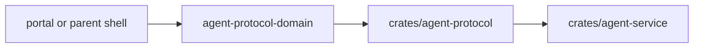

# @ocentra-parent/agent-protocol-domain

Shared WebSocket command/event contracts for localhost, LAN, and future relay
transports.

## Owns

- Agent command names and payload schemas.
- Agent event names and payload schemas.
- Security envelope fields and validation.
- Protocol defaults that must match Rust.
- Adapter-specific command/event contracts for activity, browser policy,
  parent assistant, LAN, enforcement product-control runtime state, and related
  paths.
- Enforcement policy-dispatch read-model event parsing for the service-backed
  V0.8 dispatch proof path.
- Enforcement supported-adapter runtime proof event parsing, including the
  integrity runtime audit read model carried by
  `agent.enforcement.supported-adapter-runtime-proof.reported` and its nested
  V0.8 integrity alert/status bridge.

## Must Not Own

- Product policy semantics that belong in `parent-domain`.
- Evidence schemas that belong in `activity-domain`.
- Endpoint paths that belong in `endpoint-domain`.
- Rust implementation details.

## Flow

## Connected Docs

- [Contract expectations](../../docs/expectations/contracts.md)
- [LAN pairing expectations](../../docs/expectations/lan-pairing.md)
- [Real evidence proof](../../docs/expectations/real-evidence-proof.md)

## Gaps To Fill

- Every new remote, notification, mobile, social, or location command must be
  introduced here only after product/domain contracts exist.
- Rust parity tests must cover exact field and enum values before the service
  claims support.
- V0.8 product-control runtime state is parsed from
  `agent.enforcement.product-control-spine.reported` by the
  `enforcement-product-control-adapter` export; product semantics stay in
  `parent-domain`.
- V0.8 policy-dispatch runtime state is parsed from
  `agent.enforcement.policy-dispatch.reported` by the
  `enforcement-policy-dispatch-adapter` export.
- V0.8 supported-adapter runtime proof is parsed from
  `agent.enforcement.supported-adapter-runtime-proof.reported` by the
  `enforcement-supported-adapter-runtime-proof-adapter` export; the event also
  carries the integrity audit read model for result, timer, rollback,
  child-status, parent-override, permission-loss, heartbeat, and tamper/manual
  visibility, plus nested permission-loss, stale-heartbeat, stopped-or-removed,
  and tamper/manual alert/status bridge rows.
- Integrity audit events are parent-visible proof state only. Broad
  app/domain/browser blocking, notification delivery, tamper resistance, mobile
  enforcement, stealth/persistence, and privilege escalation stay unclaimed
  until separate platform proof exists.
