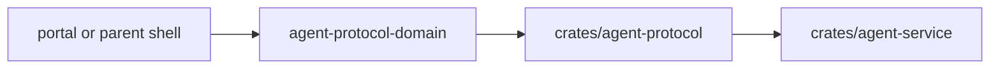

# @ocentra-parent/agent-protocol-domain

Generated/thin protocol adapters and parsers for Rust-owned agent protocol
contracts. This package is transitional edge-only surface area: it does not own
product schemas, read models, or business logic.

## Owns

- Generated bridge DTO imports.
- Thin protocol adapters, event parsers, and transport helpers that forward
  Rust-owned shapes without becoming the authority for them.
- Transport-facing helpers for activity, browser, screen, enforcement,
  network, tracking, social, app-game, and parent-assistant flows when those
  payloads are already defined by the Rust protocol surface.

## Must Not Own

- Canonical command, event, read-model, or branded schema ownership. That
  belongs in the Rust protocol crates and generated contract outputs.
- Product policy semantics or runtime business logic that belong in owning
  Rust domain crates.
- Endpoint paths or portal-only UI projections.
- Rust implementation details or Rust mirror ownership.
- New local truth that would outlive the Rust replacement.

## Flow

## Connected Docs

- [Contract expectations](../../docs/expectations/contracts.md)
- [LAN pairing expectations](../../docs/expectations/lan-pairing.md)
- [Real evidence proof](../../docs/expectations/real-evidence-proof.md)

## Gaps To Fill

- Add new helpers here only after the Rust protocol shape already exists and
  the adapter remains thin.
- Keep Rust parity exact before service/runtime claims upgrade.
- Do not let adapter/parser helpers drift back into local schema ownership or
  product-authority behavior.
- Collapse any lingering local truth into generated bridge output or Rust-owned
  contracts first.
