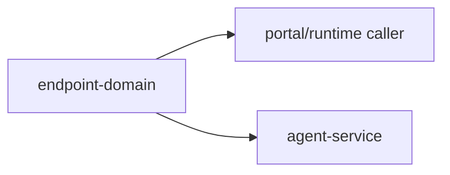

# @ocentra-parent/endpoint-domain

Shared endpoint, path, header, query, version, and route-boundary constants.

## Owns

- HTTP path constants.
- Header/query/version constants.
- Endpoint brands and decoders.
- LAN pairing endpoint constants that cross runtime boundaries.

## Must Not Own

- WebSocket command payloads. Use `agent-protocol-domain`.
- Portal route/nav semantics. Use `portal-domain`.
- Product policy decisions. Use `parent-domain`.

## Flow

## Connected Docs

- [Contract expectations](../../docs/expectations/contracts.md)
- [LAN pairing expectations](../../docs/expectations/lan-pairing.md)

## Gaps To Fill

- Keep endpoint constants aligned with Rust service paths and tests.
- Add endpoint docs when remote relay/account APIs become real.
