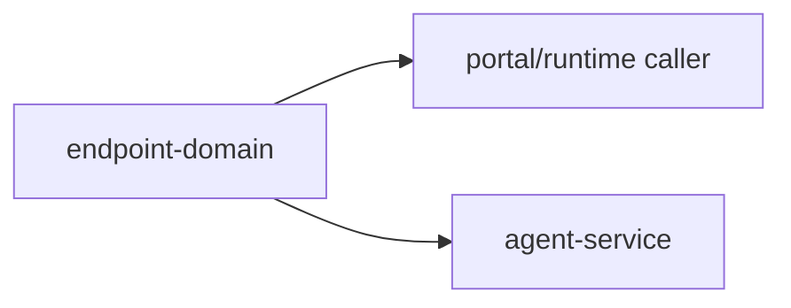

# @ocentra-parent/endpoint-domain

Shared endpoint, path, header, query, version, and route-boundary constants.

## Owns

- HTTP path constants.
- Header/query/version constants.
- Endpoint brands and decoders.
- LAN pairing endpoint constants that cross runtime boundaries.
- Parent-owned sync/export and remote connector status route contracts.
- Billing/account and account distribution route contracts.

## Must Not Own

- WebSocket command payloads. Use `agent-protocol-domain`.
- Portal route/nav semantics. Use `portal-domain`.
- Product policy decisions. Use `parent-domain`.

## Flow

## Connected Docs

- [Contract expectations](../../docs/expectations/contracts.md)
- [LAN pairing expectations](../../docs/expectations/lan-pairing.md)
- [Sync/export expectations](../../docs/expectations/sync-export.md)
- [Cloud expectations](../../docs/expectations/cloud.md)
- [Billing expectations](../../docs/expectations/billing.md)

## Gaps To Fill

- Keep endpoint constants aligned with Rust service paths and tests.
- Keep `sync-export-endpoint-contract-proof` as route contract proof only until
  parent-owned storage connectors and transfer runtime are implemented.
- Keep `billing-account-endpoint-contract-proof` as route contract proof only
  until billing provider, account backend, entitlement runtime, package subpath
  export, and updater/download handlers are explicitly assigned.
- Add endpoint docs when remote relay/account APIs become real.
