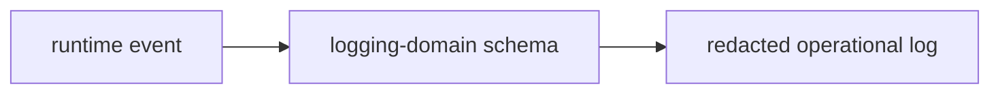

# @ocentra-parent/logging-domain

Structured operational logging and redaction contracts.

## Owns

- Log event schemas.
- Redaction-safe operational fields.
- Shared logging contracts used by TypeScript and Rust-facing protocol paths.

## Must Not Own

- Raw child evidence.
- Parent report content.
- Sensitive screenshots, browser history, or message content.
- Feature-specific policy decisions.

## Flow

## Connected Docs

- [Notification expectations](../../docs/expectations/notifications.md)
- [Data custody expectations](../../docs/expectations/data-custody.md)
- [Static analysis and security expectations](../../docs/expectations/static-analysis-security.md)

## Notification Audit History Contract

`src/notification-audit-history.ts` owns the logging-domain proof for
notification audit/history rows. It records provider status, retry lifecycle,
receipt/manual-required refs, quiet-hours/escalation refs, redaction-safe
payload fields, and child-data non-custody flags.

This contract is metadata-only. It does not claim provider adapters, send/retry
execution, webhook receipt ingestion, credentials, notification history UI, raw
child data, raw evidence payloads, or Ocentra-hosted child evidence custody.

## Tamper Integrity Audit Contract

`src/tamper-integrity-audit.ts` owns the logging-domain proof for
tamper/integrity audit rows. It records stale/offline heartbeat, permission
loss, stopped service, removed agent, uninstall detection,
tamper/manual-required, and admin-removal flow states with redaction-safe
operational refs.

This contract is metadata-only. It does not claim stealth behavior, privilege
escalation, hidden persistence, notification provider delivery, admin-removal
blocking, raw child data, raw evidence payloads, raw URLs, screenshots, command
lines, private paths, or message contents.

## Gaps To Fill

- Keep log contracts aligned with every new remote, notification, and support
  path.
- Add runtime writers only after the notification provider and history surfaces
  have real contracts and validation.
- Add explicit support-bundle redaction contracts before external support flows.
