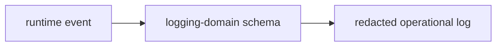

# @ocentra-parent/logging-domain

Structured operational logging and redaction contracts.

## Owns

- Log event schemas.
- Redaction-safe operational fields.
- Shared logging contracts used by TypeScript and Rust-facing protocol paths.

## Must Not Own

- Raw child evidence.
- Parent report content.
- Sensitive screenshots, browser history, or message content.
- Feature-specific policy decisions.

## Flow

## Connected Docs

- [Notification expectations](../../docs/expectations/notifications.md)
- [Data custody expectations](../../docs/expectations/data-custody.md)
- [Static analysis and security expectations](../../docs/expectations/static-analysis-security.md)

## Notification Audit History Contract

`src/notification-audit-history.ts` owns the logging-domain proof for
notification audit/history rows. It records provider status, retry lifecycle,
receipt/manual-required refs, quiet-hours/escalation refs, redaction-safe
payload fields, and child-data non-custody flags.

`src/notification-audit-history-handoff.ts` owns the metadata-only handoff from
local source rows into those audit/history rows. The current app/game proof uses
it to map linked local outbox rows to queued audit entries and
manual/unavailable rows to blocked audit entries while preserving source audit,
evidence, and policy refs.

This contract is metadata-only. It does not claim provider adapters, send/retry
execution, webhook receipt ingestion, credentials, notification history UI, raw
child data, raw evidence payloads, or Ocentra-hosted child evidence custody.

## Tamper Integrity Audit Contract

`src/tamper-integrity-audit.ts` owns the logging-domain proof for
tamper/integrity audit rows. It records stale/offline heartbeat, permission
loss, stopped service, removed agent, uninstall detection,
tamper/manual-required, and admin-removal flow states with redaction-safe
operational refs.

This contract is metadata-only. It does not claim stealth behavior, privilege
escalation, hidden persistence, notification provider delivery, admin-removal
blocking, raw child data, raw evidence payloads, raw URLs, screenshots, command
lines, private paths, or message contents.

## Support Bundle Redaction Contract

`src/support-bundle-redaction.ts` owns the logging-domain schema proof for
production-support bundle redaction and incident handoff rows, while
`src/support-bundle-redaction-read-model.ts` owns the current fixture rows. They
record parent consent, release/package/runtime support metadata, support-safe
diagnostic references, billing escalation manual-required state, account lookup
manual-required state, and backend-upload/manual support boundaries.

This contract is metadata-only. It does not claim support backend upload,
billing provider contact, account lookup execution, remote support sessions,
production SLA, provider secrets, tokens, child activity, raw URLs, screenshots,
journals, SQLite snapshots, private paths, command lines, keystrokes, clipboard
data, or message contents.

The `production-support-status-backend-redaction-manifest-proof` slice extends
this same exported contract with status backend redaction manifest readiness
rows. It proves only support-safe status target, queue/audit, redaction summary,
and manual proof references. It does not claim status backend execution, status
backend payload custody, durable payload storage, payload deletion, retry worker
execution, audit persistence execution, public runtime execution, or child
activity custody.

## Support Incident Workflow Contract

`src/support-incident-workflow.ts` owns the logging-domain schema proof for the
production support incident privacy/legal workflow, while
`src/support-incident-workflow-read-model.ts` owns the current fixture rows.
They record parent consent gating, privacy/legal disclosure before export,
redaction and custody audit refs, support-safe incident workflow state, backend
upload manual-required state, billing escalation manual-required state, and
account lookup manual-required state.

This contract is metadata-only. It does not claim support backend upload,
billing provider contact, account lookup execution, remote support sessions,
production SLA, public privacy policy publication, provider secrets, tokens,
child activity, raw URLs, screenshots, journals, SQLite snapshots, private
paths, command lines, keystrokes, clipboard data, message contents, or
Ocentra-hosted child activity custody.

## Support Backend Upload Status Contract

`src/support-backend-upload-status.ts` owns the logging-domain schema proof for
production support backend upload status rows, while
`src/support-backend-upload-status-read-model.ts` owns the current fixture rows.
They record parent-initiated and parent-consented queued, running, succeeded,
failed, manual-required, backend-unavailable, and provider-unavailable states
with redaction refs, audit refs, retry refs, abandon refs, failure refs, manual
proof requirements, and package/runtime refs.

This contract is metadata-only. It does not claim raw child activity custody,
provider secrets, remote support transcripts, real support backend upload
execution, account lookup execution, billing provider execution, production SLA,
or default Ocentra-hosted family data.

## Support Backend Upload Execution Runtime Contract

`src/support-backend-upload-execution-runtime.ts` owns the logging-domain schema
proof for production support backend upload execution/runtime boundary rows,
while `src/support-backend-upload-execution-runtime-read-model.ts` owns the
current fixture rows. They record parent-consented request recording, redaction
preflight readiness, manual dispatch requirements, backend/provider unavailable
states, retry scheduling, and operator abandon states with status refs, runtime
refs, redaction refs, audit refs, retry refs, abandon refs, and manual proof
requirements.

This contract is metadata-only. It does not claim raw child activity custody,
provider secrets, remote support transcripts, real support backend upload
execution, account lookup execution, billing provider contact execution, remote
support session execution, production SLA, or default Ocentra-hosted family
data.

## Support Backend Upload Custody Audit Contract

`src/support-backend-upload-custody-audit.ts` owns the logging-domain schema
proof for production support backend upload custody, retention, delete, and
audit-export boundary rows, while
`src/support-backend-upload-custody-audit-read-model.ts` owns the current
fixture rows. They record parent-consented custody boundary refs, retention
manual-required refs, delete request/manual-required refs, support-safe audit
export refs, status refs, runtime refs, redaction refs, and manual proof
requirements.

This contract is metadata-only. It does not claim raw child activity custody,
provider secrets, remote support transcripts, real support backend upload
execution, support backend payload retention, support backend payload deletion,
account lookup execution, billing provider contact execution, remote support
session execution, production SLA, or default Ocentra-hosted family data.

## Support Case Resolution Status Contract

`src/support-case-resolution-status.ts` owns the logging-domain schema proof
for production support case resolution/status rows, while
`src/support-case-resolution-status-read-model.ts` owns the current fixture
rows. They record parent-consented case opened, triage-ready,
parent-update-ready, escalation manual-required, operator response
manual-required, closure-ready, and SLA manual-required states with incident,
redaction, audit, publication, backend-upload status/execution, escalation,
response, closure, SLA, and manual proof refs.

This contract is metadata-only. It does not claim real support backend upload
execution, provider contact, account lookup, billing provider contact, remote
support sessions, production SLA execution, raw child activity custody,
provider secrets, remote support transcripts, or default Ocentra-hosted family
data.

## Provider Secret Custody Status Contract

`src/provider-secret-custody-status.ts` owns the logging-domain schema proof for
production support provider-secret custody status rows, while
`src/provider-secret-custody-status-read-model.ts` owns the current fixture
rows. They record custody-boundary recorded, provider-secret absent, backend
secret store manual-required, rotation manual-required, revocation
manual-required, and audit-export-ready states with legal/provider readiness,
billing support, redaction, custody audit, rotation, revocation, manual proof,
and audit export refs.

This contract is metadata-only. It does not claim provider secrets, payment
provider tokens, raw child activity, raw support bundle payloads, account
lookup results, billing provider contact records, remote support transcripts,
real provider-secret custody, backend secret store execution, rotation
execution, revocation execution, support backend upload execution, account
lookup execution, billing provider contact execution, remote support session
execution, production SLA, or default Ocentra-hosted family data.

## Privacy Legal Disclosure Status Contract

`src/privacy-legal-disclosure-status.ts` owns the logging-domain schema proof
for production support privacy/legal disclosure status rows,
`src/privacy-legal-disclosure-status-guards.ts` owns the sensitive-data and
overclaim rejection guards, and
`src/privacy-legal-disclosure-status-read-model.ts` owns the current fixture
rows. `scripts/test/production-support-privacy-legal-disclosure-status-proof.mjs`
regenerates the deterministic proof artifacts. They record disclosure requested,
parent-authorized, legal-review queued, legal-review running, parent-notification
ready, publication-ready, failed, and manual-required states with parent consent,
privacy policy, legal review, publication, support runbook, audit, failure, and
manual proof refs.

This contract is metadata-only. It does not claim legal disclosure execution,
public runtime execution, support backend upload execution, account lookup,
billing provider contact, remote support sessions, production SLA, provider
secrets, remote support transcripts, raw child activity custody, or raw support
bundle payloads.

## Status Backend Payload Custody Contract

`src/status-backend-payload-custody.ts` owns the logging-domain schema proof
for production support status backend payload custody rows, while
`src/status-backend-payload-custody-read-model.ts` owns the current fixture
rows. They record custody boundary, retention manual-required, delete request,
deletion manual-required, audit-export-ready, and backend-unavailable states
with status target refs, queue refs, audit refs, redaction refs, custody refs,
retention refs, delete refs, and manual proof refs.

This contract is metadata-only. It does not claim status backend execution,
durable status backend payload storage, status backend payload deletion, retry
worker execution, audit persistence, public runtime execution, provider
execution, support backend upload execution, account lookup, billing provider
contact, remote support sessions, production SLA, provider secrets, raw support
bundles, or default Ocentra-hosted family data.

## Data Export/Delete Lifecycle Contract

`src/data-export-delete-lifecycle.ts` owns the logging-domain schema proof for
`production-support-data-export-delete-lifecycle-proof`, while
`src/data-export-delete-lifecycle-read-model.ts` owns the current fixture rows.
They record parent-authorized export and delete requested, authorized, queued,
running, succeeded, failed, and manual-required lifecycle states with local
queue/runtime/output/delete refs, redaction/audit refs, custody refs, and manual
proof requirements.

This contract is metadata-only. It does not claim real backend upload
execution, public runtime execution, provider execution, production SLA, remote
support sessions, raw child activity custody, provider secrets, remote support
transcripts, or default Ocentra-hosted family data.

## Gaps To Fill

- Keep log contracts aligned with every new remote, notification, and support
  path.
- Add runtime writers only after the notification provider and history surfaces
  have real contracts and validation.
- Add runtime support bundle writers only after production support backend,
  account lookup, billing escalation, remote support, privacy/legal publication,
  and SLA workflows have real contracts and validation.
