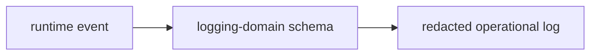

# @ocentra-parent/logging-domain

Structured operational logging and redaction contracts.

## Owns

- Log event schemas.
- Redaction-safe operational fields.
- Shared logging contracts used by TypeScript and Rust-facing protocol paths.

## Must Not Own

- Raw child evidence.
- Parent report content.
- Sensitive screenshots, browser history, or message content.
- Feature-specific policy decisions.

## Flow

## Connected Docs

- [Data custody expectations](../../docs/expectations/data-custody.md)
- [Static analysis and security expectations](../../docs/expectations/static-analysis-security.md)

## Gaps To Fill

- Keep log contracts aligned with every new remote, notification, and support
  path.
- Add explicit support-bundle redaction contracts before external support flows.
